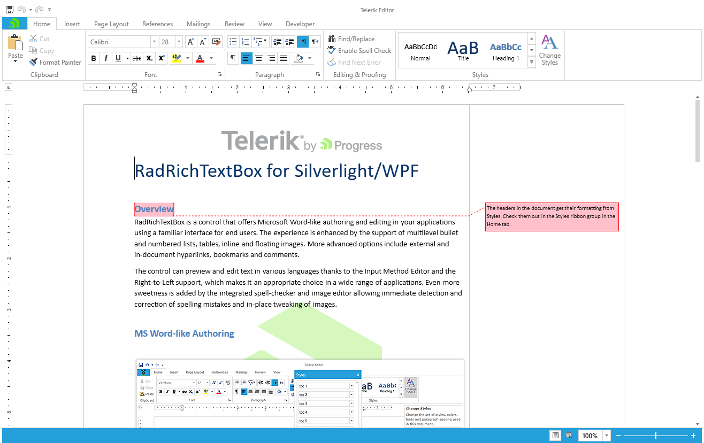

# Setting a Theme

The controls from the UI for {{ site.framework_name }} suite support different themes. You can see how to apply a theme different than the default one in the [Setting a Theme]() help article.

>note Changing the theme using implicit styles will affect all controls that have styles defined in the merged resource dictionaries. This is applicable only for the controls in the scope in which the resources are merged. 

To change the theme, you can follow the steps below:

* Choose between the themes and add reference to the corresponding theme assembly (ex: **Telerik.Windows.Themes.Windows8.dll**). You can see the different themes applied in the **Theming** examples from our [WPF Controls Examples](https://demos.telerik.com/wpf/) application.

* Merge the ResourceDictionaries with the namespaces required for the controls that you are using from the theme assembly. For __RadRichTextBox__, you will need to merge the following resources:

	* **Telerik.Windows.Controls**
	* **Telerik.Windows.Controls.Input**
	* **Telerik.Windows.Controls.Navigation**
	* **Telerik.Windows.Controls.RibbonView**
	* **Telerik.Windows.Controls.RichTextBoxUI**
	* **Telerik.Windows.Controls.ImageEditor**
	* **Telerik.Windows.Documents**

>If you are using the **{{ site.minimum_net_core_version }}** or later version of RadRichTextBox, make sure to check the [.NET Support]() topic for an updated list of the resources the control uses.

**Example 1** demonstrates how to merge the ResourceDictionaries so that they are applied globally for the entire application.

#### [XAML] Example 1: Merge the ResourceDictionaries
```XAML

		<Application.Resources>
			<ResourceDictionary>
				<ResourceDictionary.MergedDictionaries>
                    <ResourceDictionary Source="/Telerik.Windows.Themes.Windows8;component/Themes/System.Windows.xaml" />
                    <ResourceDictionary Source="/Telerik.Windows.Themes.Windows8;component/Themes/Telerik.Windows.Controls.xaml" />
                    <ResourceDictionary Source="/Telerik.Windows.Themes.Windows8;component/Themes/Telerik.Windows.Controls.Input.xaml" />
                    <ResourceDictionary Source="/Telerik.Windows.Themes.Windows8;component/Themes/Telerik.Windows.Controls.Navigation.xaml" />
                    <ResourceDictionary Source="/Telerik.Windows.Themes.Windows8;component/Themes/Telerik.Windows.Controls.RibbonView.xaml" />
                    <ResourceDictionary Source="/Telerik.Windows.Themes.Windows8;component/Themes/Telerik.Windows.Controls.RichTextBoxUI.xaml" />
                    <ResourceDictionary Source="/Telerik.Windows.Themes.Windows8;component/Themes/Telerik.Windows.Controls.ImageEditor.xaml" />
                    <ResourceDictionary Source="/Telerik.Windows.Themes.Windows8;component/Themes/Telerik.Windows.Documents.xaml" />
				</ResourceDictionary.MergedDictionaries>
			</ResourceDictionary>
		</Application.Resources>
```

__RadRichTextBox with the Windows8 theme__  



## See Also  
 * [Getting Started]() 
 * [.NET Support]() 
 * [Import/Export]()
