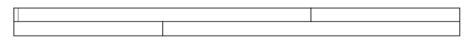

# Guidelines for Printing with RadDocument


__RadDocument__ is usually used to show the content of a RadRichTextBox, but it can also be created programmatically in order to print or export data shown in another way (e.g. in a __RadGridView__) to docx, RTF, HTML or PDF.
      

* [Sections](#sections)

* [Tables](#tables)

* [Table Column Width](#table-column-width)

* [TableCell](#tablecell)

* [Paragraphs And Spans](#paragraphs-and-spans)

* [Font Settings](#font-settings)

* [Printing](#printing)

## 

When creating the document programmatically, its structure must be closely adhered to. The hierarchy of the document elements is described in this article: [Elements Hierarchy]()

## Sections

As shown in the picture in the article referenced above, sections are the topmost elements in a RadDocument. In case the content should flow naturally between the pages, one section is sufficient. On the other hand, if you would like to have page breaks or section breaks, pages shown using different margins or page orientation, you can use several sections.
        

Each section has a number of blocks – paragraphs and tables.
        

## Tables

Next, each table has a set of table rows and each table row has a number of table cells. The default column span of table cells is 1, but it is possible to have cells with different column span.
        

What is worth noting is that the sum of the column spans of all cells in a row must be equal, i.e. if you have a table with three rows that looks like this:



the correct way to create it is as follows:

#### __C#__

```C#
	Table table = new Table();
	TableRow row1 = new TableRow();
	TableRow row2 = new TableRow();
	TableCell cell11 = new TableCell() { ColumnSpan = 2};
	TableCell cell12 = new TableCell();
	TableCell cell21 = new TableCell();
	TableCell cell22 = new TableCell() { ColumnSpan = 2 };
	
	row1.Cells.Add(cell11);
	row1.Cells.Add(cell12);
	row2.Cells.Add(cell21);
	row2.Cells.Add(cell22);
	
	table.Rows.Add(row1);
	table.Rows.Add(row2);
```


## Table Column Width

When it comes to specifying the width of the columns in the table, tables have two layout modes – fixed column width and auto width.
        

When a table's __LayoutMode__ is set to __TableLayoutModes.Fixed__, the table uses the __PreferredWidth__ of each column when rendering/exporting the document. In __Auto__ mode, the columns' width is calculated based on the longest words in each column.
        

Here is how you can set the PreferredWidth of the columns in __Fixed TableLayoutMode__:
        

#### __C#__

```C#
	cell.PreferredWidth = new TableWidthUnit(TableWidthUnitType.Fixed, width);
```


What should be mentioned here is that the cells in one column cannot have different width. Therefore, the width of the first cell in the column will be used for all cells in the column.
        

## TableCell

Customization of the __TableCells__ is possible with regard to their Padding. This is done using the __Padding__ property:
        

#### __C#__

```C#
	TableCell cell11 = new TableCell() { Padding = new Padding(20) };
```


TableCells are BlockContainers like Sections. That is why it is possible to embed both Paragraphs and new Tables in a table cell. Again, the first and last blocks in a TableCell must be Paragraphs. Here is how content can be added to a TableCell:
        

#### __C#__

```C#
	private void AddContentToCell(TableCell cell)
	{
	    Paragraph paragraph1 = new Paragraph();
	    Paragraph paragraph2 = new Paragraph();
	    Span span1 = new Span("Some text in the first paragraph");
	    paragraph1.Inlines.Add(span1);
	
	    cell.Blocks.Add(paragraph1);
	    cell.Blocks.Add(paragraph2);            
	}
```


## Paragraphs and Spans

As you can see from the example above, you can add both empty Paragraphs and Paragraphs with Spans containing text. Spans with empty Text however must not be added to the document.
        

Paragraphs can be added to BlockContainers – Sections and TableCells. Here is how they are added to Sections:
        

#### __C#__

```C#
	Paragraph paragraph = new Paragraph();
	Span span = new Span("Text in the first paragraph");
	paragraph.Inlines.Add(span);
	Paragraph emptyParagraph = new Paragraph();
	
	section.Blocks.Add(paragraph);
	section.Blocks.Add(emptyParagraph);
```


## Font Settings

There are two ways to apply font setting to the document – using local values and through Styles.
        

Here is how each of the two approaches can be utilized:

* Local Values

    * Paragraph properties – you can customize the presentation of Paragraphs using the following properties:

    * Paragraph.SpacingBefore – the space left between the current paragraph and the previous one;

    * Paragraph.SpacingAfter – the space left between the current paragraph and the next one;

    * Paragraph.LineSpacing – the space between adjacent lines in the current paragraph;

    * RadDocument.ParagraphDefaultSpacingBefore – the spacing before to be used by all paragraphs that do not have their SpacingBefore set;

    * RadDocument.ParagraphDefaultSpacingAfter –  the spacing after to be used by all paragraphs that do not have their SpacingAfter set;

    * Paragraph.Background – the background color of the paragraph.

* Span properties – these properties can be used to define the way the text is shown:

    * FontFamily;

    * FontSize;

    * ForeColor.

The default FontFamily and FontSize that the editor uses are Verdana, 12 pt. In order to change the defaults, the FontFamily and FontSize properties of RadRichTextBox can be used. In this case, one additional property must also be set; otherwise the editor will ignore the values of the FontFamily and FontSize. This is __DocumentInheritsDefaultStyleSettings__ and it must be set to __true__ (by default it is false).
        

* Styles:

Styles can also be used to customize the appearance of the text in the document. More information about styles can be found here: [Styles]()

## Printing

The most important specific that must be mentioned is that in order to print a document, it must be assigned to a RadRichTextBox in the Visual Tree. This means that there must be an editor with Visibility=”Visible” in the page that is shown when printing is initiated. The control can be in a row with Height=”0” if showing the document is unwanted.
        

Secondly, if the document you are creating is somewhat bigger, it should be created before the button that prints the document is clicked. This is so because creating the document can take some time and this could cause a SecurityException to be thrown if the allowed time limit between the user-initiated action and the printing is exceeded. More information on the behavior can be found in MSDN:[http://msdn.microsoft.com/en-us/library/ff382752(v=vs.95).aspx#common_dialogs](http://msdn.microsoft.com/en-us/library/ff382752(v=vs.95).aspx#common_dialogs)


One of the solutions is to have the document created and shown inside a RadRichTextBox and only then proceed to actually print it. If the RadRichTextBox is set as read-only, that would result in a behavior similar to print-preview.
     

## See Also

 * [Elements Hierarchy]()

 * [RadDocument]()

 * [Section]()

 * [Table]()

 * [Paragraph]()

 * [Span]()

 * [Hyperlink]()

 * [InlineImage]()
