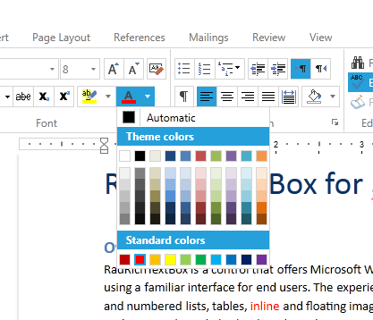

# Update Current Color in UI

The **FormattingColorPicker** is a color picker, which allows you to update the currently selected color of the content in the UI. It tracks the current color of the document element to update the selected color accordingly and it is used in **RadRichTextBox** to apply fore color, highlight color and paragraph background color.



## Using FormattingColorPicker

To use **FormattingColorPicker** you will need to add a reference to the **Telerik.Windows.Controls.RichTextBoxUI** assembly.

**Example 1** demonstrates how to add the control to your XAML and bind it to a command.

__Example 1: Add FormattingColorPicker__

```XAML

	<telerik:FormattingColorPicker ActiveColor="Red" telerik:RadRichTextBoxRibbonUI.RichTextCommand="{Binding ChangeFontForeColorCommand}"/>
```


>tipTo learn more about the commands exposed by the __RadRichTextBox__ and how to use them read [here]().


### ActiveColor property

This property gets or sets the active color which is shown on the bottom part of the drop down button. It keeps the currently selected color and it is updated according to the position of the caret.

## See Also

* [RadRichTextBoxRibbonUI]()

* [Commands in RadRichTextBox]()