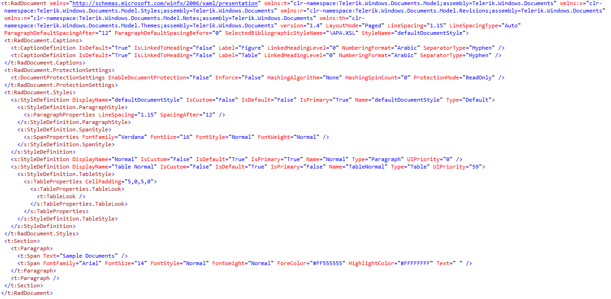

# XAML

The __[eXtensible Application Markup Language(XAML)](https://en.wikipedia.org/wiki/Extensible_Application_Markup_Language)__ is declaritive XML-based markup language develop by Microsoft for creating a rich graphical user interface(GUI). XAML language is the native __RadRichTextBox__ document format.

__XamlFormatProvider__  is compliant with the XAML markup language.

## See Also

 * [Getting Started]()
 * [Using XamlFormatProvider]()