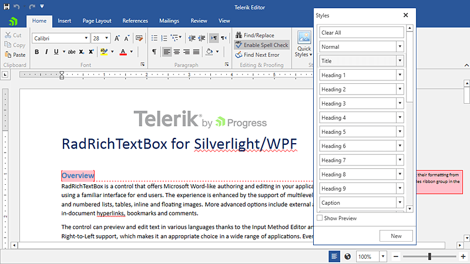

# WPF RichTextBox Overview

__RadRichTextBox__ is a control that can display and edit rich-text content including formatted text arranged in pages, paragraphs, spans (runs), tables, images, etc.





## Key Features

* __Rich Text Formatting__
	Telerik RadRichTextBox control allows you to apply diffent rich formatting options. You can find some of them listed below.	
	* Bold, Italic
	* Underline, Strike Through, Superscript and Subscript
	* Built-in Silverlight fonts and sizesUsage of all available system fonts 
	* Text color and background
	* Bullet and numbered lists
	* Paragraph alignment and indentation
	* Show/Hide formatting symbols
	* Clear Formatting 

* __Inserting pictures, symbols, hyperlinks and custom UI elements__:
	For more information, see the [InlineUIContainer]() article. You can also see the [InlineImage]() and [Hyperlink]() articles.

* __Table support__:
	The control allows you to display and create tables. This feature includes also support for nested tables, merging cells, setting different __RowSpan__ and __ColumnSpan__, tables with auto width, header row repeating on new pages, and more. For more information, see the [Table]() article.

* __Section Columns__:
	You can arrange the text into columns with equal or different width and set a separator between them. Find more information on how to use this feature in the [Section Columns UI]() and [Section Columns API]() articles.

* __Content controls__:
    Allows you to view and edit the content controls in the document. For more information, see the [Content Controls]() article.

* __Shapes__:
    You can create, modify and delete shapes of multiple types inside RadRichTextBox. Check out the [Shapes]() help topic for more details.

* __Format Painter__:
	The Format Painter feature enables you to copy the formatting of a particular content and paste it on other elements, so you can easily achieve the desired format. For more information about this functionality, check the [Format Painter]() topic.

* __Context menu__:
	A standard context menu is provided out of the box, but it can be easily customized or replaced with a user-defined menu. For more information, see the [Context Menu]() article.

* __SelectionMiniToolbar__:
	The rich text box component supports a floating toolbar that appears next to the selected element in the document. This feature is very similar to the one in MS Word, but can also be replaced with another mini toolbar. For more information, see the [Selection Mini Tool Bar]() article.

* __SpellChecker__:
	An extensible spell checking for different languages, using the built-in or custom dictionaries. For more information, see the [Spellcheck]() article.

* __Printing__:
	The printing feature allows you to use the native printing implementation of WPF. For more information, see the [Guidelines for Printing with RadDocument]() article.

* __Multi-level Undo/Redo Support__:
	Telerik __RadRichTextBox__ provides multilevel Undo/Redo support which allows past actions to be reviewed and reversed.For more information, see the [History]() article.

* __Three types of layout__:
	There are three layout types supported by the rich text box conrol - Paged, Flow (as text in an HTML page viewed in a browser) and FlowNoWrap. For more information, see the [Layout Modes]() help article.

* __Multi-region selection__:
	The built-in multi-region support enables you to perform various operations for more than one selection simultaneously. For more information, see the [Selection]() article.


* __Delete, Cut, Copy and Paste in plain text (using Silverlight's build-in clipboard). Copy/Paste in internal rich-text clipboard.__ For more information, see the [Clipboard Support]() article.


* __Rich-text clipboard__:
    The control allows rich text copy/paste from the clipboard. This includes rich text copied from applications like Word, OpenOffice etc. For more information, see the [Clipboard Support]() article. 
    * Different **[Paste Options]()** are supported as well.

* __Import/export__:
	Telerik RadRichTextBox allows you to load XAML, HTML, RTF, DOCX (rich-text) or TXT (plain text) into the control, you can format and edit it and then export it back to any of the above formats. The control also supports export to PDF. For more information, see the [Import/Export]() article.

* __Headers and Footers__:
	RadRichTextBox supports headers and footers in its document. For more information, see the [Headers and Footers]() article.

* __Track changes__:
	Support for tracking changes as formatting changes, adding and removing text, images, hyperlinks, tables, etc. This feature is useful when different people are working on the same document. For more information, see the [Track Changes]() article.

* __Bookmarks__:
	The control provides easy retrieval of previously marked parts of the document. For more information, see the [Bookmarks]() article.

* __Comments__:
	RadRichTextBox offers the ability to add text to the document which is not inserted directly in the page. For more information, see the [Comments]() article.

* __Document protection__:
	You can define editing restrictions in the document for a set of users and groups. For more information, see the [Document Protection]() article.

* __Mail merge__:
	The control makes populating a template document with data easy. For more information, see the [Mail Merge]() article.

* __Custom annotations__:
	You can extend the document model in order to serve specific needs. For more information, see the [Annotations Overview]() article.

* __Footnotes and Endnotes__:
	This feature is usually used to show the source of a material or add an explanation. For more information, see the [Footnotes and Endnotes]() article.

* __Bibliographic references__:
	This feature can be used for referencing a source in the form of text or pointing the source of a citation. For more information, see the [Bibliographic References]() article.

* __Cross-references__:
	References to a Heading, Caption or Bookmark can change along with their source. For more information, see the [Cross-Reference]() article.

* __Captions for tables and figures__:
	Images, tables, etc. can now be easily labeled. For more information, see the [Captions for Tables and Figures]() article.

* __Document variables__:
	The control provides a mechanism used for storing information in the document. For more information, see the [Document Variables]() article.

* __Code blocks__:
	This feature allows you to add source code fragments in a document. For more information, see the [Code Block]() article.

* __Line Numbering__:
	Add or customize line numbering to create the document content easy to refer to. For more information, see the [Line Numbering]() article.

## Telerik UI for WPF Support and Learning Resources

* [Telerik UI for WPF RichTextBox Homepage](https://www.telerik.com/products/wpf/richtextbox.aspx)
* [Get Started with the Telerik UI for WPF RichTextBox]()
* [Telerik UI for WPF API Reference](https://docs.telerik.com/devtools/wpf/api/)
* [Getting Started with Telerik UI for WPF Components]()
* [Telerik UI for WPF Virtual Classroom (Training Courses for Registered Users)](https://learn.telerik.com/learn/course/external/view/elearning/16/telerik-ui-for-wpf) 
* [Telerik UI for WPF RichTextBox Forums](https://www.telerik.com/forums/wpf)
* [Telerik UI for WPF Knowledge Base](https://docs.telerik.com/devtools/wpf/knowledge-base)

## See Also
 * [Getting Started]()
 * [Events]()
 * [Styles and Templates]()
 * [Useful Security Tips]()
