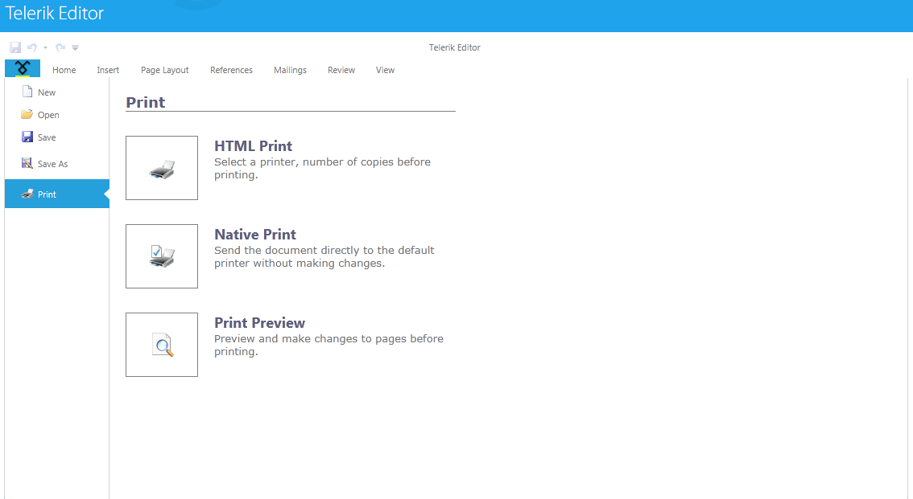

# Printing

__RadRichTextBox__ allows printing the __RadDocument__ instance shown in it. The following article describes the available printing modes, as well as how to use the respective for the feature API.
      

In order to take advantage of the printing functionality, the document you want to be printed has to be shown in a RadRichTextBox added to the Visual Tree. In cases when you do not wish to actually show the editor to the user you can set the height of the control to 0.
      

## PrintModes

These are the currently supported __PrintModes__:
        

* __Native__ - uses the default for the system print dialog. The option also allows printing silently in OOB applications with elevated trust to the default printer.
              

* __Html__ - exports the document in RadRichTextBox to HTML format using [HtmlFormatProvider]() and passes the exported document to the browser printing mechanism.
              
	>The option does not work in OOB applications.

* __HtmlPreview__ - exports the document in RadRichTextBox to HTML format using [HtmlFormatProvider]() and passes the exported document to a new browser window which shows a *Print* and a *Close* buttons along with the document. The *Print* button invokes the browser printing mechanism.

	>The option does not work in OOB applications.

>Html printing was introduced as a way to overcome a performance hit in Silverlight 4. In Silverlight 5 no such issue is observe, thus the recommend PrintMode is __Native__ (Silverlight vector) printing. However, issues may arise with certain printers related to printer settings, drivers and PostScript support. In such cases, forcing Silverlight 4 (bitmap) printing usually resolves the problem. More information on PrintSettings can be found  [here](#printing-programatically). 



* __Native__ - uses the default for the system print dialog. The option also allows printing silently to the default printer.

## Using UI



RadRichTextBox's predefined UI – [RadRichTextBoxRibbonUI](), allows you to choose one of the above-mentioned options from the *Print* backstage item of the ribbon. The buttons shown on the above picture are actually bound to the __PrintCommand__, so you can modify the UI to fit your needs.
        

In order to successfully execute the __PrintCommand__ you have to pass the wanted print mode as a __CommandParameter__:
        

#### __XAML__

{{region radrichtextbox-printing_0}}
    <telerik:RadRibbonButton Content="Print" DataContext="{Binding Commands, ElementName=radRichTextBox}" 
	  CommandParameter="Native" telerik:RadRichTextBoxRibbonUI.RichTextCommand="{Binding PrintCommand}" />
{{endregion}}

## Printing programatically

Additionally to using the UI, you can print by taking advantage of the __Print(string documentName, PrintMode mode)__ and __Print(PrintSettings printSettings)__ methods of __RadRichTextBox__.


As of Q3 2013 RadRichTextBox also provides a __Print(PrintDialog printDialog, PrintSettings printSettings)__ method. The method requires you to initialize the dialog first. This means that you could easily print silently to a printer different from the default one or modify other settings.
          

>importantYou can download a runnable project of this from our online SDK repository [here](https://github.com/telerik/xaml-sdk/tree/master/), the example is listed as __RichTextBox/CustomizePrinting__.


In the respective method, the __PrintMode__ corresponds to the mode in which you wish to print:
        

#### __C#__

{{region radrichtextbox-printing_0}}
    this.radRichTextBox.Print("My document", PrintMode.Native);
{{endregion}}

The __PrintSettings__ class holds all possible customization options when invoking printing:



* __DocumentName__ - specifies the name of the document.
              

* __PrintMode__ - the enumeration allows to select one of the predefined options [PrintModes](#printmodes).
              

* __PrintScaling__ - specifies whether the content of the document should shrink to page size if needed. The option is relevant for Native print mode only and by default content is shrunk to page size.
              

* __HtmlPrintExportSettings__ - when using Html or HtmlPreview printing, HtmlFormatProvider is used and it is possible to specify its export settings. More on import/export settings can be found [here]()

* __UseDefaultPrinter__ - forces silent printing. Can only be used in OOB application with elevated trust and is only relevant for Native printing mode.
              

* __ForceVector__ - forces vector printing in Silverlight 5. Its default value is true. If set to false, tries to execute vector printing and in case it fails the “old” bitmap printing is executed.
              

#### __C#__

{{region radrichtextbox-printing_1}}
    PrintSettings settings = new PrintSettings()
    {
        DocumentName = "My document",
        PrintMode = PrintMode.Html,
        UseDefaultPrinter = true,
        ForceVector = true
    };
    this.radRichTextBox.Print(settings);
{{endregion}}



* __DocumentName__ - specifies the name of the document.
              

* __PrintMode__ - the enumeration allows to select one of the predefined options [PrintModes](#printmodes).
              

* __PrintScaling__ - specifies whether the content of the document should shrink to page size if needed. The option is relevant for Native print mode only and by default content is shrunk to page size.
              

* __UseDefaultPrinter__ - forces silent printing. The option is only relevant for Native printing mode.
              

* __ForceVector__ - forces vector printing in Silverlight 5. Its default value is true. If set to false, tries to execute vector printing and in case it fails the “old” bitmap printing is executed.
              

* __PageRange__ - allows you to specify a single page or a range of pages which to be printed.
              

#### __C#__

{{region radrichtextbox-printing_2}}
    PrintSettings settings = new PrintSettings()
    {
        DocumentName = "My document",
        PrintMode = PrintMode.Native,
        PrintScaling = PrintScaling.None,
        UseDefaultPrinter = true,
        PageRange = new PageRange(2, 4)
    };

    this.radRichTextBox.Print(settings);
{{endregion}}



