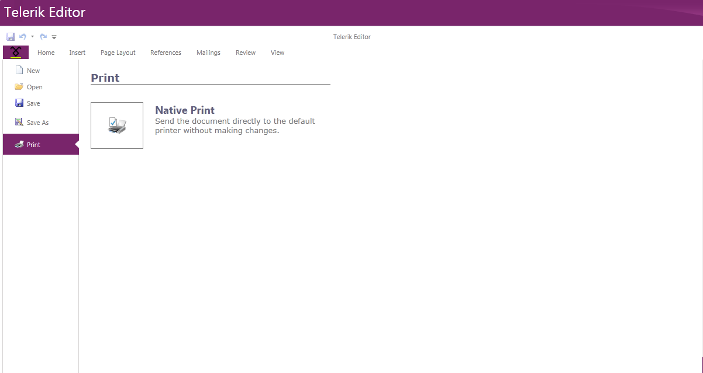

# Printing

__RadRichTextBox__ allows printing the __RadDocument__ instance shown in it. The following article describes the available printing modes, as well as how to use the respective for the feature API.      

In order to take advantage of the printing functionality, the document you want to be printed has to be loaded in a `RadRichTextBox` control added to the visual tree of the WPF application. If the editor shouldn't be visible for the end-user, you can set its `Height` property to 0.

The printing feature uses the .NET native printing APIs. 

## Using UI



RadRichTextBox's predefined UI – [RadRichTextBoxRibbonUI](), allows you to choose one of the above-mentioned options from the *Print* backstage item of the ribbon. The buttons shown on the above picture are actually bound to the __PrintCommand__, so you can modify the UI to fit your needs.        

In order to successfully execute the __PrintCommand__ you have to pass the wanted print mode as a __CommandParameter__:        

  
```XAML
    <telerik:RadRibbonButton Content="Print" DataContext="{Binding Commands, ElementName=radRichTextBox}" 
	  CommandParameter="Native" telerik:RadRichTextBoxRibbonUI.RichTextCommand="{Binding PrintCommand}" />
```

## Printing programatically

Additionally to using the UI, you can print by taking advantage of the `Print(string documentName, PrintMode mode)` and `Print(PrintSettings printSettings)` methods of `RadRichTextBox`.

RadRichTextBox also provides a `Print(PrintDialog printDialog, PrintSettings printSettings)` method. The method requires you to initialize the dialog first. This means that you could easily print silently to a printer different from the default one or modify other settings.          

>important You can download a runnable project of this from our online SDK repository [here](https://github.com/telerik/xaml-sdk/tree/master/), the example is listed as __RichTextBox/CustomizePrinting__.

  
```C#
    this.radRichTextBox.Print("My document", PrintMode.Native);
```

The __PrintSettings__ class holds all possible customization options when invoking printing:

* __DocumentName__ - specifies the name of the document.              

* __PrintMode__ - the enumeration allows to select one of the predefined options PrintModes.

* __PrintScaling__ - specifies whether the content of the document should shrink to page size if needed. The option is relevant for Native print mode only and by default content is shrunk to page size.              

* __UseDefaultPrinter__ - forces silent printing. The option is only relevant for Native printing mode.              

* __PageRange__ - allows you to specify a single page or a range of pages which to be printed.

  
```C#
    PrintSettings settings = new PrintSettings()
    {
        DocumentName = "My document",
        PrintMode = PrintMode.Native,
        PrintScaling = PrintScaling.None,
        UseDefaultPrinter = true,
        PageRange = new PageRange(2, 4)
    };

    this.radRichTextBox.Print(settings);
```
