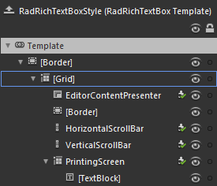

# Template Structure

## 

Like most controls, __RadRichTextBox__ also allows you to template it in order to change the control from the inside. Except for templating the whole control, you can template only parts of it or even independent controls related to it. This topic will make you familiar with the structure of __RadRichTextBox's__ template. Here is a snapshot of the template generated in Expression Blend.

It contains the following parts:

* __[Border]__ - represents the background and the border of the __RadRichTextBox__, and is of type __Border__.

* __[Grid]__ - hosts the __RadRichTextBox__ layout and is of type __Grid__.

* __EditorContentPresenter__ - represents the document area of the __RadRichTextBox__ and is of type __EditorContentPresenter__.

* __[Border]__ - represents the visual element in the right bottom corner that appears, when both of the scroll bars are visible. It's of type __Border__.

* __HorizontalScrollBar__ - represents the horizontal scroll bar and is of type __ScrollBar__.

* __VerticalScrollBar__ - represents the vertical scroll bar and is of type __ScrollBar__.

* __PrintingScreen__

* __[TextBlock]__

## See Also

 * [Styles and templates - Overview]()

 * [Styling the RadRichTextBox]()
