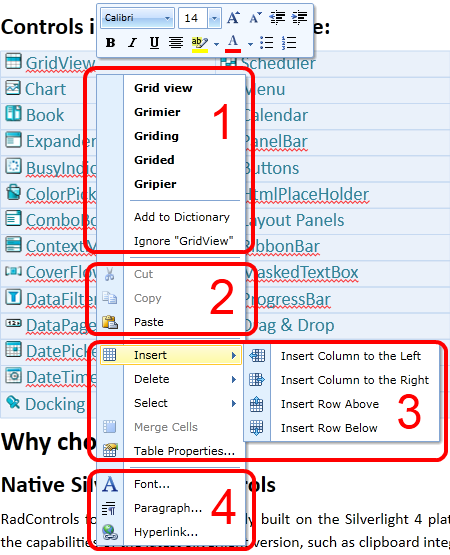
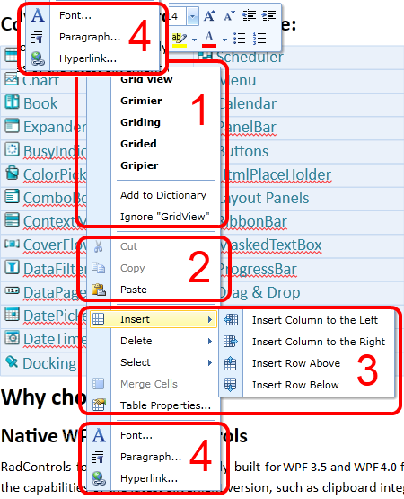
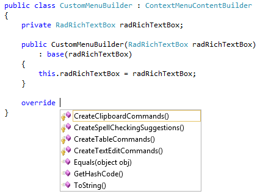

# Context Menu

The __ContextMenu__ is showed on right click over the __RadRichTextBox__, and contains some context specific commands arranged in groups – there are groups for spellchecking (1), clipboard (2), table editing (3) and text editing commands (4) as shown here:
      





Besides replacing the default __ContextMenu__ (by implementing __IContextMenu__ and marking it with __CustomContextMenuAttribute__, as shown [here](http://blogs.telerik.com/xamlteam/posts/10-11-17/customizing-radrichtextbox-s-contextmenu-and-selectionminitoolbar.aspx)), there are some more customization approaches:
      

* [Handling the Showing event](#handling-the-showing-event)

* [Use ContextMenuBuilder class](#use-contextmenubuilder-class)

## Handling the Showing event

The first one involves subscribing to the __Showing__ event of the default __ContextMenu__. The __Showing__ event is not part of the __IContextMenu__ interface, so in order to subscribe to it you need a cast to the __ContextMenu__ class (the default implementation of __IContextMenu__ in __Telerik.Windows.Documents.RadRichTextBoxUI.dll__). Here is an example of this approach.
        

#### __C#__

{{region radrichtextbox-features-context-menu_0}}
	public ContextMenuSample()
	{
	    InitializeComponent();
	    ContextMenu contextMenu = (ContextMenu)this.radRichTextBox.ContextMenu;
	    contextMenu.Showing += this.ContextMenu_Showing;
	}
	//In the event handler you can check the context relevant items and add some RadMenuItems if needed.
	private void ContextMenu_Showing(object sender, ContextMenuEventArgs e)
	{
	    // First check the context - if caret is in table, add our item
	    if (this.radRichTextBox.Document.CaretPosition.IsPositionInsideTable)
	    {
	        RadMenuItem makeCellYellowMenuItem = new RadMenuItem()
	        {
	            Header = "Make Cell Yellow"
	        };
	        makeCellYellowMenuItem.Click += this.MakeCellYellowMenuItem_Click;
	        ContextMenuGroup customContextMenuGroup = new ContextMenuGroup();
	        customContextMenuGroup.Add(makeCellYellowMenuItem);
	        e.ContextMenuGroupCollection.Add(customContextMenuGroup);
	    }
	}
	private void MakeCellYellowMenuItem_Click(object sender, RadRoutedEventArgs e)
	{
	    TableCell currentCell = this.radRichTextBox.Document.CaretPosition.GetCurrentTableCellBox().AssociatedTableCell;
	    currentCell.Background = Colors.Yellow;
	    this.radRichTextBox.UpdateEditorLayout();
	}
	{{endregion}}

#### __VB.NET__

{{region radrichtextbox-features-context-menu_1}}
	Public Sub New()
	 InitializeComponent()
	 Dim _contextMenu As ContextMenu = CType(Me.radRichTextBox.ContextMenu, ContextMenu)
	 AddHandler _contextMenu.Showing, AddressOf ContextMenu_Showing
	End Sub
	'In the event handler you can check the context relevant items and add some RadMenuItems if needed.
	Private Sub ContextMenu_Showing(ByVal sender As Object, ByVal e As ContextMenuEventArgs)
	 ' First check the context - if caret is in table, add our item
	 If Me.radRichTextBox.Document.CaretPosition.IsPositionInsideTable Then
	  Dim makeCellYellowMenuItem As New RadMenuItem() With {.Header = "Make Cell Yellow"}
	  AddHandler makeCellYellowMenuItem.Click, AddressOf MakeCellYellowMenuItem_Click
	  Dim customContextMenuGroup As New ContextMenuGroup()
	  customContextMenuGroup.Add(makeCellYellowMenuItem)
	  e.ContextMenuGroupCollection.Add(customContextMenuGroup)
	 End If
	End Sub
	Private Sub MakeCellYellowMenuItem_Click(ByVal sender As Object, ByVal e As RadRoutedEventArgs)
	 Dim currentCell As TableCell = Me.radRichTextBox.Document.CaretPosition.GetCurrentTableCellBox().AssociatedTableCell
	 currentCell.Background = Colors.Yellow
	 Me.radRichTextBox.UpdateEditorLayout()
	End Sub
{{endregion}}

## Use ContextMenuBuilder class

The second approach is more suitable when you need to reuse the customization across several __RadRichTextBox__ instances/applications. Here you can either implement the __IContextMenuContentBuilder__ interface or derive from the __ContextMenuContentBuilder__ class and override some of its protected methods which are responsible for the creation of each context menu group:
        

Now you can simply assign the instance of your class to the __ContentBuilder__ property of the context menu:
        

#### __C#__

{{region radrichtextbox-features-context-menu_2}}
	ContextMenu contextMenu = (ContextMenu)this.radRichTextBox.ContextMenu;
	contextMenu.ContentBuilder = new CustomContextMenuContentBuilder(this.radRichTextBox);
	{{endregion}}

#### __VB.NET__

{{region radrichtextbox-features-context-menu_3}}
	Dim _contextMenu As ContextMenu = CType(Me.radRichTextBox.ContextMenu, ContextMenu)
	_contextMenu.ContentBuilder = New CustomContextMenuContentBuilder(Me.radRichTextBox)
	{{endregion}}

And of course, for those of you who don’t need additional UI pop-ups, these can be disabled by setting the __IsContextMenuEnabled__ property of the __RadRichTextBox__ to __False__.
        
