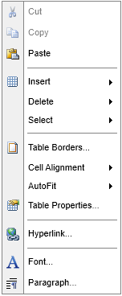
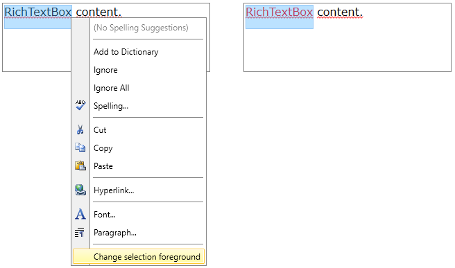

# Context Menu

The __RadRichTextBox__ UI has a built-in context menu feature which can be used to easily customize different elements in a document. The menu is displayed when you __mouse right click__ on the RadRichTextBox control. It contains some context specific commands arranged in groups. There are groups for spellchecking, clipboard, table editing and text editing.

> The context menu is available only when the __Telerik.Windows.Controls.RichTextBoxUI__ dll is referenced in the project.

#### __Figure 1: Menu in the context of a table__


The context menu is enabled by default. You can control this with the __IsContextMenuEnabled__ property. If you set the property to False, the [Selection Mini Tool Bar]() will be displayed when you click the mouse right button.

__Example 1: Disabling the context menu__

```XAML
	<telerik:RadRichTextBox IsContextMenuEnabled="False"/>
```

The menu is accessible through the __ContextMenu__ property of __RadRichTextBox__ control.

> The context menu instance is cached and shared between all the instances of RadRichTextBox in an application.
	
The RichTextBox default context menu can be fully replaced by an object that implements the __IContextMenu__ interface which is marked with __CustomContextMenuAttribute__. Additionally, the menu can be customized by adding, removing and modifying menu groups and items. You can do that by using the __Showing__ event of the menu or by creating a custom content builder and override its construction methods.

* [Using the Showing event](#using-the-showing-event)
* [Creating custom content builder](#creating-custom-content-builder)

## Using the Showing Event

You can customize the default context menu by subscribing for its __Showing__ event. The following example shows how to add menu items.

__Example 2: Subscribing to the Showing event__
```C#

	Telerik.Windows.Controls.RichTextBoxUI.ContextMenu contextMenu = (Telerik.Windows.Controls.RichTextBoxUI.ContextMenu)this.radRichTextBox.ContextMenu;
	contextMenu.Showing += RichTextBox_ContextMenuShowing;
```
	
__Example 3: Adding and removing menu items__

```C#
	private void RichTextBox_ContextMenuShowing(object sender, Telerik.Windows.Controls.RichTextBoxUI.Menus.ContextMenuEventArgs e)
	{
		if (!this.radRichTextBox.Document.Selection.IsEmpty)
		{
			RadMenuItem menuItem = new RadMenuItem()
			{
				Header = "Change selection foreground"
			};
			menuItem.Click += this.OnChangeSelectionForeground;

			ContextMenuGroup contextMenuGroup = new ContextMenuGroup();
			contextMenuGroup.Add(menuItem);
			e.ContextMenuGroupCollection.Add(contextMenuGroup);
		}
	}

	private void OnChangeSelectionForeground(object sender, RadRoutedEventArgs e)
	{
		this.radRichTextBox.ChangeTextForeColor(Colors.Red);
	}
```
	
The Showing event is not presented in the IContextMenu interface so you will need to cast the ContextMenu property to __Telerik.Windows.Controls.RichTextBoxUI.ContextMenu__.
	
#### __Figure 2: Executing the action of the new added item__  

	
You can use this approach also to remove or modify menu groups and items. They can be accessed via the __ContextMenuGroupCollection__ property of the event arguments.

## Creating Custom Content Builder

You can customize the default context menu by creating a custom content builder and assign it to the __ContentBuilder__ property of the __ContextMenu__. 

__Example 4: Creating custom content builder__

```C#
	public class CustomContextMenuBuilder : ContextMenuContentBuilder
    {
        public override ContextMenuGroupCollection Construct()
        {
            var groupsCollection = base.Construct();
            if (!this.RadRichTextBox.Document.Selection.IsEmpty)
            {
                RadMenuItem menuItem = new RadMenuItem()
                {
                    Header = "Change selection foreground"
                };
                menuItem.Click += this.OnChangeSelectionForeground;

                ContextMenuGroup contextMenuGroup = new ContextMenuGroup();
                contextMenuGroup.Add(menuItem);
                groupsCollection.Add(contextMenuGroup);                
            }
            return groupsCollection;
        }

        private void OnChangeSelectionForeground(object sender, RadRoutedEventArgs e)
        {
            this.RadRichTextBox.ChangeTextForeColor(Colors.Red);
        }
    }
```
	
__Example 5: Setting the content builder__
```C#
	Telerik.Windows.Controls.RichTextBoxUI.ContextMenu contextMenu = (Telerik.Windows.Controls.RichTextBoxUI.ContextMenu)this.radRichTextBox.ContextMenu;
	contextMenu.ContentBuilder = new CustomContextMenuBuilder();
```
			
__Figure 2__ shows how this modification affects the context menu.

The __ContextMenuContentBuilder__ class exposes several method overrides which can be used to customize different groups from the context menu. The following list contains the overrides with short descriptions.

* __`Construct`__: This method creates all groups allowed in the specific context determined by the RadRichTextBox control.
* __`CreateClipboardCommands`__: This method creates the groups containing menu items with commands related to the clipboard (copy, cut, paste, etc.).
* __`CreateCodeBlockCommands`__: This method creates the groups containing menu items with commands related to the code blocks.
* __`CreateFieldCommands`__: This method creates the groups containing menu items with commands related to the fields.
* __`CreateFloatingBlockCommands`__: This method creates the groups containing menu items with commands related to the floating blocks.
* __`CreateHeaderFooterCommands`__: This method creates the groups containing menu items with commands related to the headers/footers.
* __`CreateHyperlinkCommands`__: This method creates the groups containing menu items with commands related to the hyperlinks.
* __`CreateImageCommands`__: This method creates the groups containing menu items with commands related to the images.
* __`CreateListCommands`__: This method creates the groups containing menu items with commands related to the lists.
* __`CreateSpellCheckingSuggestions`__: This method creates the groups containing menu items with commands releated to the spellchecking suggestions.
* __`CreateTableCommands`__: This method creates the groups containing menu items with commands related to the tables.
* __`CreateTextEditCommands`__: This method creates the groups containing menu items with commands related to the text editing.
* __`CreateTrackChangesCommands`__: This method creates the groups containing menu items with commands related to the track changes.

> If you prefer, instead of deriving from the __ContextMenuContentBuilder__ class, the custom builder can implement the __IContextMenuContentBuilder__ interface and construct the groups from scratch.

## Using Different Context Menus 

By default, the context menu is cached and used by all instances of RadRichTextBox in the application. If you would like to use separate context menus for the different instances of RadRichTextBox, you can use the code from **Example 6** to reset that behavior.

__Example 6: Use separate context menu for an instance of RadRichTextBox__
```C#
      
    this.radRichTextBox.ContextMenu = new Telerik.Windows.Controls.RichTextBoxUI.ContextMenu();
    Telerik.Windows.Controls.RichTextBoxUI.ContextMenu contextMenu = (Telerik.Windows.Controls.RichTextBoxUI.ContextMenu)this.radRichTextBox.ContextMenu;
    contextMenu.ContentBuilder = new CustomContextMenuBuilder();
```


## See Also
* [Getting Started]()
* [Selection Mini Tool Bar]()
* [RadRichTextBoxRibbonUI]()
