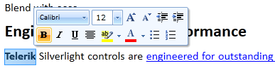
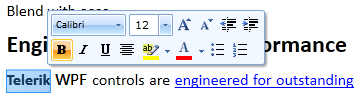

# Selection Mini Tool Bar

## 

__SelectionMiniToolBar__ is a floating toolbar that appears next to the current position after making a selection with the mouse in the document. It contains some useful commands for formatting text.
  







As __RadRichTextBox__ loads the default __SelectionMiniToolBar__ using [MEF](http://mef.codeplex.com/), it can be completely replaced with a custom one. This can be done as easy as with the other __RadRichTextBox__ dialogs by implementing the interface __ISelectionMiniToolBar__ and marking the class that implements it with the __CustomSelectionMiniToolBarAttribute__  attribute.  The technique was also described in greater details in [this blog post](http://blogs.telerik.com/xamlteam/posts/10-09-28/some-tricks-with-mef-up-the-sleeve-of-radrichtextbox-for-silverlight.aspx).
        

And of course, for those of you who don't need additional UI pop-ups, these can be disabled by setting the __IsSelectionMiniToolBarEnabled__ property of __RadRichTextBox__ to __False__.
        
