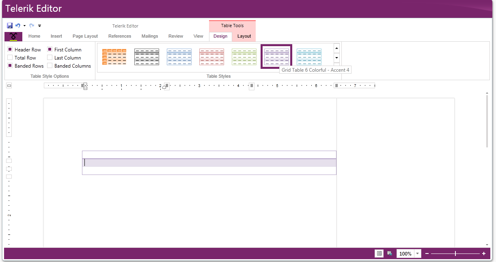
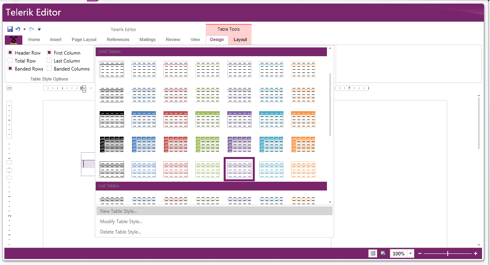
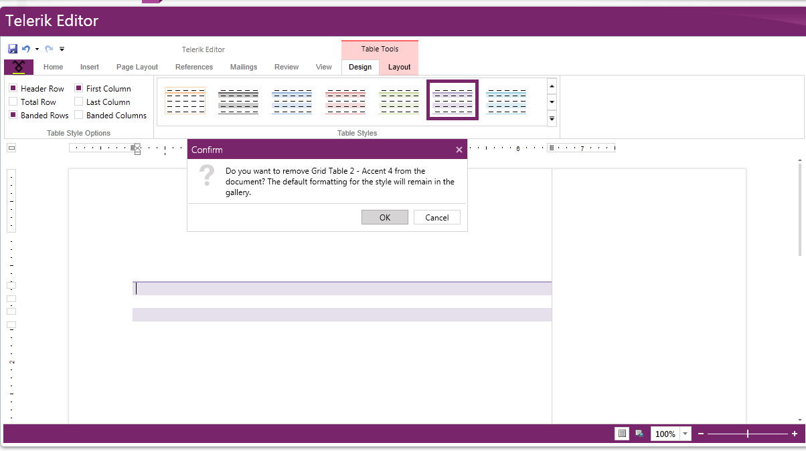

# Table Styles Gallery


RadRichTextBox's concept of styles allows you to use a predefined set of formatting options for different document elements. More about this you can learn in the Styles article [here]().
      

One of the supported type of styles is Table styles. The __TableStylesGallery__ was introduced as a way to easily create, delete, modify and apply table styles in a document. The gallery initially loads all the table styles which are present in the document and a set of built-in styles. Currently built-in styles for Office2010 and Office2013 are supported and you can easily configure which version to be used.
      

## How to Use TableStylesGallery

In order to take advantage of the TableStylesGallery you have to add references to the following assemblies:
        

* Telerik.Windows.Controls.Input
            

* Telerik.Windows.Controls.Navigation
            

* Telerik.Windows.Controls.RibbonView
            

* Telerik.Windows.Controls.RichTextBoxUI
            

>tip All pop-ups that RadRichTextBox uses (context menu, dialogs, etc.) as well as all controls used in [RadRichTextBoxRibbonUI]() are located in the Telerik.Windows.Controls.RichTextBoxUI assembly. However, you can use the TableStylesGallery alone without the whole predefined ribbon.
          

The below snippet is an example of TableStylesGallery:
        


```XAML
    <telerik:TableStylesGallery
        AssociatedRichTextBox="{Binding ElementName=radRichTextBox, Mode=OneWay}"
        BuiltInStylesVersion="Office2013"/>
```


__BuiltInStylesVersion__ is an enumeration which specifies which version of the built-in styles should be loaded in the gallery. If not specified, the gallery uses Office2013 table styles.
        

## Apply Table Style

Applying a Table Style from the TableStylesGallery is easy and intuitive. You can apply a style from the preview or open the gallery and chose one of the styles using the popup.
        


## Add Table Style

You can create a new Table style by invoking the *Create New Style* dialog. This can be done by clicking on the  *New Table Style... * menu item in the popup.
       


## Modify Table Style

All table styles can be modified using the *Modify Table Style…* menu item. When the item is clicked the *Modify Style* dialog is shown with the selected style.
        

## Delete Table Style

All table styles can be deleted using the *Delete Table Style…* menu item. If the selected style is custom, then it is removed from the gallery. Otherwise it is simply removed from the selected (or focused) table.
        


## Changing the Table Style Options

When the *Table Style Options* are changed the gallery automatically updates all the table styles appropriate to the current set of options. When user clicks between tables the Table Style Options are automatically changed based on the options of the current selected table.
        

## See Also

 * [Styles]()

 * [RadRichTextBoxRibbonUI]()
