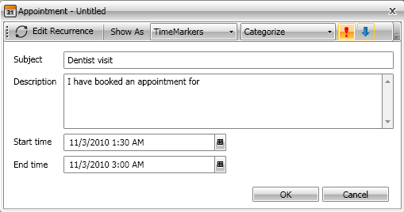

# Edit Appointment

This topic describes the work flow for editing an appointment in __RadScheduleView__ control.

## Using UI

__RadScheduleView__ uses one and the same dialog to create and edit appointments. This topic describes the end-user's work flow for editing an existing appointment.



* In order to edit an appointment just double click it in the __RadScheduleView__.

* If the appointment is not a recurrent one, the edit appointment dialog appears immediately. 

* After the edit appointment dialog is opened, you can change the Subject, Description, Start and End time of the appointment.

* You can also change or assign category, time marker or importance by using the tool bar controls.

* You can also change the appointment recurrent.

* If you have completed the appointment edit, click the 'Save & Close' button or press the __Enter__ key.

* If you want to cancel the appointment creation, click the X button or press the __Esc__ key.

## Using code

You can edit an appointment using the code. Here are the steps to accomplish this:

1. Call __BeginEdit()__ method of the __RadScheduleView__ control. It returns whether or not  the appointment or the occurrence can be edited. This method has 3 overloads:
          

1. If __BeginEdit()__ returns __True__ - edit the appointment or the occurrence.
          

1. Call __Commit()__ method to commit the changes and to update the __UI__.
          


```C#
	if (this.radScheduleView.BeginEdit(appointment))
	{
	    appointment.Subject = "New Subject";
	    this.radScheduleView.Commit();
	}
```
```VB.NET
	If Me.radScheduleView.BeginEdit(appointment) Then
	 appointment.Subject = "New Subject"
	 Me.radScheduleView.Commit()
	End If
```

## See Also

 * [Understanding Appointments]()

 * [Create Appointment]()

 * [Delete Appointment]()
