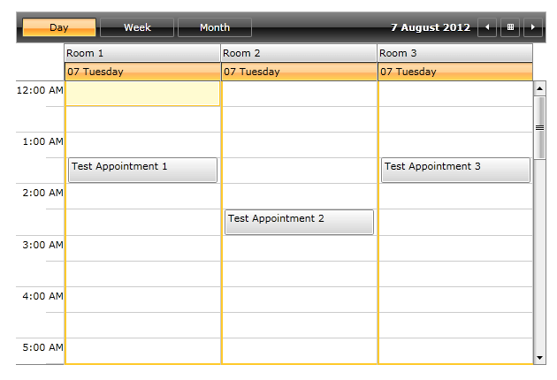
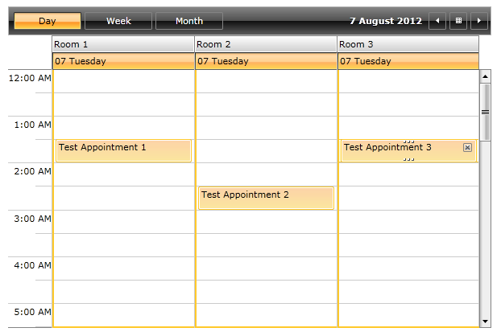
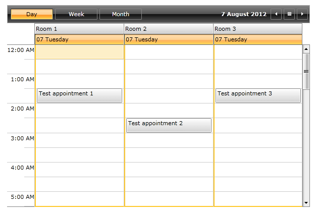
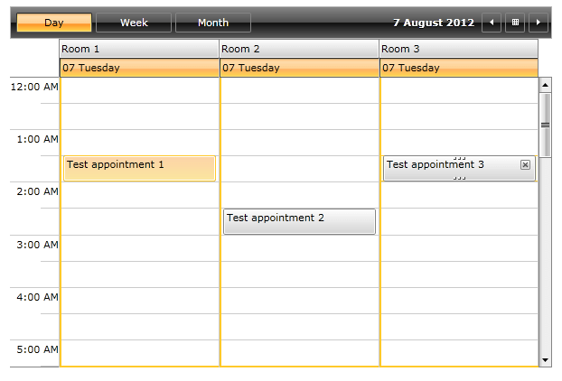

# AppointmentSelectionBehavior

In RadScheduleView there are plugin selection behaviors that make it possible to customize the logic behind all selections in the control. There are selection behaviors like AppointmentSelectionBehavior, SlotSelectionBehavior etc.

AppointmentSelectionBehavior is responsible for executing the selection logic of appointments in the control. Its default behavior is for single, multiple and extended selection. It is possible to customize the behavior in order to restrict selecting appointments in different resources, selecting more than one appointment etc.

## Synchronize with CurrentAppointment

The AppointmentSelectionBehavior exposes an `IsSynchronizedWithCurrentItem` property which determines whether the `CurrentAppointment` and `SelectedAppointment` properties will be synchronized (have the same value).

The default AppointmentSelectionBehavior used by the RadScheduleView control has its IsSynchronizedWithCurrentItem set to `True`, but you can change this as demonstrated in the next examples.

__Set IsSynchronizedWithCurrentItem to False__

<snippet id='radscheduleview-features-appointment-selection-behavior-block_1-xaml' />

__Set IsSynchronizedWithCurrentItem to False__

<snippet id='radscheduleview-features-appointment-selection-behavior-block_2-cs' />
<snippet id='radscheduleview-features-appointment-selection-behavior-block_3-vb' />

## Disable Multiple Appointments Selection Based on ResourceName

This tutorial will go through on how to create a custom AppointmentSelectionBehavior in the scenario when there are different resources in the ScheduleView control and it is required to disable simultaneous selection of appointments in different resource groups.

>Before proceeding with this tutorial first read about [Resources in RadScheduleView]().

* Create CustomAppointmentSelectionBehavior class that inherits AppointmentSelectionBehavior class:

<snippet id='radscheduleview-features-appointment-selection-behavior-block_4-cs' />

* Override the GetSelectedAppointments method:

<snippet id='radscheduleview-features-appointment-selection-behavior-block_5-cs' />

* All that is left is to attach the newly created custom behavior to the ScheduleView:

<snippet id='radscheduleview-features-appointment-selection-behavior-block_6-xaml' />

Finally the ScheduleView control in the XAML should look like this:

<snippet id='radscheduleview-features-appointment-selection-behavior-block_7-xaml' />

The end result is:

* With the default AppointmentSelectionBehavior (before selection):

* With the default AppointmentSelectionBehavior (after selection with pressed Ctrl or Shift keyboard key):

* With the custom AppointmentSelectionBehavior (before selection):

* With the custom AppointmentSelectionBehavior (after selection with pressed Ctrl or Shift keyboard key):

## See Also

 * [Resources]()

 * [SlotSelectionBehavior]()