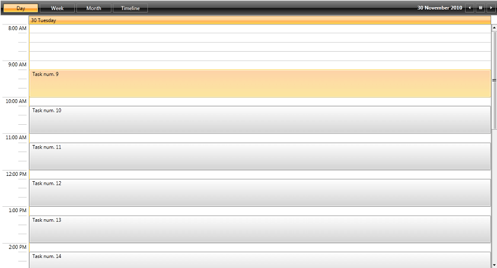
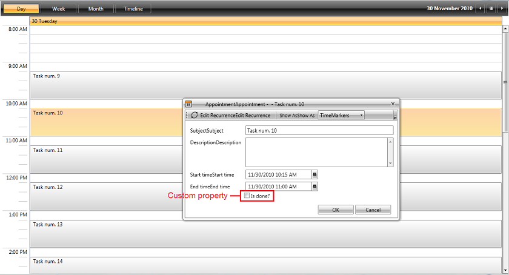
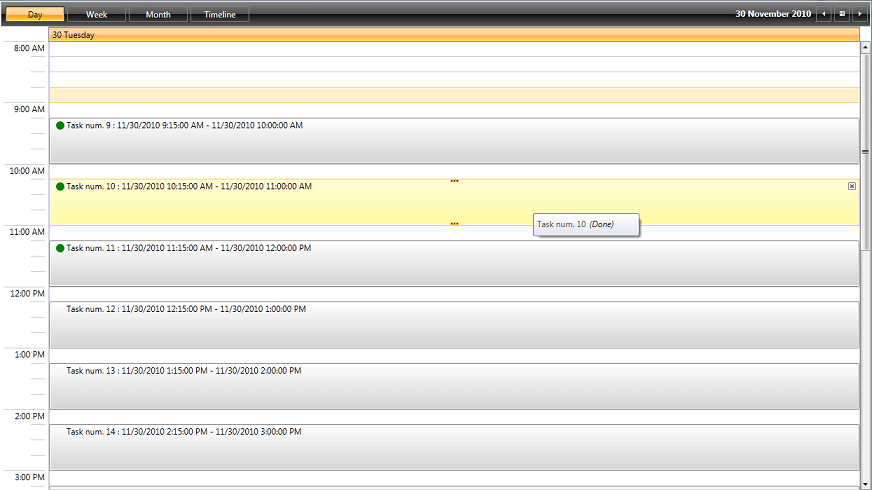

# Custom Appointment

A very common scenario when using RadScheduleView is the usage of custom appointments. When you create a __Custom Appointment__ class you gain the ability to append additional properties to the base Appointment class, to add them to your custom AppointmentItem and optionally to its ToolTip, display them in the EditAppointment dialog while supporting the cancelation of editing.      

In this article we will explore the process of using custom appointments in RadScheduleView. We will go through the following steps:

* [Create a custom appointment class and populate the RadScheduleView control with custom appointments](#creating-a-custom-appointment-class)

* [Modify the EditAppointment dialog to display the custom data of the newly created custom appointment class](#creating-a-custom-appointment-dialog)

* [Customize the AppointmentItem and its ToolTip to display the new data ](#changing-the-style-of-the-appointmentitem)

## Creating a Custom Appointment Class

To create a custom appointment class you can start off with either of the following approaches : you can implement the __IAppointment__ interface or  you can inherit from one of the classes that already implement this interface – __AppointmentBase__ (the base implementation of the interface) or __Appointment__ (an extended implementation). It is very important to provide your own implementations for the __Copy__ and __CopyFrom__ methods as they are used intensively in the editing process of the ScheduleView control. If you choose to implement the interface, the Copy and CopyFrom methods will be automatically implemented for you, but if you take the second approach and inherit from one of the base classes, you should keep this in mind.        

Let's create a simple task tracking system. For our Custom Appointment class we will inherit from __Appointment__. Our tracking system will need  to show an additional field for the task progress – an indication of whether the task has finished or not. In order to enable editing in transactions of the new property we need to use the __Storage__ method of the __AppointmentBase__ class to access the instance which owns the fields. We will name our custom appointment class __Task.__ __Example 1__ shows the creation of the Custom Appointment class:        

>important When inheriting the AppointmentBase class it is required to create a parameter-less constructor for the the custom class.

__Example 1: Create Custom Appointment__

```C#
	public class Task:Appointment
	{
	    private bool isDone;
	    public bool IsDone
	    {
	        get
	        {
	             return this.Storage<Task>().isDone;
	        }
	        set
	        {
	             var storage = this.Storage<Task>();
	             if (storage.isDone != value)
	             {
	                  storage.isDone = value;
	                  this.OnPropertyChanged(() => this.IsDone);
	             }
	        }
	    }
	    public override IAppointment Copy()
	    {
	        var newAppointment = new Task();
	        newAppointment.CopyFrom(this);
	        return newAppointment;
	    }
	    public override void CopyFrom(IAppointment other)
	    {
	        var task = other as Task;
	        if (task != null)
	        {
	                this.IsDone = task.IsDone;
	        }
	        base.CopyFrom(other);
	    }
	}
```
```VB.NET
	Public Class Task
	 Inherits Appointment
	 Private m_isDone As Boolean
	 Public Property IsDone() As Boolean
	  Get
	   Return Me.Storage(Of Task)().m_isDone
	  End Get
	  Set
	   Dim storage = Me.Storage(Of Task)()
	   If storage.m_isDone <> value Then
	    storage.m_isDone = value
	    Me.OnPropertyChanged("IsDone")
	   End If
	  End Set
	 End Property
	 Public Overrides Function Copy() As IAppointment
	  Dim newAppointment = New Task()
	  newAppointment.CopyFrom(Me)
	  Return newAppointment
	 End Function
	 Public Overrides Sub CopyFrom(other As IAppointment)
	  Dim task = TryCast(other, Task)
	  If task IsNot Nothing Then
	   Me.IsDone = task.IsDone
	  End If
	  MyBase.CopyFrom(other)
	 End Sub
	End Class
```

For the next step, it is important to set the __AppointmentsSource__ of RadScheduleView to be of type __IList<Task>__, because this way the ScheduleView knows that our custom appointments should be of type __Task__. __Example 2__ demonstrates how to create an __ObservableCollection<Task>__.        

__Example 2: Create the TasksCollection__

```C#
	public MainWindow()
	{
		InitializeComponent();
		
		// "this.scheduleView" refers to the RadScheduleView instance that we are targetting
		this.scheduleView.AppointmentsSource = new TasksCollection();
	}

	public class TasksCollection : ObservableCollection<Task>
	{
	    public TasksCollection()
	    {
	         DateTime today = DateTime.Today;
	         foreach (Task t in Enumerable.Range(9, 14).Select(i =>
	            new Task
	            {
	                 Start = today.AddMinutes(i * 60 + 15),
	                 End = today.AddMinutes((i + 1) * 60),
	                 Subject = string.Format("Task num. {0}",i),
	                 IsDone = today.AddMinutes((i + 1) * 60) < DateTime.Now
	             }))
	         {
	          this.Add(t);
	         }
	    }
	}
```
```VB.NET
	Public Sub New()
		InitializeComponent()

		' "this.scheduleView" refers to the RadScheduleView instance that we are targetting
		Me.scheduleView.AppointmentsSource = New TasksCollection()
	End Sub

	Public Class TasksCollection
		Inherits ObservableCollection(Of Task)

			Public Sub New()
				Dim today As Date = Date.Today
				For Each t As Task In Enumerable.Range(9, 14).Select(Function(i) New Task With {
					.Start = today.AddMinutes(i * 60 + 15),
					.End = today.AddMinutes((i + 1) * 60),
					.Subject = String.Format("Task num. {0}",i),
					.IsDone = today.AddMinutes((i + 1) * 60) < Date.Now
				})
				Me.Add(t)
				Next t
			End Sub
	End Class
```

#### __Figure 1: Result from Example 2__



## Creating a Custom Appointment Dialog

In order to create a custom appointment dialog we are going to modify the __EditAppointmentDialogStyle__ property of __RadScheduleView__ control. The DataContext of the __SchedulerDialog__, which is the __TargetType__ of this style is an __AppointmentDialogViewModel__ object. This class contains all needed data for editing an appointment including the Appointment itself. It can be reached by using the __Occurrence__ property of the ViewModel and subsequently the __Appointment__ property of __Occurrence.__ 

Now that we have our custom IsDone property, let's add a CheckBox for it and bind to it. In order to do that, you need to extract and modify the default ControlTemplate of the EditAppointmentDialog with x:Key="EditAppointmentTemplate". You can locate it in the "Themes.Implicit\"your theme"\Themes\" directory inside the UI for WPF installation folder. The template along with the style through which it can be applied with x:Key="EditAppointmentDialogStyle", can be found in the "Telerik.Windows.Controls.ScheduleView.xaml" file. For more information about extracting and modifying the dialog ControlTemplates, check out the [How to extract the default styles of the dialogs](#how-to-extract-the-default-styles-of-the-dialogs) section in our documentation.

After you have extracted the default __EditAppointmentTemplate__, you can add a CheckBox as demonstrated in __Example 3__ which can replace the CheckBox with x:Name="AllDayEventCheckbox".

__Example 3: Bind the IsDone property__

```XAML
	 <CheckBox Grid.Row="4" Grid.Column="1" Margin="3" Content="Is done?" IsChecked="{Binding Occurrence.Appointment.IsDone, Mode=TwoWay}"/>
```

#### __Figure 2: Result from Example 3__


>tip The important thing to note here is that we can bind to our new properties using __Occurrence.Appointment__.

## Changing the Style of the AppointmentItem

Next, we are going to change the ControlTemplate of the AppointmentItem to reflect which tasks are done and which are not. We will do that by using the __AppointmentStyleSelector__ property of the __RadScheduleView__. For more information on extracting and modifying the default style selector, check out the [Appointment Style]() article. For the purposes of this example we will modify the ControlTemplate of the __VerticalStyle__ property.

The __DataContext__ of the AppointmentItem's ControlTemplate represents an __AppointmentProxy__, which holds the most important properties of the Appointment and the Appointment itself. We want to display a green dot for all tasks that are done. We will achieve this by adding an Ellipse in the __ControlTemplate__ and then binding its __Visibility__ to the __IsDone__ property of the __Task__ through a converter. The Ellipse demonstrated in __Example 4__ is added to the ControlTemplate of the VerticalStyle. The ControlTemplate's key is "AppointmentItemVerticalControlTemplate". You can refer to the [Editing Control Templates]() article for more information about extracting ControlTemplates.

__Example 4: Indicate the status of an appointment with an Ellipse__

```XAML
	<Ellipse Fill="Green" Width="12" Height="12" VerticalAlignment="Top" Margin="10 5 5 5" HorizontalAlignment="Left" Visibility="{Binding Appointment.IsDone, Converter={StaticResource BooleanToVisibilityConverter}}" />
```

## Customizing the Appointment ToolTip

This step is, of course, optional. The customization of the Appointment ToolTip is achieved by setting the __ToolTipTemplate__ property of __RadScheduleView__. The DataContext in this template is once again of type __AppointmentProxy__ so we can use the same approach we used in the AppointmentItem ControlTemplate. 

__Example 5__ demonstrates how you can modify the Appointment ToolTipTemplate in order to add the text (Done) only for the tasks which are already done:

__Example 5: Define a ToolTipTemplate__

```XAML
	<DataTemplate x:Key="ToolTipTemplate">
	   <StackPanel Orientation="Horizontal" MinWidth="140" Margin="0 5">
	      <TextBlock MaxWidth="200" TextWrapping="Wrap" Text="{Binding Subject}"/>
	      <TextBlock Text="(Done)" Grid.Row="1" Margin="5 0 5 0" Foreground="#FF191D1A" Visibility="{Binding Appointment.IsDone, Converter={StaticResource BooleanToVisibilityConverter}}" FontStyle="Italic" />
	   </StackPanel> 
	</DataTemplate>
```

#### __Figure 3: Result from Examples 4 and 5__



By completing this last modification, we have reached the end of the process needed to create a custom appointment in RadScheduleView control.

## See Also

 * [Understanding Appointments]()
 * [Editing Control Templates](%slug styling-apperance-editing-control-templates%)