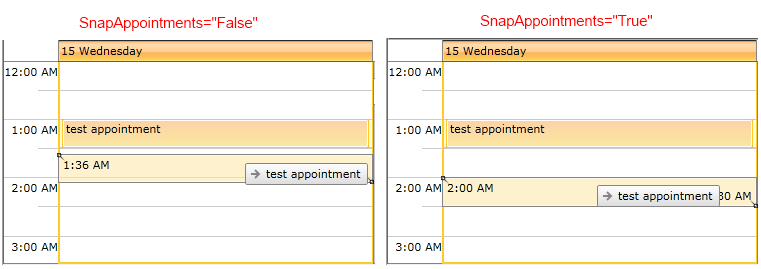
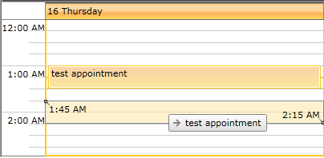
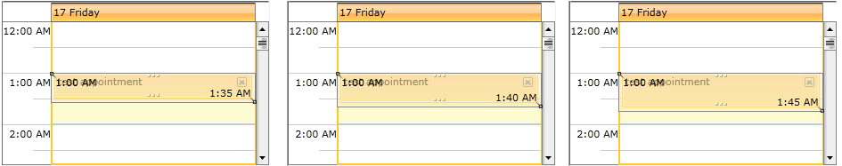

# Snapping Appointments

RadScheduleView provides the option to automatically snap the appointments while resizing/dragging them. This behavior is enabled through the __SnapAppointments__ Boolean property:


```XAML
	<telerik:RadScheduleView SnapAppointments="True">
	...
	</telerik:RadScheduleView>
```

This way during drag/resize operation the Start/End times of the appointment will be rounded according to the TimeSlots’ length:



>When dragging an appointment, the default snap behavior rounds the appointment's start time to the closest tick.

You could set MinorTickLength property of the ViewDefinition in order to snap the appointments to different duration:     


```XAML
	<telerik:RadScheduleView SnapAppointments="True">		
		<telerik:RadScheduleView.ViewDefinitions>
			<telerik:DayViewDefinition MinorTickLength = "15min" />		
		</telerik:RadScheduleView.ViewDefinitions>	
	</telerik:RadScheduleView>
```

And the result is:



>tipYou can check [Configuring the TimeRuler ticks]() article for more details about MinorTickLength property.

## Customizing the SnapBehavior

For more advanced scenarios when snapping of the appointments is not directly connected with the time slots, the RadScheduleView control provides a way to customize the snapping of the appointments in a more detailed manner. You just need to create a class which inherits from __Telerik.Windows.Controls.ScheduleView.SnapBehavior__ and to override its SnapStart and SnapEnd methods. Then an instance of this class should be set to the __SnapBehavior__ property of RaddScheduleView.

In the next example it is demonstrated how to set the snapping to 5 minutes regardless of the TimeSlots length.

* First, create CustomSnapBehavior class:


```C#
	public class CustomSnapBehavior : Telerik.Windows.Controls.ScheduleView.SnapBehavior
	{
	}
```

* Override the needed methods:


```C#
	public class CustomSnapBehavior : Telerik.Windows.Controls.ScheduleView.SnapBehavior
	{
	
		public override DateTime SnapEnd(SnapData snapData, DateTime timeToSnap)
		{
			if (timeToSnap >= snapData.OriginalData.End)
			{
				return SnapToTimeSpan(TimeSpan.FromMinutes(5), timeToSnap, true);
			}
			else
			{
				return SnapToTimeSpan(TimeSpan.FromMinutes(5), timeToSnap, false);
			}
		}
	
		public override DateTime SnapStart(SnapData snapData, DateTime timeToSnap)
		{
			if (timeToSnap >= snapData.OriginalData.End)
			{
				return SnapToTimeSpan(TimeSpan.FromMinutes(5), timeToSnap, true);
			}
			else
			{
				return SnapToTimeSpan(TimeSpan.FromMinutes(5), timeToSnap, false);
			}
		}
	
		public static DateTime SnapToTimeSpan(TimeSpan timeSpan, DateTime timeToSnap, bool roundToBiggestNumber)
		{
			var difference = timeToSnap.Ticks % timeSpan.Ticks;
			if (roundToBiggestNumber)
			{
				return timeToSnap.AddTicks(timeSpan.Ticks - difference);
			}
	
			return timeToSnap.AddTicks(-difference);
		}
		
        	protected override Freezable CreateInstanceCore()
        	{
            		return new CustomSnapBehavior();
        	}
	}
```

* Attach the newly created custom behavior to the ScheduleView control:


```XAML
	<telerik:RadScheduleView SnapAppointments="True">
		...
		<telerik:RadScheduleView.SnapBehavior>
			<local:CustomSnapBehavior />
		</telerik:RadScheduleView.SnapBehavior>
	</telerik:RadScheduleView>
```

So now the appointments are snapped to 5 minutes:


