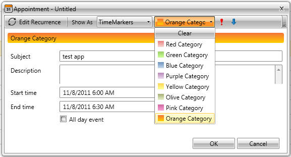
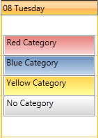
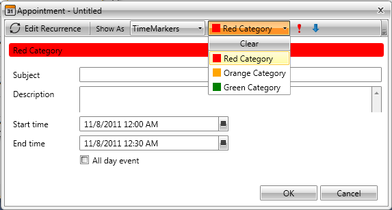

# Categories

__RadScheduleView__ provides you with a built-in categories support. You can assign a category to each one of your appointments, thus making them easily distinguishable.	

This chapter will cover the following topics:

* [Assign Category to an Appointment run-time](#assign-category-to-an-appointment-run-time)

* [Adding Categories to the RadScheduleView](#adding-categories-to-the-radscheduleview)

## Assign Category to an Appointment run-time

Run-time you can define the category of your appointment via the drop down menu in the EditAppointmentDialog:



On the snapshot below you can see four appointments where three of them have categories set, while the fourth does not have. Note how the background color of the appointments is taken from their categories.      	



## Adding Categories to the RadScheduleView

By default the RadScheduleView has predefined list of categories i.e. "Red Category", "Blue Category", "Olive Category" etc.       	

However, there are cases when new categories are needed and you have to create them on your own, as it is shown below.      	

>The categories used by the RadScheduleView control are represented by the class __Telerik.Windows.Controls.Category__ located in the assembly __Telerik.Windows.Controls.ScheduleView.dll__.

Each category has three important characteristics:

1. __CategoryName__ - each category has a name assigned. It is used to distinguish that category amongst the others in your application. You can set or get it using the property __Category.CategoryName__ or __Category.DisplayName__.

1. __CategoryBrush__ - each category has a color brush assigned. It is used to mark all of the appointments of that category in your application. You can set it or get it using the property __Category.CategoryBrush__.

1. __IsChecked__ - Used to identify whether or not this category is selected.

The categories available in the RadScheduleView are defined in the CategoriesSource property (IEnumarable). Just add or remove categories to that collection in order to add or remove categories to the RadScheduleView itself.


```XAML
	<telerik:RadScheduleView x:Name="scheduleView" AppointmentsSource="{Binding Appointments}">								
		<telerik:RadScheduleView.CategoriesSource>
			<telerik:CategoryCollection>
				<telerik:Category CategoryName="Red Category">
					<telerik:Category.CategoryBrush>
						<SolidColorBrush Color="Red"></SolidColorBrush>
					</telerik:Category.CategoryBrush>
				</telerik:Category>
				<telerik:Category CategoryName="Orange Category">
					<telerik:Category.CategoryBrush>
						<SolidColorBrush Color="Orange"></SolidColorBrush>
					</telerik:Category.CategoryBrush>
				</telerik:Category>
				<telerik:Category CategoryName="Green Category">
					<telerik:Category.CategoryBrush>
						<SolidColorBrush Color="Green"></SolidColorBrush>
					</telerik:Category.CategoryBrush>
				</telerik:Category>
			</telerik:CategoryCollection>
		</telerik:RadScheduleView.CategoriesSource>
		<telerik:RadScheduleView.ViewDefinitions>
			<telerik:DayViewDefinition />
		</telerik:RadScheduleView.ViewDefinitions>		
	</telerik:RadScheduleView>
```

or


```C#
	public class MyViewModel : ViewModelBase
	{
		public ObservableCollection<Appointment> Appointments { get; set; }
		public ObservableCollection<Category> Categories { get; set; }
	
		public MyViewModel()
		{
			this.Appointments = new ObservableCollection<Appointment>();
			this.Categories = new ObservableCollection<Category>() {
				new Category( "Red Category", new SolidColorBrush( Colors.Red ) ),
				new Category( "Orange Category", new SolidColorBrush( Colors.Orange ) ),
				new Category( "Green Category", new SolidColorBrush( Colors.Green ) )
			};
		}
	}
```


```XAML
	<telerik:RadScheduleView x:Name="scheduleView" 
						AppointmentsSource="{Binding Appointments}"
						CategoriesSource="{Binding Categories}">		
				<telerik:RadScheduleView.ViewDefinitions>
			<telerik:DayViewDefinition />
		</telerik:RadScheduleView.ViewDefinitions>		
	</telerik:RadScheduleView>
```

Finally, set the DataContext:


```C#
	this.DataContext = new MyViewModel();
```

Here is how the new categories look like:



## See Also

 * [Implementing View-ViewModel ]()
