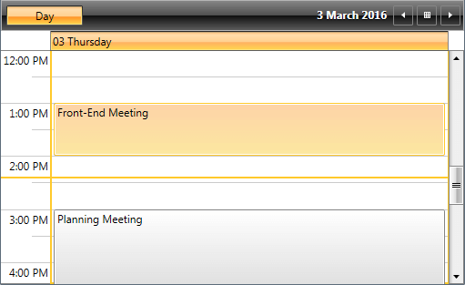
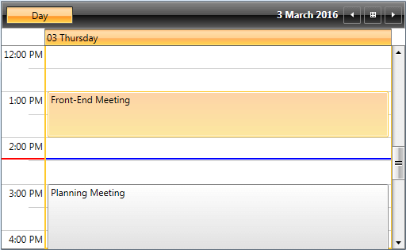
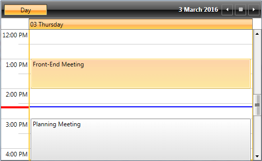

# CurrentTimeIndicator

**RadScheduleView** provides the option to visually mark the current time in the TimeRuler and across the Appointments area through its __ShowCurrentTimeIndicator__ property.

This article covers the following topics:

* [Enabling the CurrentTimeIndicator](#enabling-the-currenttimeindicator)
* [Setting CurrentTimeIndicator Location](#setting-currenttimeindicator-location)
* [Styling CurrentTimeIndicator](#styling-currenttimeindicator)


## Enabling the CurrentTimeIndicator

In order to display the current time indicator, you must set the __ShowCurrentTimeIndicator__ property of the RadScheduleView as in __Example 1__.

__Example 1: Enable CurrentTimeIndicator__

```XAML
	<telerik:RadScheduleView AppointmentsSource="{Binding Appointments}" ShowCurrentTimeIndicator="True">            
		<telerik:RadScheduleView.ViewDefinitions>
			<telerik:DayViewDefinition />               
		</telerik:RadScheduleView.ViewDefinitions>
	</telerik:RadScheduleView>	
```

Running the code from __Example 1__ will result in RadScheduleView with current time marked as shown in __Figure 1__.

#### __Figure 1: Enable CurrentTimeIndicator__


## Setting CurrentTimeIndicator Location

As of R2 2016, you can show the CurrentTimeIndicator not only in the TimeRuler of the ScheduleView, but also across the Appointments area through the __CurrentTimeIndicatorLocation__ property as shown in __Example 2__. __CurrentTimeIndicatorLocation__ property is of type enum and can receive the following values:

* **TimeRulerArea** – the default value, the indicator is shown inside the TimeRuler.
* **AppointmentsArea** – the indicator is shown only through the Appointments panel.
* **WholeArea** – the indicator is shown on both the TimeRuler and Appointments panel.

__Example 2: Set CurrentTimeIndicatorLocation__

```XAML
	<telerik:RadScheduleView AppointmentsSource="{Binding Appointments}" 
		ShowCurrentTimeIndicator="True"
		CurrentTimeIndicatorLocation="WholeArea">            
		<telerik:RadScheduleView.ViewDefinitions>
			<telerik:DayViewDefinition />               
		</telerik:RadScheduleView.ViewDefinitions>
	</telerik:RadScheduleView>
```

__Figure 2__ shows current time marked across the whole area of RadScheduleView.

#### __Figure 2: Set CurrentTimeIndicatorLocation__


## Styling CurrentTimeIndicator

You could change the look of CurrentTimeIndicator by setting the __CurrentTimeIndicatorStyle__ and __CurrentTimeIndicatorAppointmentsAreaStyle__ properties of the ScheduleView.

__CurrentTimeIndicatorStyle__ is applied to the part of the CurrentTimeIndicator in the TimeRuler, while __CurrentTimeIndicatorAppointmentsAreaStyle__ is applied to the part in the Appointments area.

__Example 3__ demonstrates how both Styles are defined and __Example 4__ shows how the Style properties should be set to the ScheduleView.

__Example 3: Define CurrentTimeIndicator Styles__

```XAML
	<Style x:Key="CurrentTimeIndicatorStyle" TargetType="telerik:CurrentTimeIndicator">
		<Setter Property="Canvas.ZIndex" Value="2"/>  
		<Setter Property="Template">
			<Setter.Value>
				<ControlTemplate>
					<Rectangle Margin="0 0 -1 -1" MinWidth="2" MinHeight="2" Fill="Red"/>
				</ControlTemplate>
			</Setter.Value>
		</Setter>
	</Style>
	<Style x:Key="CurrentTimeIndicatorAppointmentsAreaStyle" TargetType="telerik:CurrentTimeIndicator">
		<Setter Property="Canvas.ZIndex" Value="2"/>         
		<Setter Property="Template">
			<Setter.Value>
				<ControlTemplate>
					<Rectangle Margin="0 0 -1 -1" MinWidth="2" MinHeight="2" Fill="Blue"/>
				</ControlTemplate>
			</Setter.Value>
		</Setter>
	</Style>
```

__Example 4: Set CurrentTimeIndicator Style Properties__

```XAML
	<telerik:RadScheduleView AppointmentsSource="{Binding Appointments}" 
		ShowCurrentTimeIndicator="True"
		CurrentTimeIndicatorLocation="WholeArea" 
        CurrentTimeIndicatorStyle="{StaticResource CurrentTimeIndicatorStyle}" 
        CurrentTimeIndicatorAppointmentsAreaStyle="{StaticResource CurrentTimeIndicatorAppointmentsAreaStyle}">
		<telerik:RadScheduleView.ViewDefinitions>
			<telerik:DayViewDefinition />               
		</telerik:RadScheduleView.ViewDefinitions>
	</telerik:RadScheduleView>
```

If you run the application at this stage, you will see RadScheduleView with CurrentTimeIndicator styled in different colors as shown in __Figure 3__.

#### __Figure 3: Custom CurrentTimeIndicator Styles__


Additionally, you could set the __AllowCustomSize__ property of the CurrentTimeIndicator in order to allow rendering elements with bigger size. For example, if you need the part in the TimeRuler area to be thicker, you can customize the __CurrentTimeIndicatorStyle__ as shown in __Example 5__. 

__Example 5: Set AllowCustomSize__

```XAML
	<Style x:Key="CurrentTimeIndicatorStyle" TargetType="telerik:CurrentTimeIndicator">
		<Setter Property="Canvas.ZIndex" Value="2"/>
		<Setter Property="AllowCustomSize" Value="True" />
		<Setter Property="Template">
			<Setter.Value>
				<ControlTemplate>
					<Rectangle Margin="0 0 -1 -1" MinWidth="2" MinHeight="4" Fill="Red"/>
				</ControlTemplate>
			</Setter.Value>
		</Setter>
	</Style>
```

Running the application will lead to the result shown in __Figure 4__.

#### __Figure 4: CurrentTimeIndicator with AllowCustomSize set__


>tip For more advanced customizations, see the ScheduleView [Custom CurrentTimeIndicator Style](https://github.com/telerik/xaml-sdk/tree/master/ScheduleView/CustomCurrentTimeIndicatorStyle) example in our XAML SDK Repository.


