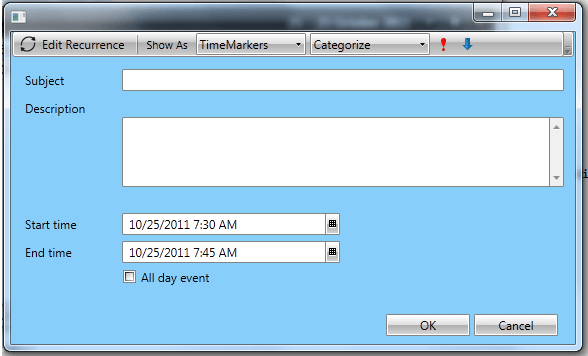
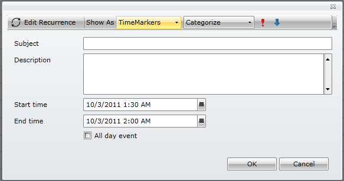

# Customizing Dialog Windows

>To customize the RadScheduleView dialogs, e.g. the window content, please read the [Custom Dialogs]() article

The dialogs in RadScheduleView are displayed in RadWindow instances by default. You can either [customize the RadWindow](#custom-radwindow) or entirely [replace it with any other ContentControl](#replace-radwindow-with-custom-control).

RadScheduleView uses the __IScheduleViewDialogHostFactory__ and __IScheduleViewDialogHost__ interfaces to abstract the dialog hosts and their generation. The default implementation of the IScheduleViewDialogHostFactory interface that creates RadWindow instances is named __ScheduleViewDialogHostFactory__.

## Custom RadWindow

Create a new class, deriving from ScheduleViewDialogHostFactory and override the __CreateNew__ method:

__Example 1: Custom ScheduleViewDialogHostFactory with customized RadWindow__

<snippet id='radscheduleview-features-customizing-dialog-windows-block_1-cs' />

Configure RadScheduleView to use the new class:

__Example 2: Set SchedulerDialogHostFactory__

<snippet id='radscheduleview-features-customizing-dialog-windows-block_2-xaml' />

## Replace RadWindow with Custom Control

Create a new class, deriving from WindowChildWindow and implement the __IScheduleViewDialogHost__ interface:


__Example 3: Custom IScheduleViewDialogHost__
<snippet id='radscheduleview-features-customizing-dialog-windows-block_3-cs' />



__Example 3: Custom IScheduleViewDialogHost__
<snippet id='radscheduleview-features-customizing-dialog-windows-block_4-cs' />


Create a new class and implement the __IScheduleViewDialogHostFactory__:
    

__Example 4: Custom ScheduleViewDialogHostFactory with Custom IScheduleViewDialogHost__
<snippet id='radscheduleview-features-customizing-dialog-windows-block_5-cs' />



__Example 4: Custom ScheduleViewDialogHostFactory with Custom IScheduleViewDialogHost__
<snippet id='radscheduleview-features-customizing-dialog-windows-block_6-cs' />


Configure RadScheduleView to use the new factory:    

__Example 5: Set SchedulerDialogHostFactory__

<snippet id='radscheduleview-features-customizing-dialog-windows-block_7-xaml' />

#### Figure 1: Custom appointment dialog





