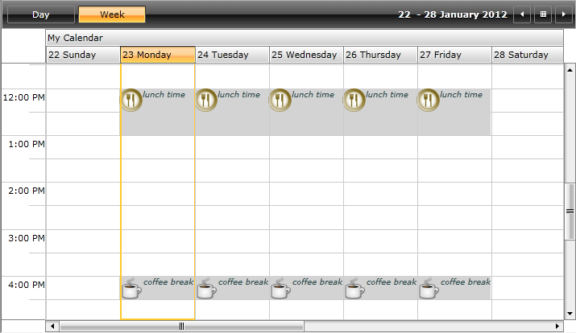

# Custom Slots

This article describes how you can create a custom SpecialSlot, add custom properties to it and bind the properties in the Slot template.

>Please check [here]() for more details about SpecialSlots.

Let's for example have the following RadScheduleView grouped by "Calendar" ResourceType:


```XAML
	<telerik:RadScheduleView AppointmentsSource="{Binding Appointments}">
		<telerik:RadScheduleView.ViewDefinitions>				
			<telerik:WeekViewDefinition  />
		</telerik:RadScheduleView.ViewDefinitions>
		<telerik:RadScheduleView.ResourceTypesSource>
			<telerik:ResourceTypeCollection>
				<telerik:ResourceType Name="Calendar">
					<telerik:Resource ResourceName="My Calendar" />
					<telerik:Resource ResourceName="Team Calendar" />
				</telerik:ResourceType>
			</telerik:ResourceTypeCollection>
		</telerik:RadScheduleView.ResourceTypesSource>
		<telerik:RadScheduleView.GroupDescriptionsSource>
			<telerik:GroupDescriptionCollection>
				<telerik:ResourceGroupDescription ResourceType="Calendar" />
				<telerik:DateGroupDescription />
			</telerik:GroupDescriptionCollection>
		</telerik:RadScheduleView.GroupDescriptionsSource>
	</telerik:RadScheduleView>
```

We will define a custom Slot class, create a collection of custom Slot objects which then will be set to the SpecialSlotsSource property.Also in this tutorial we will crete custom ScheduleViewStyleSelector class and define the needed Styles.

* First, create a class which inherits __Telerik.Windows.Controls.ScheduleView.Slot__ class:


```C#
	public class BreakSlot : Slot
	{
		public string ImageSource { get; set; }
		public string Description { get; set; }
	
		public BreakSlot(DateTime start, DateTime end) : base(start, end)
		{
			this.Resources.Add(new Resource("My Calendar", "Calendar"));			
		}
	
		public override Slot Copy()
		{
			Slot slot = new BreakSlot(this.Start, this.End);
			slot.CopyFrom(this);
			return slot;
		}
	
		public override void CopyFrom(Slot other)
		{
			var otherSlot = other as BreakSlot;
			if (otherSlot != null)
			{
				this.ImageSource = otherSlot.ImageSource;
				this.Description = otherSlot.Description;
				base.CopyFrom(otherSlot);
			}
		}
	}
```

>Note how __Copy__ and __CopyFrom__ methods in the custom slot class are overriden!

* Then you should create the collection of __BreakSlot__ objects and set their additional properties:


```C#
	this.SpecialSlots = new ObservableCollection<Slot>()
	{
		new BreakSlot( new DateTime(2012, 1, 23, 12, 0, 0), new DateTime(2012, 1, 23, 13, 0, 0)) {
			RecurrencePattern = new RecurrencePattern(null, RecurrenceDays.WeekDays, RecurrenceFrequency.Weekly, 1, null, null),
			ImageSource = "meal_icon.png",
			Description =  "lunch time"
		}, 
		new BreakSlot(new DateTime(2012, 1, 23, 16, 0, 0), new DateTime(2012, 1, 23, 16, 30, 0)) {
			RecurrencePattern = new RecurrencePattern(null, RecurrenceDays.WeekDays, RecurrenceFrequency.Weekly, 1, null, null),
			ImageSource = "coffee_icon.png",
			Description = "coffee break"
		}
	};
```

* The next step is to create the __ScheduleViewStyleSelector__ class:


```C#
	public class SpecialSlotStyleSelector : ScheduleViewStyleSelector
	{
		private Style breakSlotStyle;
	
		public Style BreakSlotStyle
		{
			get
			{
				return this.breakSlotStyle;
			}
			set
			{
				this.breakSlotStyle = value;
			}
		}
	
		public override Style SelectStyle(object item, DependencyObject container, ViewDefinitionBase activeViewDefinition)
		{
			Slot slot = item as Slot;
	
			if (item is BreakSlot)
				return this.BreakSlotStyle;
	
			return base.SelectStyle(item, container, activeViewDefinition);
		}
	}
```

* and to define the Style:


```XAML
	<local:SpecialSlotStyleSelector x:Key="SpecialSlotStyleSelector">
		<local:SpecialSlotStyleSelector.BreakSlotStyle>
			<Style TargetType="telerik:HighlightItem">
				<Setter Property="Template">
					<Setter.Value>
						<ControlTemplate>
							<Border Background="LightGray">
								<StackPanel Orientation="Horizontal" VerticalAlignment="Top" HorizontalAlignment="Left">
									<Image Source="{Binding Slot.ImageSource}" MaxHeight="29" />
									<TextBlock Text="{Binding Slot.Description}" FontSize="10" FontStyle="Italic" Foreground="DarkSlateGray" />
								</StackPanel>
							</Border>
						</ControlTemplate>
					</Setter.Value>
				</Setter>
			</Style>
		</local:SpecialSlotStyleSelector.BreakSlotStyle>
	</local:SpecialSlotStyleSelector>
```

>If you're using [Implicit Styles]() please, notice that the Style that targets the __HighlightItem__ should be based on the default HighlightItemStyle.

* Finally, bind them to __SpecialSlotsSource__ and __SpecialSlotsStyleSelector__ properties:


```XAML
	<telerik:RadScheduleView AppointmentsSource="{Binding Appointments}"
				SpecialSlotsSource="{Binding SpecialSlots}"
				SpecialSlotStyleSelector="{StaticResource SpecialSlotStyleSelector}">
		<telerik:RadScheduleView.ViewDefinitions>				
			<telerik:WeekViewDefinition  />
		</telerik:RadScheduleView.ViewDefinitions>
		...
	</telerik:RadScheduleView>
```

Here is the result:


