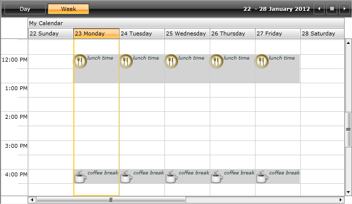

# Custom Slots

This article describes how you can create a custom SpecialSlot, add custom properties to it and bind the properties in the Slot template.

>Please check [here]() for more details about SpecialSlots.

Let's for example have the following RadScheduleView grouped by "Calendar" ResourceType:

<snippet id='radscheduleview-features-customslots-block_1-xaml' />

We will define a custom Slot class, create a collection of custom Slot objects which then will be set to the SpecialSlotsSource property.Also in this tutorial we will crete custom ScheduleViewStyleSelector class and define the needed Styles.

* First, create a class which inherits __Telerik.Windows.Controls.ScheduleView.Slot__ class:

<snippet id='radscheduleview-features-customslots-block_2-cs' />

>Note how __Copy__ and __CopyFrom__ methods in the custom slot class are overriden!

* Then you should create the collection of __BreakSlot__ objects and set their additional properties:

<snippet id='radscheduleview-features-customslots-block_3-cs' />

* The next step is to create the __ScheduleViewStyleSelector__ class:

<snippet id='radscheduleview-features-customslots-block_4-cs' />

* and to define the Style:

<snippet id='radscheduleview-features-customslots-block_5-xaml' />

>If you're using [Implicit Styles]() please, notice that the Style that targets the __HighlightItem__ should be based on the default HighlightItemStyle.

* Finally, bind them to __SpecialSlotsSource__ and __SpecialSlotsStyleSelector__ properties:

<snippet id='radscheduleview-features-customslots-block_6-xaml' />

Here is the result:

