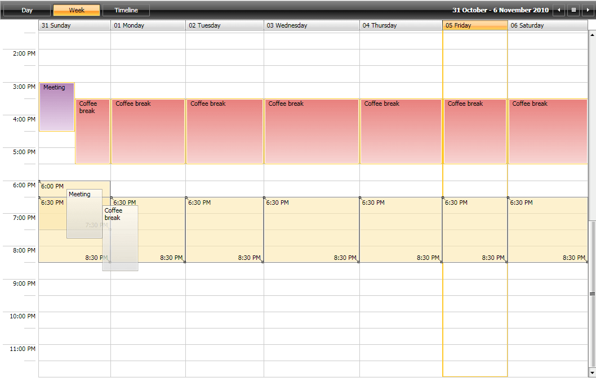
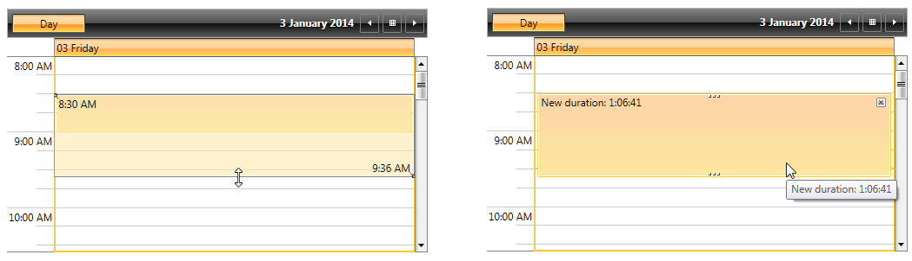
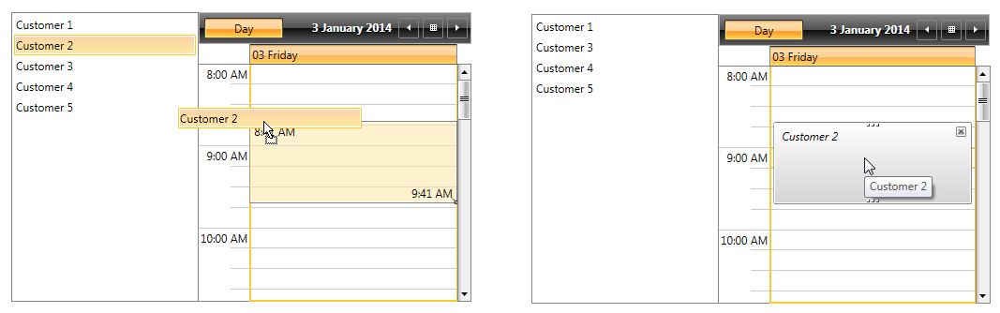

# Drag and Drop with RadScheduleView

__RadScheduleView__ uses __DragDropManager__ to implement drag and drop of appointments. In order to add some custom logic for drag and drop, you can inherit the __Telerik.Windows.Controls.ScheduleViewDragDropBehavior__ class. The class provides several methods that you can override to implement custom drag and drop functionality. This article will demonstrate all of the available methods.



## DragDropState Parameter

Each of the methods provided in the __ScheduleViewDragDropBehavior__ class receives an object of type DragDropState. The object contains all the needed information in order to help you achieve the required drag and drop and resize functionality. The object provides the following properties:      

* __Appointment__ - Holds a reference to the appointment that is held with the mouse.            

* __DestinationAppointmentsSource__ - Holds a reference to the AppointmentsSource collection of the drag destination.            

* __DestinationSlots__ - Gets a collection containing the new slots of the dragged Appointments.            

* __DraggedAppointments__ - Contains all appointments that are being dragged, including the appointment that is selected while the user clicks and holds the mouse button. When resizing this property is null.              

* __IsControlPressed__ - Gets or sets a value indicating the control key is pressed.            

* __ServiceProvider__ - Gets the IServiceProvider associated with the current instance.            

* __SlotDuration__ - Gets the duration between two minor ticks.            

* __SourceAppointmentsSource__ - Holds a reference to the AppointmentsSource collection of the drag source.            

* __SourceResources__ *(available with Q2 2014 version of UI for WPFSilverlight)* - Gets a collection containing the original resources from which the dragging operation has started.            

* __TargetedAppointment__ *(available with Q2 2014 version of UI for WPFSilverlight)* - Holds a reference to the targeted appointment on which the drop operation will be performed.            

## ScheduleViewDragDropBehavior class

The following section will provide some detailed information about the following methods and properties of the ScheduleViewDragDropBehavior class:

### Methods

* `CanDrop`
* `CanStartDrag`
* `Drop`
* `CanResize`
* `CanStartResize`
* `Resize`
* `ConvertDraggedData`
* `CoerceDraggedItems`
* `DragDropCompleted`
* `DragDropCanceled`

### Properties

* `ResizeCursor`
* `CacheConvertedDragData`

### CanDrop(DragDropState state)      

The __CanDrop__(*DragDropState* state) method gets the value specifying whether the drag and drop operation can be finished or not. The method is called  multiple times during the operation. On each call you can check if a requirement is fulfilled in order to prevent or allow the completion of the drop. For example, you can easily prevent copying Appointments when dragging them with the Control Key pressed by returning false if the key is pressed:

__Example 1: Overriding the CanDrop method__

```C#
	public override bool CanDrop(DragDropState state)
	{
	    if (state.IsControlPressed)
	    {
	        return false;
	    }
	
	    return base.CanDrop(state);
	}
```

### CanStartDrag(DragDropState state)

__CanStartDrag__(*DragDropState* state) - Gets the value specifying whether the drag operation can be performed or not. The method is called at the moment when the operation is starting. For example, if you need to prevent dragging of more than two Appointments, you can override the method the following way:

__Example 2: Overriding the CanStartDrag method__

```C#
	public override bool CanStartDrag(DragDropState state)
	{
	    if (state.DraggedAppointments.Count() > 2)
	    {
	        return false;
	    }
	
	    return base.CanStartDrag(state);
	} 
```

### Drop(DragDropState state)

__Drop__(*DragDropState* state) - The method is called right after the Appointment is dropped and before the DragDropCompleted method is called. For example, if you want to add a Category to the just dropped Appointment, you can do it as shown below:

__Example 3: Override the Drop method__

```C#
	public override void Drop(DragDropState state)
	{
	    var appointment = state.Appointment as Appointment;
	
	    if (appointment.Category == null)
	    {
	        appointment.Category = new Category("Green Category", Brushes.Green);
	    }
	
	    base.Drop(state);
	}
```

### CanResize(DragDropState state)

__CanResize__(*DragDropState* state) - Gets the value specifying whether the resize operation can be finished or not. The method is called multiple times during the Resize operation and you can easily stop the operation by returning false. The following example demonstrates how to stop the resizing when the duration becomes more than two hours and less than half an hour.

__Example 4: Override the CanResize method__

```C#
	public override bool CanResize(DragDropState state)
	{
	    var destinationSlot = state.DestinationSlots.First() as Slot;
	    var duration = destinationSlot.End - destinationSlot.Start;
	
	    if (duration <= new TimeSpan(0, 30, 0) || duration > new TimeSpan(2, 0, 0))
	    {
	        return false;
	    }
	
	    return base.CanResize(state);
	}
```

### CanStartResize(DragDropState state)

__CanStartResize__(*DragDropState* state) - Gets the value specifying whether the resize operation can be performed or not. The method is called at the moment when the operation is starting. For example, if you need to prevent the resizing of an Appointment that is marked with the Busy TimeMarker, you will need to do it the following way:

__Example 5: Override the CanStartResize method__

```C#
	public override bool CanStartResize(DragDropState state)
	{
	    var appointment = state.Appointment as Appointment;
	
	    if (appointment.TimeMarker != null && appointment.TimeMarker.Equals(TimeMarker.Busy))
	    {
	        return false;
	    }
	
	    return base.CanStartResize(state);
	}
```

### Resize(DragDropState state)

__Resize__(*DragDropState* state) - The method is called right after the resize operation is finished. You can find the initial Appointment in the Appointment property of the *DragDropState* and the new information in the DestinationSlot property. So, for example, you can easily modify the Appointment subject after resizing in order to include the new duration as shown below:        

__Example 6: Override the Resize method__

```C#
	public override void Resize(DragDropState state)
	{
	    var appointment = state.Appointment as Appointment;
	    var destinationSlot = state.DestinationSlots.First() as Slot;
	    var duration = destinationSlot.End - destinationSlot.Start;
	    appointment.Subject = "New duration: " + duration.ToString("h\\:mm\\:ss");
	    base.Resize(state);
	}
```

This is the result:



### ConvertDraggedData(object data)

> By default, the __ConvertDraggedData__ method will be called constantly. This behavior can be modified through the [CacheConvertedDragData](#cacheconverteddragdata) property.

__ConvertDraggedData__(Object data) - This method is fired when you drag appointments from a different source (another control or application) and is used to convert the data to an appointment. For example, if you are dragging from a ListBox to ScheduleView and you have objects of type Customer as an ItemsSource of the ListBox, you can convert the dragged Customer object to an Appointment the following way:           

__Example 7: Override the ConvertDraggedData method__

```C#
	public override IEnumerable<IOccurrence> ConvertDraggedData(object data)
	{
	    if (Telerik.Windows.DragDrop.Behaviors.DataObjectHelper.GetDataPresent(data, typeof(Meeting), false))
	    {
	        var customers = Telerik.Windows.DragDrop.Behaviors.DataObjectHelper.GetData(data, typeof(Customer), true) as IEnumerable;
	        if (customers != null)
	        {
	            var newApp = customers.OfType<Customer>().Select(c => new Appointment { Subject = c.Name });
	
	            return newApp;
	        }
	    }
	
	    return base.ConvertDraggedData(data);
	}
```

This will create a new Appointment with the Subject being the Name of the dropped customer as shown below:



### CoerceDraggedItems(DragDropState state)

__CoerceDraggedItems__(*DragDropState* state) - Initializes the drag operation. This method could be used to filter the selected appointments. This method allows adding or removing Appointments to the selection depending on a specific condition. For example, if you need to filter the dragged Appointments by the Resource in order to move all the Appointments with the current Resource, you do it the following way:           

__Example 8: Override the CoerceDraggedItems method__

```C#
	public override IEnumerable<IOccurrence> CoerceDraggedItems(DragDropState state)
	{
	    var resource = (state.Appointment as Appointment).Resources.First();
	    var allAppointments = state.SourceAppointmentsSource.Cast<IOccurrence>();
	    var desiredAppointments = allAppointments.Where(a => (a as Appointment).Resources.Any(r => r == resource));
	
	    return desiredAppointments;
	}
```

### DragDropCompleted(DragDropState state)

__DragDropCompleted__( *DragDropState* state) - This method is called when the drag-drop operation is finished.
        

### DragDropCanceled(DragDropState state)

__DragDropCanceled__( *DragDropState* state) - The method is called whenever the execution of the operation has failed for some reason.

### Setting the CustomDragDropBehavior

After the CustomDragDropBehavior is implemented, all you need is to set it as RadScheduleView.DragDropBehavior:

__Example 9: Set the CustomDragDropBehavior__

```XAML
	<telerik:RadScheduleView.DragDropBehavior>
	  <local:CustomDragDropBehavior />
	</telerik:RadScheduleView.DragDropBehavior>
```

### ResizeCursor

The __ResizeCursor__ property was introduced with Q1 2016 release of UI for WPFSilverlight. Using it you can change the cursor that indicates a resize operation is happening. That could be done initially or while resizing an Appointment, for example, inside the __CanResize__ method:

__Example 10: Setting the ResizeCursor property__

```C#
	public override bool CanResize(DragDropState state)
	{
		var destinationSlot = state.DestinationSlots.First() as Slot;
		var duration = destinationSlot.End - destinationSlot.Start;

		if (duration <= new TimeSpan(0, 30, 0) || duration >= new TimeSpan(2, 0, 1))
		{
			this.ResizeCursor = Cursors.Wait;
			return false;
		}

		this.ResizeCursor = Cursors.SizeNS;
		return base.CanResize(state);
	}
```

>The default cursor is represented by setting the ResizeCursor property value to null.

### CacheConvertedDragData 

As of __R1 2017 SP1__, __ScheduleViewDragDropBehavior__ exposes the __CacheConvertedDragData__ property. Its default value is __False__, meaning that the ConvertDraggedData method will be called repeatedly. When the property is set to __True__, the method will be called only once and the converted data will be cached. 


>Check out the Drag and Drop Example at [WPF online demos](https://demos.telerik.com/wpf/) to see the __RadScheduleView__'s Drag and Drop functionality in action.        
