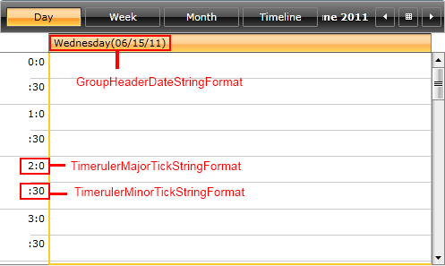
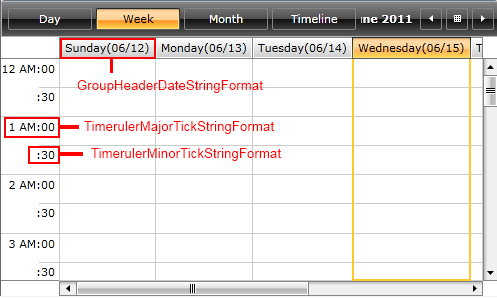
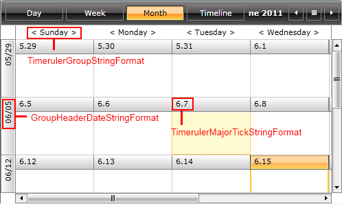
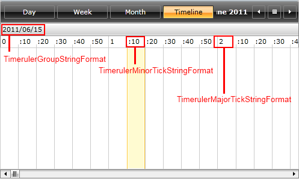

# Formatting

The __RadScheduleView__ control provides a built-in date formatting support. Each ScheduleView ViewDefinition can be easily customized to display dates and times on the time ruler and in the GroupHeaders in custom formats.      

This article covers the following topics:

* [Formatting properties](#formatting-properties)

* How to apply the formatting properties to the ViewDefinitions:          

	* [DayViewDefinition](#dayviewdefinition)

	* [WeekViewDefinition](#weekviewdefinition)

	* [MonthViewDefinition](#monthviewdefinition)

	* [TimelineViewDefinition](#timelineviewdefinition)

## Formatting properties

- TimerulerMajorTickStringFormat /TimerulerMinorTickStringFormat - used to set the format that will be applied on TimeRuler MajorTick/MinorTick;        

- TimerulerGroupStringFormat - sets the format applied on TimeRulerGroupItem;        

- GroupHeaderDateStringFormat - sets the format applied on the Date GroupHeaders.       

>In this article custom dates and time format strings will be used for setting the various RadScheduleView's properties. For more information about the custom date and time format specifiers and the result string produced by each format specifier, check out the [Custom Date and Time Format Strings](http://msdn.microsoft.com/en-us/library/8kb3ddd4.aspx) topic.          

<!-- -->

>You will notice that some of the format strings start with {} and some don't. The two curly brackets are required when declaring a format string in XAML that starts with a opening curly bracket, in order to prevent the XAML parser from recognizing it as a markup extension. If the format string starts with a different character, the {} are not needed.

## DayViewDefinition

Let’s for example set the formatting properties of DayViewDefinition:

<snippet id='radscheduleview-features-formatting-block_1-xaml' />

## WeekViewDefinition

Setting these properties to WeekViewDefinition will lead to similar result:        

<snippet id='radscheduleview-features-formatting-block_2-xaml' />

## MonthViewDefinition

In MonthViewDefinition you can set the following formatting properties:

<snippet id='radscheduleview-features-formatting-block_3-xaml' />

And the result is:

## TimelineViewDefinition

Setting the formatting properties in TimelineViewDefinition like this:

<snippet id='radscheduleview-features-formatting-block_4-xaml' />

results in the following look:

Check out the [online demo](https://demos.telerik.com/silverlight/?ScheduleView/CustomDateFormats)[RadScheduleView Custom Date Formats example](https://demos.telerik.com/wpf/) to see the formatting properties in action.        