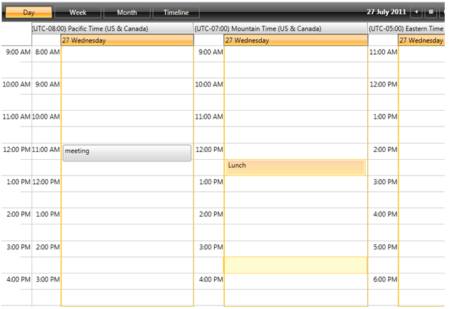
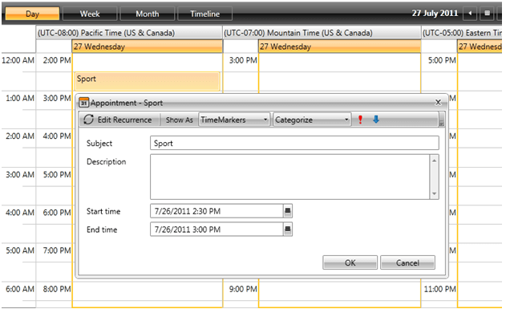

# Grouping By TimeZone

RadScheduleView supports grouping by time zone. This can be achieved by adding a __TimeZoneGroupDescription__ to the GroupDescriptionSource property of RadScheduleView:
      

#### __XAML__

{{region radscheduleview-features-groupbytimezone_0}}
	<telerik:RadScheduleView AppointmentsSource="{Binding Appointments}" TimeZonesSource="{Binding TimeZones}">
	   <telerik:RadScheduleView.ViewDefinitions>
	      <telerik:DayViewDefinition />
	      <telerik:WeekViewDefinition />
	      <telerik:MonthViewDefinition  />
	      <telerik:TimelineViewDefinition />
	   </telerik:RadScheduleView.ViewDefinitions>
	   <telerik:RadScheduleView.GroupDescriptionsSource>
	      <telerik:GroupDescriptionCollection>
	         <telerik:TimeZoneGroupDescription />
	      </telerik:GroupDescriptionCollection>
	   </telerik:RadScheduleView.GroupDescriptionsSource>
	</telerik:RadScheduleView>
	{{endregion}}

This type of grouping groups the appointments by their TimeZone property. One appointment cannot be displayed in two timezones.

             
          

>

Grouping by TimeZone is not supported for MonthViewDefinition. 

## 
        TimeZonesSource property
      

The displayed groups can be configured by the __TimeZonesSource__property of the control. This property can be bound to any collection of __TimeZoneInfo objects__.
If this property is not set, all system time zones will be displayed. the Time Zones that will be displayed are TimeZoneInfo.Local and TimeZoneInfo.Utc.

When the view is grouped by a TimeZone, the EditApointmentDialog will display the Start and End time converted to the corresponding TimeZone: 

         
      
