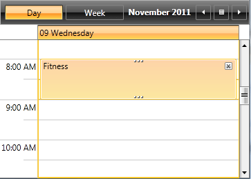
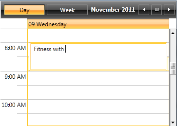
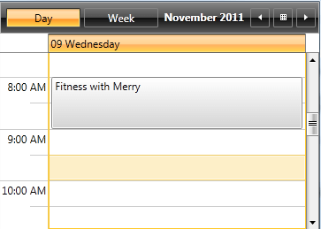

# Inline Editing

RadScheduleView supports inline editing of the displayed appointment's subject.

## How to start, commit and cancel the inline process run-time.

Inline editing lets you edit the appointment's subject right where you see it in the appointment. Just select the appointment, press F2 and type your changes.

* Select the target appointment:



* Press __F2__ and type the changes:



* Press __Enter__ or click outside the textbox in order to apply the change:



>tipPressing the __Enter__ key will apply your changes, while pressing the __Esc__ key will reject them.

>It is important to know that if you edit an appointment which is result of recurrence, then the changes will be applied to the whole series.

## How to enable\disable the inline editing behavior

The RadScheduleView exposes a property __IsInlineEditingEnabled__ which allows you to enable\disable the inline editing behavior.

>tipThe default value of the __IsInlineEditingEnabled__ property is True. Which means that the inline editing behavior is allowed by default.

If you want to disable the inline editing behavior, you should set the __IsInlineEditingEnabled__ property to False.      	

```XAML
	<telerik:RadScheduleView x:Name="scheduleView" IsInlineEditingEnabled="False"/>
```

```C#
	scheduleView.IsInlineEditingEnabled = false;
```
