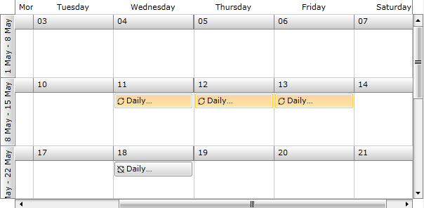

# Overview

__RadScheduleView__ provides the functionality to configure repeating appointments. The user has the ability to apply recurring scheduling patterns such as daily, weekly, monthly or set a range of recurrence from date to date. The flexible rule mechanism covers all possible recurrence scenarios. Furthermore, you also have the option to handle the exceptions from this rule.        

The purpose of this overview is to give you a straight-forward way how to create and apply a recurrence pattern, rule and exception. If you want to dive deeper into the recurrence feature of the RadScheduler, check out the following topics:

* [Recurrence Pattern]()

* [Recurrence Rule]()

__RadScheduleView__ includes support for recurring events on daily, weekly, monthly and yearly basis. Exceptions to the recurrence rules are also permitted. To support this recurrence behavior, the __IAppointment__ interface includes the __RecurrenceRule__ property. When an appointment is promoted into a recurring event its __RecurrenceRule__ is set with correct __RecurrencePattern__.        

>If the user modifies an individual appointment occurrence, an exception is created. This exception is added to the __RecurrenceRule__ of the master appointment along with its specific date.          

Consider the following example:

* Create a sample appointment that starts at 11/05/2011 10:00 AM and lasts half an hour: 


```C#
	var startDate = new DateTime(2011, 05, 11, 10, 0, 0);
	var appointment = new Appointment() {
	    Start = startDate,
	    End = startDate.AddMinutes(30),
	    Subject = "Daily appointment"
	};
```


```VB.NET
	Dim startDate = New DateTime(2011, 5, 11, 10, 0, 0)
	Dim appointment = New Appointment() With {
	    .Start = startDate,
	    .End = startDate.AddMinutes(30),
	    .Subject = "Daily appointment"
	}
```

* Create a daily recurrence pattern, that specifies a limit of 4 occurrences for the appointment: 


```C#
	var pattern = new RecurrencePattern() {
	    Frequency = RecurrenceFrequency.Daily,
	    DaysOfWeekMask = RecurrenceDays.EveryDay,
	    MaxOccurrences = 4
	};
```


```VB.NET
	Dim pattern = New RecurrencePattern() With {
	    .Frequency = RecurrenceFrequency.Daily,
	    .DaysOfWeekMask = RecurrenceDays.EveryDay,
	    .MaxOccurrences = 4
	}
```

* Set the recurrence rule to appointment: 


```C#
	appointment.RecurrenceRule = new RecurrenceRule(pattern);
```


```VB.NET
	appointment.RecurrenceRule = New RecurrenceRule(pattern)
```

* Add exception date to the recurrence rule: 


```C#
	appointment.RecurrenceRule.AddException(new DateTime(2011, 05, 14, 10, 0, 0));
```


```VB.NET
	appointment.RecurrenceRule.AddException(New DateTime(2011, 5, 14, 10, 0, 0))
```

* Create an exception appointment: 


```C#
	var exceptionAppointment = (Appointment)appointment.Copy();
	exceptionAppointment.Start = new DateTime(2011, 05, 18, 11, 0, 0);
	exceptionAppointment.End = exceptionAppointment.Start.AddMinutes(45);
	appointment.RecurrenceRule.AddException(new DateTime(2011, 05, 15, 10, 0, 0), exceptionAppointment);
```


```VB.NET
	Dim exceptionAppointment As Appointment = DirectCast(appointment.Copy(), Appointment)
	exceptionAppointment.Start = New DateTime(2011, 5, 15, 11, 0, 0)
	exceptionAppointment.End = exceptionAppointment.Start.AddMinutes(45)
	appointment.RecurrenceRule.AddException(New DateTime(2011, 5, 15, 10, 0, 0), exceptionAppointment)
```

Finally when you add the created appointment to the collection bound to the __AppointmentsSource__ property of the __RadScheduleView__, you'll get four generated appointments: 


