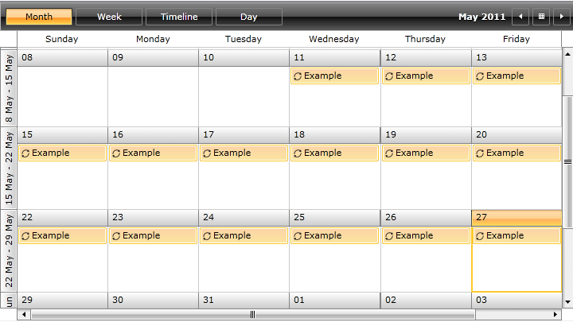
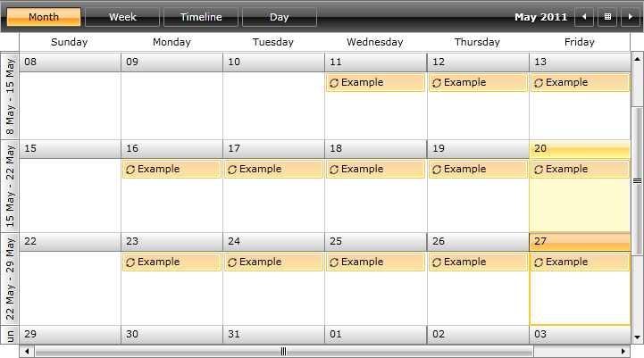
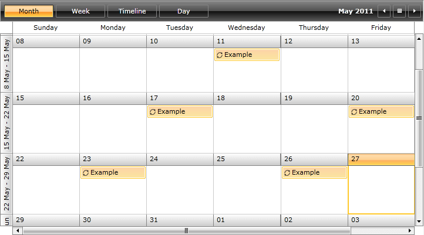
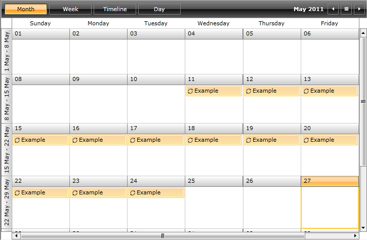

# RecurrencePattern

__RadScheduleView__ includes support for recurring events on daily, weekly, monthly and yearly basis. [Exceptions](#Exceptions) to the recurrence rules are also permitted. To support this recurrence behavior, the __IAppointment__ interface includes the __RecurrenceRule__ property. When an appointment is promoted into a recurring event its __RecurrenceRule__ is set with correct __RecurrencePattern__.

The [RecurrenceRule]() class is the engine for creating and evaluating recurrence rules. It has a mandatory property __Pattern__ of type __RecurrencePattern__.

The purpose of this tutorial is to show you:

* The main properties exposed by the __RecurrencePattern__ class:

	* [Frequency](#frequency)

	* [MinutesOfHour](#minutesofhour)

	* [HoursOfDay](#hoursofday)

	* [DaysOfWeekMask](#daysofweekmask)

	* [Interval](#interval)

	* [DaysOfMonth](#daysofmonth)

	* [DayOrdinal](#dayordinal)

	* [MonthOfYear](#monthofyear)

	* [MaxOccurrences](#maxoccurrences)

	* [RepeatUntil](#repeatuntil)

* The main methods exposed by the __RecurrencePattern__ class:          

	* [Copy()](#copy)

	* [CopyFrom](#copyfrom)

* [Examples](#examples) - show you how to combine the exposed by the __RecurrencePattern__ class properties to configure repeating appointments with ultimate flexibility. The following cases will be examined:          

	* [Create](#how-to-create-every-day-recurring-appointment) every day recurring appointment.            

	* [Create](#how-to-create-every-week-day-recurring-appointment) every __week__ day recurring appointment.            

	* [Create](#how-to-create-an-appointment-that-occurs-on-every-n-days) an appointment that occurs on every "n" days.  
	
	* [Create](#how-to-create-an-appointment-that-occurs-on-every-n-th-day-of-the-month-and-the-interval-between-each-recurrence-is-m-months) an appointment that occurs on every "n-th" day of the month and the interval between each recurrence is "m" months. 
	
	* [Create](#how-to-create-an-appointment-that-occurs-on-every-n-th-week-day-and-the-interval-between-each-recurrence-is-m-months) an appointment that occurs on every "n-th" __week__ day and the interval between each recurrence is "m" months.            

	* [Create](#how-to-create-an-yearly-appointment) a yearly appointment.            

	* [Set](#set-the-maximum-occurrences-of-the-appointment) the maximum occurrences of the appointment.

	* [Set](#set-the-end-date-of-the-appointments-occurrences) the end date of the appointment's occurrences.            

## RecurrencePattern Class

While the __RecurrenceRule__ class is the engine for creating and evaluating recurrence rules, the __RecurrencePattern__ class carries the main information about the occurrence.        

The __RecurrencePattern__ class is located in the __Telerik.Windows.Controls.ScheduleView__ namespace of the __Telerik.Windows.Controls.ScheduleView.dll__ assembly.        

The next several sections describe the main properties and methods exposed by the __RecurrencePattern__ class.        

## Frequency

If you want to set the __frequency__ of the recurrence, you need to set the __RecurrencePattern__'s __Frequency__ property. Its values are predefined in the __RecurrenceFrequency__ enumeration, which exposes the following values:        

* __Minutely__ (available since Q3 2012 SP1) - use __RecurrenceFrequency.Minutely__ whenever you want the appointment to occur every minute.

* __Hourly__ (available since Q3 2012 SP1) - use __RecurrenceFrequency.Hourly__ whenever you want the appointment to occur every hour.

* __Daily__ - use __RecurrenceFrequency.Daily__ whenever you want the appointment to occur every day.

* __Monthly__ - use __RecurrenceFrequency.Monthly__ whenever you want the appointment to occur every month.

* __Weekly__ - use __RecurrenceFrequency.Weekly__ whenever you want the appointment to occur every week.

* __Yearly__ - use __RecurrenceFrequency.Yearly__ whenever you want the appointment to occur every year.

>The __RecurrenceFrequency__ enumeration exposes also the following values:
* __Secondly__
* __None__  
__However, these values are invalid recurrence frequency and should not be used.__

>tipThe default value of the __RecurrencePattern__'s __Frequency__ property is __RecurrenceFrequency.None__. Which means that the __Frequency__ property is a mandatory property and you should always set it.					

>Minutely and Hourly Frequency can be set only with code ( not from the EditAppointmentDialog).  In order to display these options, you should [customize the EditAppointmentDialogStyle]() and add them in the template manually. 

## MinutesOfHour

When you want to specify the minutes of the hour when the appointment occurs, you should set this property. It is mainly used for Minutely Frequency and should be set to an array of integers.

## HoursOfDay

When you want to specify the hours of the day when the appointment occurs, you should set this property. It is mainly used for Hourly Frequency and should be set to an array of integers.

## DaysOfWeekMask

When you want to set the days of the week of the recurrence, you need to set the __RecurrencePattern__'s __DaysOfWeekMask__ property. Its values are predefined in the __RecurrenceDays__ enumeration, which exposes the following values:

* __EveryDay__

* __Friday__

* __Monday__

* __Saturday__

* __Sunday__

* __Thursday__

* __Tuesday__

* __Wednesday__

* __WeekDays__

* __WeekendDays__

* __None__

>tipThe default value of the __RecurrencePattern__'s __DaysOfWeekMask__ property is __RecurrenceDays.None__. However, the __DaysOfWeekMask__ is not a mandatory property.

>tip__RecurrenceDays.WeekDays__ is equivalent to __RecurrenceDays.Monday | RecurrenceDays.Tuesday | RecurrenceDays.Wednesday | RecurrenceDays.Thursday | RecurrenceDays.Friday__.

>tip__RecurrenceDays.WeekendDays__ is equivalent to __RecurrenceDays.Saturday | RecurrenceDays.Sunday.__

>tip__RecurrenceDays.EveryDay__ is equivalent to __RecurrenceDays.Monday | RecurrenceDays.Tuesday | RecurrenceDays.Wednesday | RecurrenceDays.Thursday | RecurrenceDays.Friday | RecurrenceDays.Saturday | RecurrenceDays.Sunday__.

>tip__Enum__ members are often used in logical operation to create a combination of values. Often you should set more than one value of the __DaysOfWeekMask__ property, like in the [Example](#examples) section at the end of the topic.

## Interval

If you want to set the number of days between each recurrence, you need to specify the __RecurrencePattern__'s __Interval__ property.

>tipThe default value of the __RecurrencePattern__'s __Interval__ property is 1.

>tipCombining the __Interval__ property with the __DaysOfWeekMask__ and __Frequency__ pattern gives you even more flexibility when creating recurring appointments. For more information take a look at the [Example](#examples) section at the end of the topic.

## DaysOfMonth

When you want to specify on which day of the month the appointment occurs, you need to set the __DaysOfMonth__ property.

## DayOrdinal

When you want to specify the day ordinal (first, second, third, fourth, etc.), you need to set the __DayOrdinal__ property. For example, you may want to create an appointment that occurs on every second Monday of every third month. Check out the solution [here](#how-to-create-an-appointment-that-occurs-on-every-"n"-days?).

## MonthOfYear

When you want to specify on which month of the year the appointment occurs, you need to set the __MonthOfYear__ property. This property is used mainly in the __Yearly__ appointments. Check out the [Example](#examples) section for more information.

## MaxOccurrences

When you want to specify a limit of the occurrences for the appointment, then you need to set the __MaxOccurrences__ property. Check out the [example](#set-the-maximum-occurrences-of-the-appointment) at the end of the topic.

## FirstDayOfWeek

Gets or sets the day on which the week starts. This property is only meaningful when **RecurrenceFrequency** is set to **Weekly** and **Interval** is greater than **1**.

## RecursUntil

When you want to specify the end date of the appointment's occurrences, then you need to set the __RecursUntil__ property. Check out the [example](#set-the-end-date-of-the-appointment's-occurrences) at the end of the topic.

## Copy()

When you want to create a new instance of __RecurrencePattern__ with the same values as a specified __RecurrencePattern__, then you need to use the __Copy()__ method.


```C#
	var pattern = new RecurrencePattern() {
	    Frequency = RecurrenceFrequency.Monthly,
	    MaxOccurrences = 10
	};
	var copyPattern = pattern.Copy();
```
```VB.NET
	Dim pattern = New RecurrencePattern() With {
	    .Frequency = RecurrenceFrequency.Monthly,
	    .MaxOccurrences = 10
	}
	Dim copyPattern = pattern.Copy()
```

In the above example, a new __monthly__ recurrence pattern is created. It also has a limit of __10 occurrences__. When you invoke the __pattern.Copy()__ method this creates a new instance of the __RecurrencePattern__ class with exactly the same characteristics as the source object (the __Frequency__ property will be set to __RecurrenceFrequency.Monthly__ and the __MaxOccurrences__ property will be set to 10).        

## CopyFrom()

Use the __CopyFrom()__ method to duplicate the pattern properties of the specified __RecurrencePattern__ object in the __RecurrencePattern__ object that calls this method.        


```C#
	var pattern = new RecurrencePattern() {
	    Frequency = RecurrenceFrequency.Monthly,
	    MaxOccurrences = 10
	};
	var newPattern = new RecurrencePattern();
	newPattern.CopyFrom(pattern);
```
```VB.NET
	Dim pattern = New RecurrencePattern() With {
	    .Frequency = RecurrenceFrequency.Monthly,
	    .MaxOccurrences = 10
	}
	Dim newPattern As New RecurrencePattern()
	newPattern.CopyFrom(pattern)
```

All properties in the current instance (newPattern object) will be replaced by the corresponding properties in the specified __RecurrencePattern__ object.

## Examples

For the next examples the following appointment declaration will be used.


```C#
	var startDate = new DateTime(2011, 05, 11, 10, 0, 0);
	var appointment = new Appointment() {
	    Start = startDate,
	    End = startDate.AddHours(2),
	    Subject = "Example"
	};
```
```VB.NET
	Dim startDate = New DateTime(2011, 5, 11, 10, 0, 0)
	Dim appointment = New Appointment() With {
	    .Start = startDate,
	    .End = startDate.AddHours(2),
	    .Subject = "Example"
	}
```

A simple appointment that starts at 11/05/2011 10:00 AM and lasts two hours is created.

## How to Create Every Day Recurring Appointment?

If you want to create an appointment that occurs every day, the only thing you should do is to set the __RecurrencePattern__'s __Frequency__ property to __RecurrenceFrequency.Daily__.        


```C#
	var pattern = new RecurrencePattern() {
	    Frequency = RecurrenceFrequency.Daily
	};
	appointment.RecurrenceRule = new RecurrenceRule(pattern);
```
```VB.NET
	Dim pattern = New RecurrencePattern() With {
	    Frequency = RecurrenceFrequency.Daily
	}
	appointment.RecurrenceRule = New RecurrenceRule(pattern)
```

The result can be seen on the next figure. As you can see the appointment with subject "Example" occurs on every day of the week.

## How to Create Every Week Day Recurring Appointment?

Creating an every day recurring event is extremely simple - you just need to set the [Frequency](#frequency) property. However, if you want to create every week (working) day recurring event, setting only the __Frequency__ property won't be enough. You will need to set the [DaysOfWeekMask](#daysofweekmask) property, too. See the following example:        


```C#
	var pattern = new RecurrencePattern() {
	      Frequency = RecurrenceFrequency.Weekly,
	      DaysOfWeekMask = RecurrenceDays.WeekDays
	};
	appointment.RecurrenceRule = new RecurrenceRule(pattern);
```
```VB.NET
	Dim pattern = New RecurrencePattern() With {
	     .Frequency = RecurrenceFrequency.Weekly,
	     .DaysOfWeekMask = RecurrenceDays.WeekDays
	}
	appointment.RecurrenceRule = New RecurrenceRule(pattern)
```

The result of the above example will be a __RecurrencePattern__ which will create an appointment every week day, like on the image below.



>tipSometimes you may want to create an appointment that occurs during the __weekend__ days, instead of every __week__ day. The only thing you should change is to set the __DaysOfWeekMask__ property to __RecurrenceDays.WeekendDays__.

>tipIf you want to create an appointment that occurs every specific week day (Monday, Tuesday, etc.), you need only to set the correct value for the __DaysOfWeekMask__ property. For example, in order to create an appointment that occurs every Friday, set the __DaysOfWeekMask__ property to __RecurrenceDays.Friday__.        

## How to Create an Appointment that Occurs on Every "n" Days?

When you want to create an appointment that occurs on every "n" days, you should set the __Frequency__, __DaysOfWeekMask__ and the __Interval__ properties of the __RecurrencePattern__ object. For example, in order to create an appointment that occurs on every third day (that means the number of days between each recurrence is 3), you should:

* Set the __Frequency__ property to __RecurrenceFrequency.Daily__.

* Set the __DaysOfWeekMask__ property to __RecurrenceDays.EveryDay__.

* Set the __Interval__ property to 3.


```C#
	var pattern = new RecurrencePattern() {
	    Frequency = RecurrenceFrequency.Daily,
	    DaysOfWeekMask = RecurrenceDays.EveryDay,
	    Interval = 3
	};
	appointment.RecurrenceRule = new RecurrenceRule(pattern);
```
```VB.NET
	Dim pattern = New RecurrencePattern() With {
	     .Frequency = RecurrenceFrequency.Daily,
	     .DaysOfWeekMask = RecurrenceDays.EveryDay,
	     .Interval = 3
	}
	appointment.RecurrenceRule = New RecurrenceRule(pattern)
```

Executing the previous pattern will result in creating an appointment that occurs on every third day. See the next image for the result.



>tipIn this example, the key moment is setting the __Interval__ property. For example, if you want the number of days between each recurrence to be 4, 5, 6 or n days, then you just need to set the correct value to the __Interval__ property.        

## How to Create an Appointment that Occurs on Every "n-th" Day of the Month and the Interval Between Each Recurrence is "m" Months?

For example, if you want to create an appointment that occurs on every __fifth__ day of the month and the interval between each recurrence is __two__ months, then you should perform the following steps:        

* Set the __DaysOfMonth__ property to 5.
          

* Set the __Frequency__ property to __RecurrenceFrequency.Monthly__.
          

* Set the __Interval__ property to 2.          


```C#
	var pattern = new RecurrencePattern() {
	    DaysOfMonth = new int[] { 5 },
	    Frequency = RecurrenceFrequency.Monthly,
	    Interval = 2
	};
	appointment.RecurrenceRule = new RecurrenceRule(pattern);
```
```VB.NET
	Dim pattern = New RecurrencePattern() With {
	     .DaysOfMonth = New int[] { 5 },
	     .Frequency = RecurrenceFrequency.Monthly,  
	     .Interval = 2
	}
	appointment.RecurrenceRule = New RecurrenceRule(pattern)
```

## How to Create an Appointment that Occurs on Every "n-th" Week Day and the Interval Between Each Recurrence is "m" Months?

For example, if you want to create an appointment that occurs on every second Monday of the month and the interval between each recurrence is two months, then you should perform the following steps:

* Set the __DayOrdinal__ to 2.

* Set the __Frequency__ property to __RecurrenceFrequency.Monthly__.

* Set the __DaysOfWeekMask__ property to __RecurrenceDays.Monday__.

* Set the __Interval__ property to 2.


```C#
	var pattern = new RecurrencePattern() {
	    DayOrdinal = 2,
	    DaysOfWeekMask = RecurrenceDays.Monday,
	    Frequency = RecurrenceFrequency.Monthly,
	    Interval = 2
	};
	appointment.RecurrenceRule = new RecurrenceRule(pattern);
```
```VB.NET
	Dim pattern = New RecurrencePattern() With {
	     .DayOrdinal = 2,
	     .DaysOfWeekMask = RecurrenceDays.Monday,
	     .Frequency = RecurrenceFrequency.Monthly,  
	     .Interval = 2
	}
	appointment.RecurrenceRule = New RecurrenceRule(pattern)
```

## How to Create an Yearly Appointment?

For example, if you want to create an appointment that occurs on 13th of November each year, then you should perform the following steps:

* Set the __Frequency__ property to __RecurrenceFrequency.Yearly__.          

* Set the __MonthOfYear__ to 11.          

* Set the __DaysOfMonth__ to 13.          


```C#
	var pattern = new RecurrencePattern() {
	    Frequency = RecurrenceFrequency.Yearly,
	    MonthOfYear = 11,
	    DaysOfMonth = new int[] { 13 }
	};
	appointment.RecurrenceRule = new RecurrenceRule(pattern);
```
```VB.NET
	Dim pattern = New RecurrencePattern() With {
	    .Frequency = RecurrenceFrequency.Yearly,
	    .MonthOfYear = 11,
	    .DaysOfMonth = New int[] { 13 }
	}
	appointment.RecurrenceRule = New RecurrenceRule(pattern)
```

## Set the Maximum Occurrences of the Appointment

When you want to specify a limit of the occurrences for the appointment, then you need to set the __MaxOccurrences__ property. For example if you want to specify a limit of 3 occurences for a daily appointment, then you should set the __MaxOccurrences__ property to 3.


```C#
	var pattern = new RecurrencePattern() {
	    Frequency = RecurrenceFrequency.Daily,
	    MaxOccurrences = 3
	};
	appointment.RecurrenceRule = new RecurrenceRule(pattern);
```
```VB.NET
	Dim pattern = New RecurrencePattern() With {
	    .Frequency = RecurrenceFrequency.Daily,
	    .MaxOccurrences = 3
	}
	appointment.RecurrenceRule = New RecurrenceRule(pattern)
```

## Set the End Date of the Appointment's Occurrences

When you want to specify the end date of the appointment's occurrences, then you need to set the __RepatUntil__ property.


```C#
	var pattern = new RecurrencePattern() {
	    Frequency = RecurrenceFrequency.Daily,
	    RecursUntil = new DateTime( 2011, 05, 24, 10, 0, 0 )
	};
	appointment.RecurrenceRule = new RecurrenceRule(pattern);
```
```VB.NET
	Dim pattern = New RecurrencePattern() With {
	     .Frequency = RecurrenceFrequency.Daily,
	     .RecursUntil = New DateTime(2011, 5, 24, 10, 0, 0)
	}
	appointment.RecurrenceRule = New RecurrenceRule(pattern)
```

The appointment that starts on 11.05.201 will occur until 24.05.2011. See the next image.


