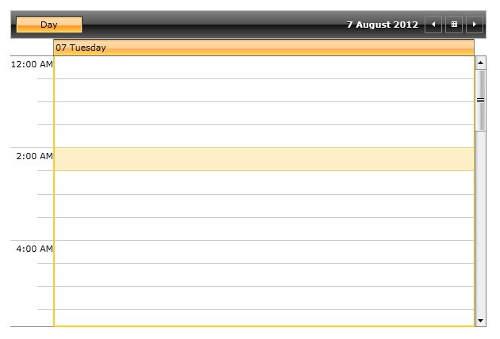
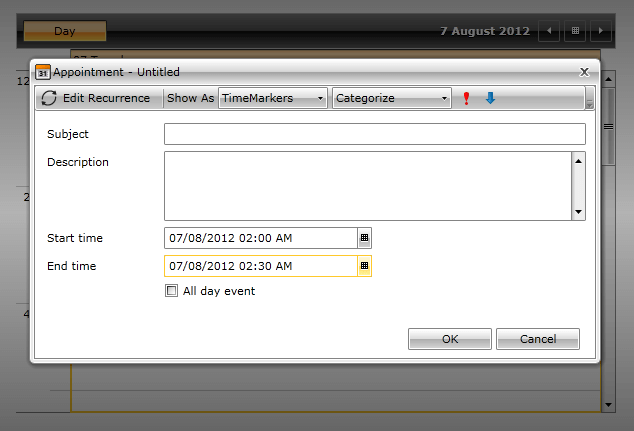
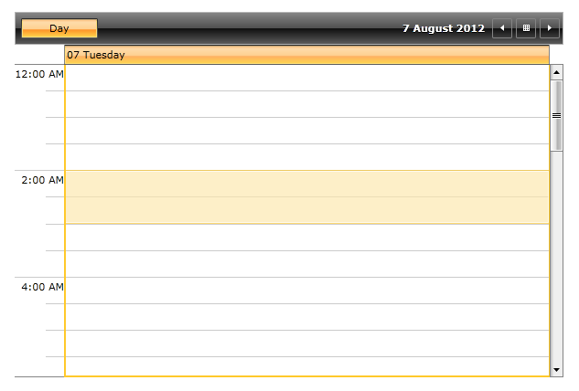
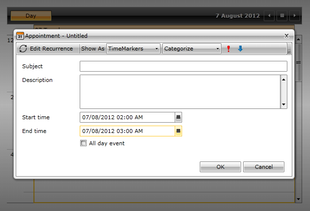

# SlotSelectionBehavior

In RadScheduleView there are plugin selection behaviors that make it possible to customize the logic behind all selections in the control. There are selection behaviors like AppointmentSelectionBehavior, SlotSelectionBehavior etc.

SlotSelectionBehavior is responsible for executing the selection logic of slots in the control. The behavior can be customized in order to implement behaviors for selecting all of the empty slots between two appointments, skipping slots when selecting restricted slots etc.

## One hour selection behavior

When selecting a slot in RadScheduleView the default SlotSelectionBehavior depends on the size of the MinorTickLength to determine the length of the selected slot. When changing the MinorTickLength from its default value custom SlotSelectionBehavior can help you implement fixed selection length.

This tutorial will go through the steps needed to create a custom SlotSelectionBehavior in the scenario when the selected slot needs to be equal to one hour.

* Create a custom SlotSelectionBehavior class that inherits SlotSelectionBehavior class:

#### __C#__

```C#
	public class CustomSlotSelectionBehavior : SlotSelectionBehavior
	{
	}
```

* Override the GetSelectionOverride method:

#### __C#__

```C#
	public class CustomSlotSelectionBehavior : SlotSelectionBehavior
	{
		protected override Slot GetSelectionOverride(SlotSelectionState state, Slot currentSlot)
		{
			Slot newSlotSelection = new Slot(currentSlot.Start, currentSlot.End.AddMinutes(30));
			return base.GetSelectionOverride(state, newSlotSelection);
		}
	}
```

* All that is left is to attach the newly create custom behavior to the ScheduleView control:


#### __XAML__

```XAML
	<telerik:RadScheduleView>
		...
		<telerik:RadScheduleView.SlotSelectionBehavior>
			<local:CustomSlotSelectionBehavior/>
		</telerik:RadScheduleView.SlotSelectionBehavior>
		...
	</telerik:RadScheduleView>
```

Finally the ScheduleView control in the XAML should look like this:

#### __XAML__

```XAML
	<telerik:RadScheduleView>
		...
		<telerik:RadScheduleView.ViewDefinitions>
			<telerik:DayViewDefinition MinorTickLength="30min" MajorTickLength="2h"/>
		</telerik:RadScheduleView.ViewDefinitions>
		<telerik:RadScheduleView.SlotSelectionBehavior>
			<local:CustomSlotSelectionBehavior/>
		</telerik:RadScheduleView.SlotSelectionBehavior>
	</telerik:RadScheduleView>
```

The end result is:

* With the default SlotSelectionBehavior:



* With the default SlotSelectionBehavior (creating new appointment with double click on a slot):



* With the custom SlotSelectionBehavior:



* With the custom SlotSelectionBehavior (creating new appointment with double click on a slot):



## See Also

 * [AppointmentSelectionBehavior]()

 * [Custom Slots]()

 * [Special and ReadOnly slots]()
