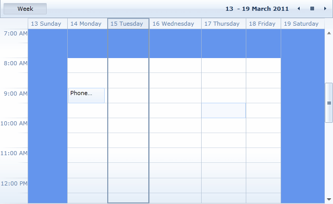
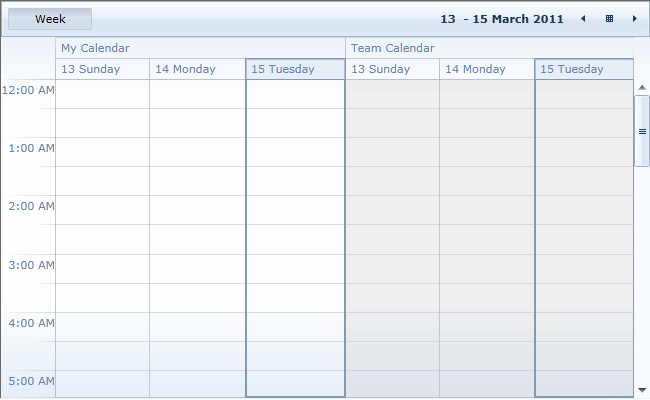

# Special and ReadOnly slots

Using __RadScheduleView__ you can define special and read-only slots and apply different styles to them.  You just need to prepare a collection of Slot objects and assign it to __SpecialSlotsSource__ property of the ScheduleView.      

Every Slot has the following properties:

* __Start__ - start date of the Slot.          

* __End__ - end date of the Slot.          

* __Resources__ - a collection of resources for which the slot is defined.          

* __RecurrencePattern__ - defines whether the slot will be displayed for repeating days.          

* __IsReadOnly__ - when set to __true__ the slot is disabled.          

>When a slot is disabled you cannot create, edit, delete or drag and drop appointments in it. The existing appointments in disabled slots are in read-only mode - edit appointment dialog is still shown when the appointment is clicked but its properties cannot be edited. ReadOnly slots have a greyed-out style applied, but it can be changed with SpecialSlotsStyleSelector.        

__SpecialSlotsStyleSelector__ allows you to apply a separate Style for the special slots. You can use this feature for working/nonworking hours, holidays, days off, etc.      

This article will cover the following examples:      

[Setting a separate Style for nonworking hours](#setting-a-separate-style-for-nonworking-hours)

[Setting all the slots for a given resource to be read-only](#setting-all-the-slots-for-a-given-resource-to-be-read-only)

>In some cases when using a big number of special slots there could be some __performance__ issues in the RadScheduleView control. In order to not lose performance when using Special and ReadOnly slots you should keep in mind the following measures:      
>	* Populate the Slots that are in the visible range only.       
>	* If a Slot is in multiple Resources at the same time do not create a separate Slot for each Resource but rather assign the Resources to the Slot.     
>	* If a Slot is recurring do not create many different separate Slots but rather create a recurring one.            
>	* Treat the Slots as Appointments, the same performance principals exist.            

## Setting a separate Style for nonworking hours

* First you should create the collection of Slot objects and set their RecurrencePattern property:            

<snippet id='radscheduleview-features-speacialslots-block_1-cs' />

* Then create the ScheduleViewStyleSelector class:            

<snippet id='radscheduleview-features-speacialslots-block_2-cs' />

and define the Style:

<snippet id='radscheduleview-features-speacialslots-block_3-xaml' />

* Finally, bind them to SpecialSlotsSource and SpecialSlotsStyleSelector properties:            

<snippet id='radscheduleview-features-speacialslots-block_4-xaml' />

Here is the result:

##  Setting all the slots for a given resource to be read-only

Let's for example have the following Resource Type defined:

<snippet id='radscheduleview-features-speacialslots-block_5-xaml' />

* You can create the collection of read-only slots for "Team" Resource like this:           

<snippet id='radscheduleview-features-speacialslots-block_6-cs' />

> The types of objects added to the Resources collection of the Slot and to the ResourceType object in the ResourceTypesSource need to match. This is important in scenarios where the __IResource__ interface is implemented.

* And assign it to the ScheduleView's SpecialSlotsSource property:            

<snippet id='radscheduleview-features-speacialslots-block_7-xaml' />

The read-only slots will look like this:

Note that EditAppointmentDialog is shown even for appointments which are visualized in the read-only slots. In order to prevent it, susbscribe to ShowDialog event of the RadScheduleView:        

<snippet id='radscheduleview-features-speacialslots-block_8-xaml' />

and cancel it in the event handler:       

<snippet id='radscheduleview-features-speacialslots-block_9-cs' />

Check out the [online demo](https://demos.telerik.com/silverlight/#ScheduleView/SpecialSlots)[online demo](https://demos.telerik.com/wpf/?ScheduleView/SpecialSlots) to see special slots in action.        