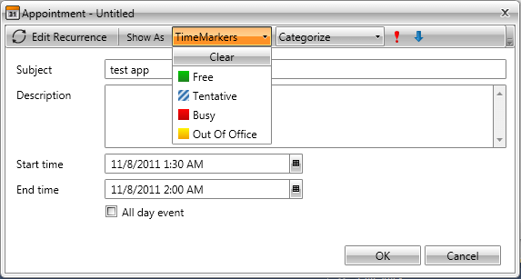
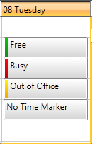
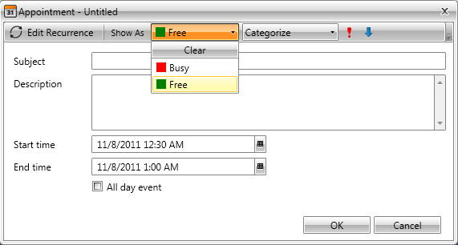

# Time Markers

__RadScheduleView__ provides you with a built-in time markers support. You can assign a time marker to each one of your appointments, thus making them easily distinguishable.		

This chapter will cover the following topics:

* [Assign Time Marker to an Appointment run-time](#assign-time-marker-to-an-appointment-run-time)

* [Adding TimeMarkers to the RadScheduleView](#adding-timemarkers-to-the-radscheduleview)

## Assign Time Marker to an Appointment run-time

Run-time you can define the time marker of your appointment via the drop down menu in the EditAppointmentDialog.



On the snapshot below you can see four appointments where three of them have time markers set, while the fourth does not have. Notice the color markers in the left part of the appointments.



## Adding TimeMarkers to the RadScheduleView

By default the RadScheduleView has predefined list of time markers i.e. "Busy", "Free", etc.

However, there are cases when new time markers are needed and you have to create them on your own, as it is shown below. 

Each time marker has three important characteristics:

1. __TimeMarkerName__ - each time marker has a name assigned. It is used to distinguish that time marker amongst the others in your application.

1. __TimeMarkerBrush__ - each category has a color brush assigned.

The time markers available in the RadScheduleView are defined in the TimeMarkersSource property (IEnumarable). Just add or remove time markers to that collection in order to add or remove time markers to the RadScheduleView itself.

#### __XAML__

```XAML
	<telerik:RadScheduleView x:Name="scheduleView" AppointmentsSource="{Binding Appointments}">
			<telerik:RadScheduleView.TimeMarkersSource>
				<telerik:TimeMarkerCollection>
					<telerik:TimeMarker TimeMarkerName="Busy" TimeMarkerBrush="Red"  />
					<telerik:TimeMarker TimeMarkerName="Free" TimeMarkerBrush="Green" />
				</telerik:TimeMarkerCollection>
			</telerik:RadScheduleView.TimeMarkersSource>
				<telerik:RadScheduleView.ViewDefinitions>
			<telerik:DayViewDefinition />
		</telerik:RadScheduleView.ViewDefinitions>		
	</telerik:RadScheduleView>
```

or

#### __C#__

```C#
	public class MyViewModel : ViewModelBase
	{
		public ObservableCollection<Appointment> Appointments { get; set; }
		public ObservableCollection<TimeMarker> TimeMarkers { get; set; }
	
		public MyViewModel()
		{
			this.Appointments = new ObservableCollection<Appointment>();
			this.TimeMarkers = new ObservableCollection<TimeMarker>() {
				new TimeMarker("Busy", new SolidColorBrush( Colors.Red ) ),
				new TimeMarker("Free", new SolidColorBrush( Colors.Green ) )
			};
		}
	}
```

#### __XAML__

```XAML
	<telerik:RadScheduleView x:Name="scheduleView" 
				AppointmentsSource="{Binding Appointments}"
				TimeMarkersSource="{Binding TimeMarkers}">		
				<telerik:RadScheduleView.ViewDefinitions>
			<telerik:DayViewDefinition />
		</telerik:RadScheduleView.ViewDefinitions>		
	</telerik:RadScheduleView>
```

Finally, set the DataContext:

#### __C#__

```C#
	this.DataContext = new MyViewModel();
```

Here is the result:



## See Also

 * [Implementing View-ViewModel ]()
 