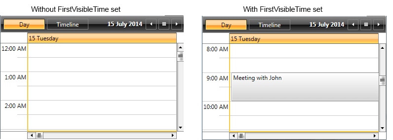
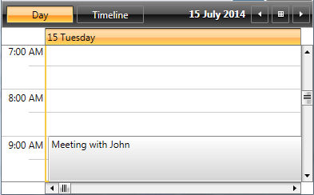
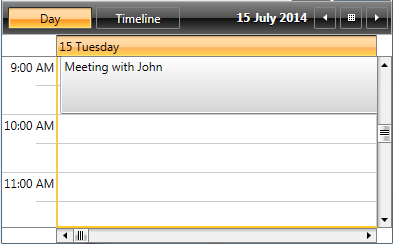

# Scrolling the TimeRuler

This article will explain how you could set up the ScheduleView, so that the ViewDefintion is scrolled to specific time or a particular appointment/slot.  We will take a look at the following properties/methods of the control:

* [FirstVisibleTIme property](#firstvisibletime-property)

* [ScrollIntoView method](#scrollintoview-method)

* [ScrollTimeRuler method](#scrolltimeruler-method)         

## FirstVisibleTime property

__FirstVisibleTime__ property is of type TimeSpan and is used to scroll the TimeRuler of the ActiveViewDefinition to a specific time. 

__FirstVisibleTime__ property is applied only with the initial load of the ScheduleView, afterwards when you change the ViewDefinitions they will go to their DayStartTime.

__Example 1__ shows how the property can be set in XAML and __Example 2__ – in code-behind.

__Example 1__

```XAML
	<telerik:RadScheduleView x:Name="ScheduleView"
	    AppointmentsSource="{Binding Appointments}"                                  
	                         FirstVisibleTime="8:00:00">
	     <telerik:RadScheduleView.ViewDefinitions>
	          <telerik:DayViewDefinition />
	     </telerik:RadScheduleView.ViewDefinitions>
	</telerik:RadScheduleView>
```

__Example 2__

```C#
	ScheduleView.FirstVisibleTime = TimeSpan.FromHours(8);
```

The next screenshot shows how the ScheduleView looks on its initial load with and without FirstVisibleTIme set:



## ScrollIntoView method

__ScrollIntoView__ method is used to scroll the ActiveViewDefinition to a specific slot. It takes as first argument the Slot itself or an Appointment. In case the parameter is of type Appointment (or an occurrence of a recurrent appointment), the method calculates the slot where the appointment is placed and scrolls to it. Additionally, ScrollIntoView accepts a second optional parameter which identifies whether the slot should be aligned to top/left depending on the orientation (the default value is __false__).        

__Example 3__ shows how you can scroll to a particular appointment:

__Example 3__

```C#
	ScheduleView.ScrollIntoView(meetingApp);
```

The TimeRuler is scrolled, so that the appointment is visible:



Calling the same method with a second parameter set to true as shown in __Example 4__:

__Example 4__

```C#
	ScheduleView.ScrollIntoView(meetingApp, true);
```

leads to the following result:



>__ScrollIntoView__ methods scrolls only by TimeRuler – this means that if the TimeRuler is vertical, it will update only the vertical scrollbar and will not affect the horizontal scrollbar.

## ScrollTimeRuler method

__ScrollTimeRuler__ method scrolls the TimeRuler to the specified time. It accept a first parameter of type TimeSpan and a second boolean parameter to identify whether the time should be scrolled to top/left depending on the orientation.

__Example 5__ demonstrates how the method can be used:

__Example 5__

```C#
	ScheduleView.ScrollTimeRuler(TimeSpan.FromHours(10), true);
```

And the result is:


## See Also

 * [Configuring the TimeRuler ticks]()
