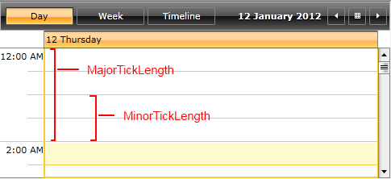
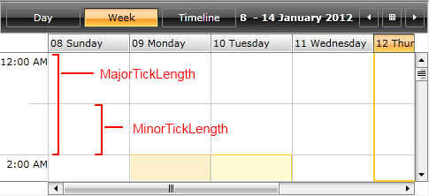
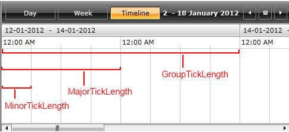

# Configuring the TimeRuler ticks

The __MajorTickLength__ and __MinorTicklength__ properties of the RadScheduleView ViewDefinitions are used to determine the density of the time ruler items. You can play with different combinations to find the one that best suits your needs. The appointments will snap with regards to the minor ticks.  Also TimelineViewDefinition has an additional __GroupTickLength__ property used to set the length of the group.

Let’s have the RadScheduleView defined like this:


```XAML
	<telerik:RadScheduleView AppointmentsSource="{Binding Appointments}" >
		<telerik:RadScheduleView.ViewDefinitions>
			<telerik:DayViewDefinition MinorTickLength="30min" MajorTickLength="2h"  />
			<telerik:WeekViewDefinition MinorTickLength="1h" MajorTickLength="2h" />
			<telerik:TimelineViewDefinition MinorTickLength="6h" MajorTickLength="1d" GroupTickLength="2d" />
		</telerik:RadScheduleView.ViewDefinitions>
	</telerik:RadScheduleView>
```

This will lead to the following results:

* In DayViewDefinition:



* In WeekViewDefinition:



* In TimelineViewDefinition:



>You can check [this article]() where it is explained how the dates and times on the time ruler can be formatted.   	

## Setting the properties

The ticklength properties can be set in the XAML and in code-behind:

* In XAML: 

	You can use the following formats:

	* min,  minute, minutes;

	* h, hour, hours;

	* d, day, days;

	* w, week, weeks;

	* m, month, months;

	* y, year, years.

Here are some examples:


```XAML
	<telerik:DayViewDefinition MinorTickLength="5min" MajorTickLength="1h" />				
	<telerik:TimelineViewDefinition MinorTickLength="1day" MajorTickLength="2days" GroupTickLength="1week" />
```

* In Code-Behind:

	The same can be set in code-behind like this:


```C#
	var dayView = new DayViewDefinition()
	{
		MinorTickLength = new FixedTickProvider(new DateTimeInterval(5, 0, 0, 0, 0)),
		MajorTickLength = new FixedTickProvider(new DateTimeInterval(0, 1, 0, 0, 0))
	};
	this.ScheduleView.ViewDefinitions.Add(dayView);
	
	
	var timelineView = new TimelineViewDefinition()
	{
		MinorTickLength = new FixedTickProvider(new DateTimeInterval(1, 0)),
		MajorTickLength = new FixedTickProvider(new DateTimeInterval(2, 0)),
		GroupTickLength = new FixedTickProvider(new DateTimeInterval(0, 0, 1))
	};
	this.ScheduleView.ViewDefinitions.Add(timelineView);
```


You can check the ScheduleView Configurator example at [UI for Silverlight demos](https://demos.telerik.com/silverlight/#ScheduleView/ScheduleViewConfigurator)[UI for WPF demos](https://demos.telerik.com/wpf/) to see the tick length properties in action.
