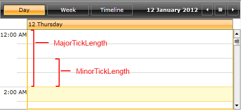
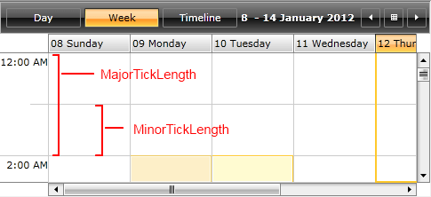
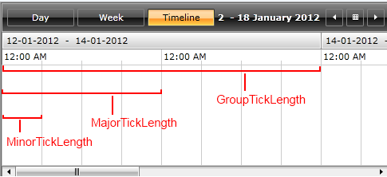

# Configuring the TimeRuler ticks

The __MajorTickLength__ and __MinorTicklength__ properties of the RadScheduleView ViewDefinitions are used to determine the density of the time ruler items. You can play with different combinations to find the one that best suits your needs. The appointments will snap with regards to the minor ticks.  Also TimelineViewDefinition has an additional __GroupTickLength__ property used to set the length of the group.

Let’s have the RadScheduleView defined like this:

<snippet id='radscheduleview-features-timeruler-ticks-configuration-block_1-xaml' />

This will lead to the following results:

* In DayViewDefinition:

* In WeekViewDefinition:

* In TimelineViewDefinition:

>You can check [this article]() where it is explained how the dates and times on the time ruler can be formatted.   	

## Setting the properties

The ticklength properties can be set in the XAML and in code-behind:

* In XAML: 

	You can use the following formats:

	* min,  minute, minutes;

	* h, hour, hours;

	* d, day, days;

	* w, week, weeks;

	* m, month, months;

	* y, year, years.

Here are some examples:

<snippet id='radscheduleview-features-timeruler-ticks-configuration-block_2-xaml' />

* In Code-Behind:

	The same can be set in code-behind like this:

<snippet id='radscheduleview-features-timeruler-ticks-configuration-block_3-cs' />

You can check the ScheduleView Configurator example at [UI for Silverlight demos](https://demos.telerik.com/silverlight/#ScheduleView/ScheduleViewConfigurator)[UI for WPF demos](https://demos.telerik.com/wpf/) to see the tick length properties in action.