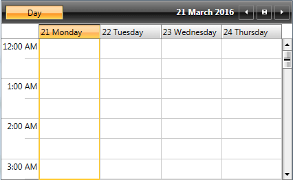
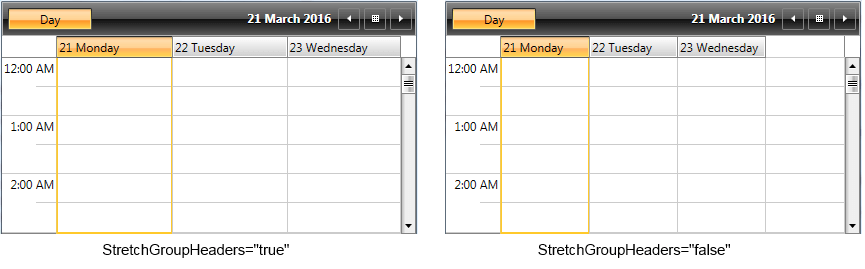
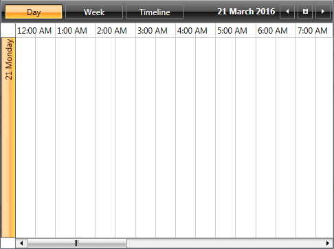
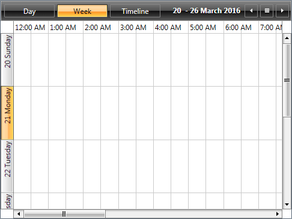
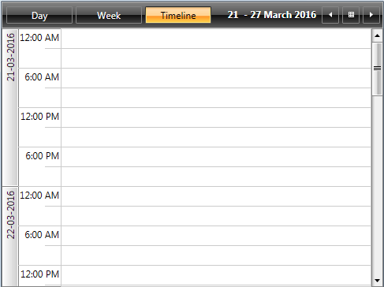
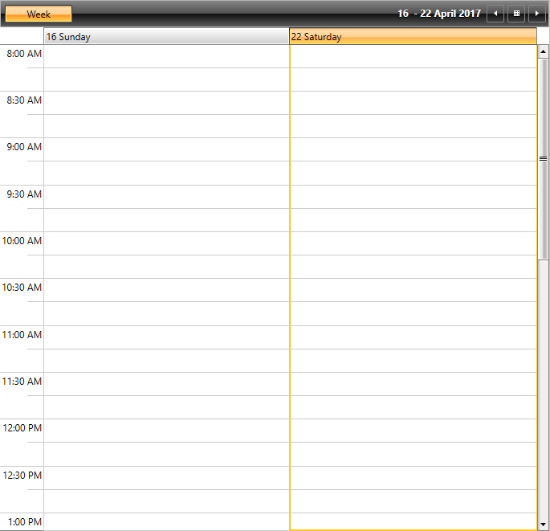
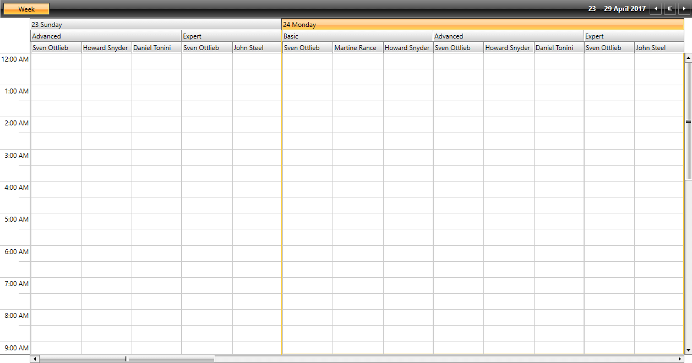

# Configuration

RadScheduleView's predefined ViewDefinitions have various properties, which can be set in order the views to be configured best. Some of them are common for all views, others are specific for each view. In the following section we will go through all common properties.      

>For more information about the view specific properties, check [here]().

* [Title](#title)

* [LargeChangeInterval](#largechangeinterval)

* [SmallChangeInterval](#smallchangeinterval)

* [DayStartTime](#daystarttime)

* [DayEndTime](#dayendtime)

* [VisibleDays](#visibledays)

* [FirstDayOfWeek](#firstdayofweek)

* [StretchGroupHeaders](#stretchgroupheaders)

* [Orientation](#orientation)

* [GroupFilter](#groupfilter)

* [SubGroupsFilter](#subgroupsfilter)

## Title

Gets or sets the title of the view.LargeChangeInterval

## LargeChangeInterval

Gets or sets the date time interval with which the current will be increased or decreased when clicking on the navigation buttons in the header of the ScheduleView. The default values of the __LargeChangeInterval__ property are:

* 1d (1 day) for DayView

* 7d (7 days) for WeekView

* 1m (1 month) for MonthView

* 7d (7 days) for TimelineView

The property is of type __DateTimeInterval__. In the following example the __LargeChangeInterval__ property of DayView is set to 2 days and of MonthView is set of 2 months and 4 days.

__Example 1: Setting the LargeChangeInterval property in XAML__  
```XAML
	<telerik:RadScheduleView x:Name="scheduleView" AppointmentsSource="{Binding Appointments}">
		<telerik:RadScheduleView.ViewDefinitions>
			<telerik:DayViewDefinition LargeChangeInterval="2d"/>
			<telerik:MonthViewDefinition LargeChangeInterval="2m 4d"/>
		</telerik:RadScheduleView.ViewDefinitions>
	</telerik:RadScheduleView>
```

__Example 2: Setting the LargeChangeInterval property in code__  
```C#
	dayDefintion.LargeChangeInterval = new Telerik.Windows.Controls.ScheduleView.
	DateTimeInterval(2, 0);
	monthDefinition.LargeChangeInterval = new Telerik.Windows.Controls.ScheduleView.
	DateTimeInterval(4, 2);
```

## SmallChangeInterval

Gets or sets the small change interval of the ScheduleView. It indicates the date time interval with which the current will be increased or decreased when moving the scrollbar. The default values of the __SmallChangeInterval__ are:      

* 7d (7 days) for MonthView

* 1d (1 day) for TimelineView

Setting the SmallChangeInterval property of a DayViewDefiniton and WeekViewDefinition won’t change the behavior of the view. That is due to that using the vertical scrollbar will not navigate to the next set of days, but will scroll the current view.      

The following example shows how to set the __SmallChangeInterval__ property of a MonthViewDefinition to 11 days and of a TimelineViewDefinition to 3 days:

__Example 3: Setting the SmallChangeInterval property in XAML__
```XAML
	<telerik:RadScheduleView x:Name="scheduleView" AppointmentsSource="{Binding Appointments}">
		<telerik:RadScheduleView.ViewDefinitions>
			<telerik:MonthViewDefinition SmallChangeInterval="11d"/>
			<telerik:TimelineViewDefinition SmallChangeInterval="3d"/>
		</telerik:RadScheduleView.ViewDefinitions>
	</telerik:RadScheduleView>
```

__Example 4: Setting the SmallChangeInterval property in code__  
```C#
	monthDefintion.SmallChangeInterval = new Telerik.Windows.Controls.ScheduleView.
	DateTimeInterval(11, 0);
	timelineDefinition.SmallChangeInterval = new Telerik.Windows.Controls.ScheduleView.
	DateTimeInterval(3, 0);
```

## DayStartTime

Gets or sets the time used to indicate the start of the TimeRuler. The default value of the DayStartTime for all views is 00:00:00 or 12:00 AM.      

The DayStartTime is of type TimeSpan. It will not affect the look of the MonthView, since MonthView does not display time.      

The following example illustrates how to set the DayStartTime for DayView, WeekView and TimelineView:

__Example 5: Setting the DateStartTime property in XAML__  
```XAML
	<telerik:RadScheduleView x:Name="scheduleView" AppointmentsSource="{Binding Appointments}">
		<telerik:RadScheduleView.ViewDefinitions>
			<telerik:DayViewDefinition DayStartTime="07:30:00"/>
			<telerik:WeekViewDefinition DayStartTime="08:00:00"/>
			<telerik:TimelineViewDefinition DayStartTime="11:30:00"/>
		</telerik:RadScheduleView.ViewDefinitions>
	</telerik:RadScheduleView>
```

__Example 6: Setting the DateStartTime property in code__  
```C#
	dayDefintion.DayStartTime = new TimeSpan(7, 30, 00);
	weekDefinition.DayStartTime = new TimeSpan(8, 0, 0);
	timelineDefinition.DayStartTime = new TimeSpan(11, 30, 0);
```

> MonthViewDefinition and AgendaViewDefinition do not support the __DayStartTime__ property.

## DayEndTime

Gets or sets the time used to indicate the end of the view. The default values of the DayStartTime for the view are:      

* 1.00:00:00 (1 day) for DayView

* 1.00:00:00 (1 day) for WeekView

* 1.00:00:00 (1 day) for TimelineView

The DayEndTime property is of type TimeSpan. The MonthView will be affected in the following manner – if there are appointments out of the displayed time range, they won’t be displayed in the MonthView also.      

The following example illustrates how to set the DayStartTime for DayView, WeekView and TimelineView:      

__Example 7: Setting the DayEndTime property in XAML__  
```XAML
	<telerik:RadScheduleView x:Name="scheduleView" AppointmentsSource="{Binding Appointments}">
		<telerik:RadScheduleView.ViewDefinitions>
			<telerik:DayViewDefinition DayEndTime="17:30:00"/>
			<telerik:WeekViewDefinition DayEndTime="18:00:00"/>
			<telerik:TimelineViewDefinition DayEndTime="21:30:00"/>
		</telerik:RadScheduleView.ViewDefinitions>
	</telerik:RadScheduleView>
```

__Example 8: Setting the DayEndTime property in code__  
```C#
	dayDefintion.DayEndTime = new TimeSpan(17, 30, 00);
	weekDefinition.DayEndTime = new TimeSpan(18, 0, 0);
	timelineDefinition.DayEndTime = new TimeSpan(21, 30, 0);
```

> MonthViewDefinition and AgendaViewDefinition do not support the __DayEndTime__ property.

## VisibleDays

Gets or sets the visible dates in the view. It indicates the count of the dates that will be shown in the view. The default values of the VisibleDays property are:      

* 1 day for DayView

* 7 days for WeekView

* 42 days for MonthView

* 7 days for TimelineView

The following code-snippet illustrates how to set the VisibleDays property in XAML and in code-behind for all predefined views:      

__Example 9: Setting the VisibleDays property in XAML__  
```XAML
	<telerik:RadScheduleView x:Name="scheduleView" AppointmentsSource="{Binding Appointments}">
		<telerik:RadScheduleView.ViewDefinitions>
			<telerik:DayViewDefinition VisibleDays="4"/>
			<telerik:WeekViewDefinition VisibleDays="11"/>
			<telerik:MonthViewDefinition VisibleDays="21" />
			<telerik:TimelineViewDefinition VisibleDays="9"/>
		</telerik:RadScheduleView.ViewDefinitions>
	</telerik:RadScheduleView>
```

__Example 10: Setting the VisibleDays property in code__  
```C#
	dayDefintion.VisibleDays = 4;
	weekDefinition.VisibleDays = 11;
	monthDefintion.VisibleDays = 21;
	timelineDefinition.VisibleDays = 9;
```

#### __Figure 1: RadScheduleView with VisibleDays set__  


## FirstDayOfWeek

Gets or sets the first weekday with which the week will start according to the view. It affects only the WeekView and MonthView. Once set, it will override the FirstDayOfWeek property of the ScheduleView and the one that is default for the culture.

## StretchGroupHeaders

If set to True (default value) and there is more available space in the ViewDefintion left, it will be distributed among the groups. 

__Example 11: Setting the StretchGroupHeaders property__  
```XAML
	<telerik:RadScheduleView x:Name="scheduleView" AppointmentsSource="{Binding Appointments}" >		
		<telerik:RadScheduleView.ViewDefinitions>
			<telerik:DayViewDefinition VisibleDays="3" StretchGroupHeaders="False"  />           
		</telerik:RadScheduleView.ViewDefinitions>
	</telerik:RadScheduleView>
```

#### __Figure 2: RadScheduleView with StretchGroupHeaders set__  


## Orientation

Gets or sets the orientation of the view. When the orientation is horizontal the TimeRuler is also horizontally oriented, but the GroupHeaders are oriented vertically and vice versa.      

Values can be Vertical or Horizontal. __Not present in MonthView.__ This is measured according to the position of the TimeRuler. The default values of Orientation property are:      

* Vertical for DayView

* Vertical for WeekView

* Horizontal for TimelineView

The following code-snippets show how to set the Orientation property in XAML and code-behind:      

__Example 12: Setting the Orientation property in XAML__  
```XAML
	<telerik:RadScheduleView x:Name="scheduleView" AppointmentsSource="{Binding Appointments}">
		<telerik:RadScheduleView.ViewDefinitions>
			<telerik:DayViewDefinition Orientation="Horizontal" />
			<telerik:WeekViewDefinition Orientation="Horizontal"/>
			<telerik:TimelineViewDefinition Orientation="Vertical"/>
		</telerik:RadScheduleView.ViewDefinitions>
	</telerik:RadScheduleView>
```

__Example 13: Setting the Orientation property in code__  
```C#
	dayDefintion.Orientation = Orientation.Horizontal;
	weekDefinition.Orientation = Orientation.Horizontal;
	timelineDefinition.Orientation = Orientation.Vertical;
```

The following figures show the how the Orientation property affects the views.

#### __Figure 3: DayView with Horizontal Orientation__  


#### __Figure 4: WeekView with Horizontal Orientation__  


#### __Figure 5: TimelineView with Vertical Orientation__  


## GroupFilter

The __GroupFilter__ property can be used when in a grouped scenario a given group needs to be excluded. It is a predicate that takes a given group as a parameter and returns a boolean value determining whether the group should take part in the grouping operation or not. The following example demonstrates how __RadScheduleView__ can display only weekends or only working days through its __GroupFilter__.

__Example 14: Defining the GroupFilter predicate in the view model__  
```C#
	public class MyViewModel : ExampleViewModel<Appointment>
    {
         private Func<object, bool> groupFilter;

         public MyViewModel()
         {
             this.groupFilter = new Func<object, bool>(this.GroupFilterFunc);
         }

         public Func<object, bool> GroupFilter
         {
             get
             {
                 return this.groupFilter;
             }
             private set
             {
                 if (this.groupFilter != value)
                 {
                     this.groupFilter = value;
                     this.OnPropertyChanged(() => this.GroupFilter);
                 }
             }
         }

         private bool GroupFilterFunc(object groupName)
         {
             if (groupName is DateTime)
             {
                 return ((DateTime)groupName).DayOfWeek == DayOfWeek.Saturday
                     || ((DateTime)groupName).DayOfWeek == DayOfWeek.Sunday;
             }
             return true;
         }
    }
```	

__Example 15: Applying the GroupFilter to a WeekView__  
```XAML
	<telerik:RadScheduleView AppointmentsSource="{Binding Appointments}">
            <telerik:RadScheduleView.ViewDefinitions>
                <telerik:WeekViewDefinition GroupFilter="{Binding GroupFilter}" DayStartTime="08:00" DayEndTime="20:00"/>
            </telerik:RadScheduleView.ViewDefinitions>
```	

#### __Figure 6: WeekView with applied GroupFilter__  

 
## SubGroupsFilter

As of __R2 2017__ RadScheduleView exposes the __SubGroupsFilter__ mechanism. It provides the option to control whether a given item should be visible in a particular group or not. The following example demonstrates how RadScheduleView can be populated with some sample Resources and how they can be visualized in a given group and hidden in another.

__Example 16: Defining the SubGroupsFilter in the view model__  
```C#
	public class MyViewModel : ExampleViewModel<Appointment>
    {
         private Func<IGroupInfo, bool> subGroupsFilter;

         public MyViewModel()
         {
            this.subGroupsFilter = new Func<IGroupInfo, bool>(this.FilterSpeakersByRooms);
         }

        public Func<IGroupInfo, bool> SubGroupsFilter
        {
            get
            {
                return this.subGroupsFilter;
            }
            private set
            {
                this.subGroupsFilter = value;
                this.OnPropertyChanged(() => this.SubGroupsFilter);
            }
        }

        private bool FilterSpeakersByRooms(IGroupInfo groupInfo)
        {
            if (groupInfo != null)
            {
                var currentResource = groupInfo.Name as Resource;

                var parentResource = groupInfo.ParentGroupInfo.Name as Resource;

                if (currentResource != null && parentResource != null)
                {
                    // John Steel has only Expert level subjects.
                    if (currentResource.ResourceType == "Speaker")
                    {
                        if (currentResource.ResourceName == "John Steel" && parentResource.ResourceName != "Expert")
                        {
                            return false;
                        }

                        // Howard Snyder has only Basic and Advanced level subjects.
                        if (currentResource.ResourceName == "Howard Snyder" && parentResource.ResourceName == "Expert")
                        {
                            return false;
                        }

                        // Martine Rance has only Basic level subjects.
                        if (currentResource.ResourceName == "Martine Rance" && parentResource.ResourceName != "Basic")
                        {
                            return false;
                        }

                        // Daniel Tonini has only Advanced level subjects.
                        if (currentResource.ResourceName == "Daniel Tonini" && parentResource.ResourceName != "Advanced")
                        {
                            return false;
                        }
                    }
                }

                DateTime date;
                // Hide the Advanced subgroup for the days that have no advanced subjects.
                if (DateTime.TryParse(groupInfo.ParentGroupInfo.Name.ToString(), out date))
                {
                    if (currentResource.ResourceName == "Basic" && (date.DayOfWeek >= DayOfWeek.Friday || date.DayOfWeek == DayOfWeek.Sunday))
                    {
                        return false;
                    }
                }
            }

            return true;
        }
    }
```	

__Example 17: Populating RadScheduleView with Resources and binding the SubGroupsFilter__  
```XAML
	<telerik:RadScheduleView AppointmentsSource="{Binding Appointments}">
            <telerik:RadScheduleView.ViewDefinitions>
                <telerik:WeekViewDefinition SubGroupsFilter="{Binding SubGroupsFilter}"/>
            </telerik:RadScheduleView.ViewDefinitions>
            <telerik:RadScheduleView.ResourceTypesSource>
                <telerik:ResourceTypeCollection>
                    <telerik:ResourceType Name="Speaker">
                        <telerik:Resource ResourceName="Sven Ottlieb" />
                        <telerik:Resource ResourceName="Martine Rance" />
                        <telerik:Resource ResourceName="Howard Snyder" />
                        <telerik:Resource ResourceName="Daniel Tonini" />
                        <telerik:Resource ResourceName="John Steel" />
                    </telerik:ResourceType>
                    <telerik:ResourceType Name="Level">
                        <telerik:Resource ResourceName="Basic" />
                        <telerik:Resource ResourceName="Advanced" />
                        <telerik:Resource ResourceName="Expert" />
                    </telerik:ResourceType>
                </telerik:ResourceTypeCollection>
            </telerik:RadScheduleView.ResourceTypesSource>
            <telerik:RadScheduleView.GroupDescriptionsSource>
                <telerik:GroupDescriptionCollection >
                    <telerik:DateGroupDescription />
                    <telerik:ResourceGroupDescription ResourceType="Level" />
                    <telerik:ResourceGroupDescription ResourceType="Speaker" />
                </telerik:GroupDescriptionCollection>
            </telerik:RadScheduleView.GroupDescriptionsSource>
        </telerik:RadScheduleView>
```	

#### __Figure 7: WeekView with applied SubGroupsFilter__  


## See Also  
 * [ViewDefinitions - Overview]()
 * [View specific properties]()