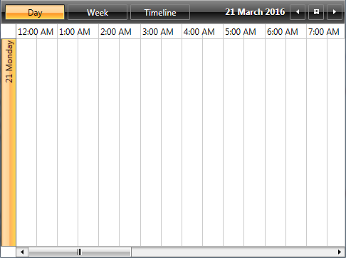

# Configuration

RadScheduleView's four predefined ViewDefinitions have various properties, which can be set in order the views to be configured best. Some of them are common for all views, others are specific for each view. In the following section we will go through all common properties.      

>For more information about the view specific properties, check [here]().

* [Title](#title)

* [LargeChangeInterval](#largechangeinterval)

* [SmallChangeInterval](#smallchangeinterval)

* [DayStartTime](#daystarttime)

* [DayEndTime](#dayendtime)

* [VisibleDays](#visibledays)

* [FirstDayOfWeek](#firstdayofweek)

* [StretchGroupHeaders](#stretchgroupheaders)

* [Orientation](#orientation)

## Title

Gets or sets the title of the view.LargeChangeInterval

## LargeChangeInterval

Gets or sets the date time interval with which the current will be increased or decreased when clicking on the navigation buttons in the header of the ScheduleView. The default values of the __LargeChangeInterval__ property are:

* 1d (1 day) for DayView

* 7d (7 days) for WeekView

* 1m (1 month) for MonthView

* 7d (7 days) for TimelineView

The property is of type __DateTimeInterval__. In the following example the __LargeChangeInterval__ property of DayView is set to 2 days and of MonthView is set of 2 months and 4 days.

#### __XAML__

{{region radscheduleview-viewdefinitions-configuration_0}}
	<telerik:RadScheduleView x:Name="scheduleView" AppointmentsSource="{Binding Appointments}">
		<telerik:RadScheduleView.ViewDefinitions>
			<telerik:DayViewDefinition LargeChangeInterval="2d"/>
			<telerik:MonthViewDefinition LargeChangeInterval="2m 4d"/>
		</telerik:RadScheduleView.ViewDefinitions>
	</telerik:RadScheduleView>
{{endregion}}

#### __C#__

{{region radscheduleview-viewdefinition-configuration_1}}
	dayDefintion.LargeChangeInterval = new Telerik.Windows.Controls.ScheduleView.
	DateTimeInterval(2, 0);
	monthDefinition.LargeChangeInterval = new Telerik.Windows.Controls.ScheduleView.
	DateTimeInterval(4, 2);
{{endregion}}

## SmallChangeInterval

Gets or sets the small change interval of the ScheduleView. It indicates the date time interval with which the current will be increased or decreased when moving the scrollbar. The default values of the __SmallChangeInterval__ are:      

* 7d (7 days) for MonthView

* 1d (1 day) for TimelineView

Setting the SmallChangeInterval property of a DayViewDefiniton and WeekViewDefinition won’t change the behavior of the view. That is due to that using the vertical scrollbar will not navigate to the next set of days, but will scroll the current view.      

The following example shows how to set the __SmallChangeInterval__ property of a MonthViewDefinition to 11 days and of a TimelineViewDefinition to 3 days:

#### __XAML__
{{region radscheduleview-viewdefinitions-configuration_2}}
	<telerik:RadScheduleView x:Name="scheduleView" AppointmentsSource="{Binding Appointments}">
		<telerik:RadScheduleView.ViewDefinitions>
			<telerik:MonthViewDefinition SmallChangeInterval="11d"/>
			<telerik:TimelineViewDefinition SmallChangeInterval="3d"/>
		</telerik:RadScheduleView.ViewDefinitions>
	</telerik:RadScheduleView>
{{endregion}}

#### __C#__

{{region radscheduleview-viewdefinition-configuration_3}}
	monthDefintion.SmallChangeInterval = new Telerik.Windows.Controls.ScheduleView.
	DateTimeInterval(11, 0);
	timelineDefinition.SmallChangeInterval = new Telerik.Windows.Controls.ScheduleView.
	DateTimeInterval(3, 0);
{{endregion}}

## DayStartTime

Gets or sets the time used to indicate the start of the TimeRuler. The default value of the DayStartTime for all views is 00:00:00 or 12:00 AM.      

The DayStartTime is of type TimeSpan. It will not affect the look of the MonthView, since MonthView does not display time.      

The following example illustrates how to set the DayStartTime for DayView, WeekView and TimelineView:

#### __XAML__

{{region radscheduleview-viewdefinitions-configuration_4}}
	<telerik:RadScheduleView x:Name="scheduleView" AppointmentsSource="{Binding Appointments}">
		<telerik:RadScheduleView.ViewDefinitions>
			<telerik:DayViewDefinition DayStartTime="07:30:00"/>
			<telerik:WeekViewDefinition DayStartTime="08:00:00"/>
			<telerik:TimelineViewDefinition DayStartTime="11:30:00"/>
		</telerik:RadScheduleView.ViewDefinitions>
	</telerik:RadScheduleView>
{{endregion}}

#### __C#__

{{region radscheduleview-viewdefinition-configuration_5}}
	dayDefintion.DayStartTime = new TimeSpan(7, 30, 00);
	weekDefinition.DayStartTime = new TimeSpan(8, 0, 0);
	timelineDefinition.DayStartTime = new TimeSpan(11, 30, 0);
{{endregion}}

## DayEndTime

Gets or sets the time used to indicate the end of the view. The default values of the DayStartTime for the view are:      

* 1.00:00:00 (1 day) for DayView

* 1.00:00:00 (1 day) for WeekView

* 1.00:00:00 (1 day) for TimelineView

The DayEndTime property is of type TimeSpan. The MonthView will be affected in the following manner – if there are appointments out of the displayed time range, they won’t be displayed in the MonthView also.      

The following example illustrates how to set the DayStartTime for DayView, WeekView and TimelineView:      

#### __XAML__

{{region radscheduleview-viewdefinitions-configuration_6}}
	<telerik:RadScheduleView x:Name="scheduleView" AppointmentsSource="{Binding Appointments}">
		<telerik:RadScheduleView.ViewDefinitions>
			<telerik:DayViewDefinition DayEndTime="17:30:00"/>
			<telerik:WeekViewDefinition DayEndTime="18:00:00"/>
			<telerik:TimelineViewDefinition DayEndTime="21:30:00"/>
		</telerik:RadScheduleView.ViewDefinitions>
	</telerik:RadScheduleView>
{{endregion}}

#### __C#__

{{region radscheduleview-viewdefinition-configuration_7}}
	dayDefintion.DayEndTime = new TimeSpan(17, 30, 00);
	weekDefinition.DayEndTime = new TimeSpan(18, 0, 0);
	timelineDefinition.DayEndTime = new TimeSpan(21, 30, 0);
{{endregion}}

## VisibleDays

Gets or sets the visible dates in the view. It indicates the count of the dates that will be shown in the view. The default values of the VisibleDays property are:      

* 1 day for DayView

* 7 days for WeekView

* 42 days for MonthView

* 7 days for TimelineView

The following code-snippet illustrates how to set the VisibleDays property in XAML and in code-behind for all predefined views:      

#### __XAML__

{{region radscheduleview-viewdefinitions-configuration_8}}
	<telerik:RadScheduleView x:Name="scheduleView" AppointmentsSource="{Binding Appointments}">
		<telerik:RadScheduleView.ViewDefinitions>
			<telerik:DayViewDefinition VisibleDays="4"/>
			<telerik:WeekViewDefinition VisibleDays="11"/>
			<telerik:MonthViewDefinition VisibleDays="21" />
			<telerik:TimelineViewDefinition VisibleDays="9"/>
		</telerik:RadScheduleView.ViewDefinitions>
	</telerik:RadScheduleView>
{{endregion}}

#### __C#__

{{region radscheduleview-viewdefinition-configuration_9}}
	dayDefintion.VisibleDays = 4;
	weekDefinition.VisibleDays = 11;
	monthDefintion.VisibleDays = 21;
	timelineDefinition.VisibleDays = 9;
{{endregion}}

And the result is shown on the next figure for DayView and TimelineView:

## FirstDayOfWeek

Gets or sets the first weekday with which the week will start according to the view. It affects only the WeekView and MonthView. Once set, it will override the FirstDayOfWeek property of the ScheduleView and the one that is default for the culture.

## StretchGroupHeaders

If set to True, it will stretch the GroupHeader if there is more available space.

## Orientation

Gets or sets the orientation of the view. When the orientation is horizontal the TimeRuler is also horizontally oriented, but the GroupHeaders are oriented vertically and vice versa.      

Values can be Vertical or Horizontal. __Not present in MonthView.__ This is measured according to the position of the TimeRuler. The default values of Orientation property are:      

* Vertical for DayView

* Vertical for WeekView

* Horizontal for TimelineView

The following code-snippets show how to set the Orientation property in XAML and code-behind:      

#### __XAML__

{{region radscheduleview-viewdefinitions-configuration_10}}
	<telerik:RadScheduleView x:Name="scheduleView" AppointmentsSource="{Binding Appointments}">
		<telerik:RadScheduleView.ViewDefinitions>
			<telerik:DayViewDefinition Orientation="Horizontal" />
			<telerik:WeekViewDefinition Orientation="Horizontal"/>
			<telerik:TimelineViewDefinition Orientation="Vertical"/>
		</telerik:RadScheduleView.ViewDefinitions>
	</telerik:RadScheduleView>
{{endregion}}

#### __C#__

{{region radscheduleview-viewdefinition-configuration_11}}
	dayDefintion.Orientation = Orientation.Horizontal;
	weekDefinition.Orientation = Orientation.Horizontal;
	timelineDefinition.Orientation = Orientation.Vertical;
{{endregion}}

This is how the views look like after setting the Orientation property:

DayView with Orientation property set to Horizontal.

WeekView with Orientation property set to Horizontal.

TimelineView with Orientation property set to Horizontal.     
