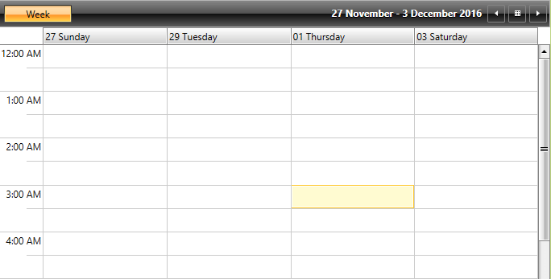
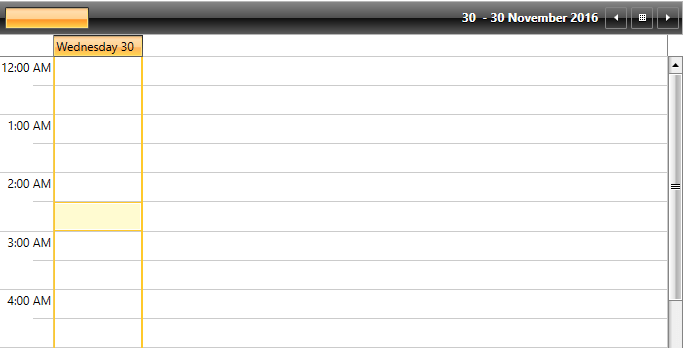
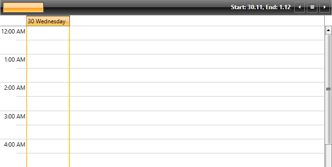
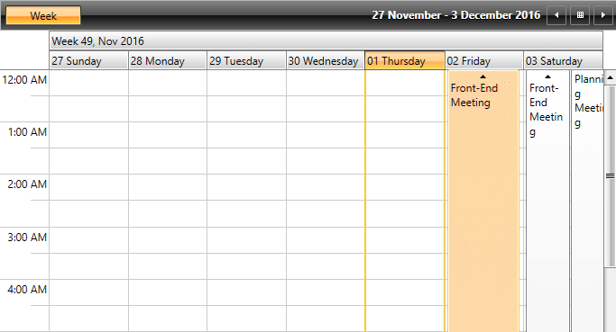
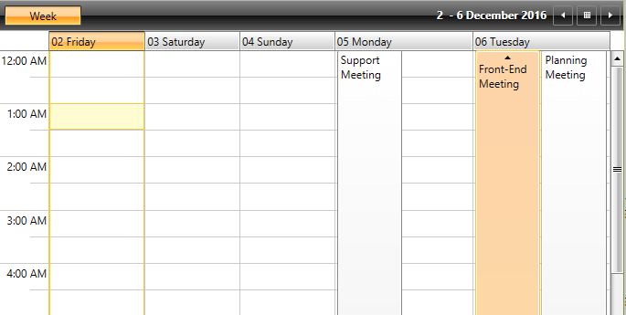

# Define a Custom ViewDefinition

This topic will demonstrate the customization capabilities provided by __RadScheduleView__ for defining a custom ViewDefinition. Determining which ViewDefinition to inherit, so that the needed customizations are based on it, depends on the particular needs. More information on the built-in ViewDefinitions can be found in the [Overview]() topic.

>As modifying the appearance of different elements of the control is discussed in this article, it is recommended to review the [Visual Structure]() topic first.

* [Custom DateGroupDescription](#custom-dategroupdescription)

* [Set the Format of the Group Header](#set-the-format-of-the-group-header)

* [Format the text of the visible range](#format-the-text-of-the-visible-range)

* [Show the Week Group Headers](#show-the-week-group-headers)

* [Set the Beginning and the End of the Visible Range](#set-the-beginning-and-the-end-of-the-visible-range)

## Custom DateGroupDescription

When a custom ViewDefinition based on __WeekViewDefinition__ or __MonthViewDefinition__ is defined, you could customize the grouping of the used __DateGroupDescription__. In this case the __DateGroupDescription__ property of the ViewDefinition needs to be overriden by returning a  custom object inheriting from __DateGroupDescription__. The custom __DateGroupDescription__ object needs to override the __GroupLength__ property.

__Example 1: Defining the custom DateGroupDescription__
<snippet id='radscheduleview-features-viewdefinitions-customviewdefinition-block_1-cs' />
<snippet id='radscheduleview-features-viewdefinitions-customviewdefinition-block_2-vb' />

After the needed __DateGroupDescription__ is defined, it needs to be returned by the __DateGroupDescription__ property of the custom ViewDefinition.

__Example 2: Return the custom DateGroupDescription__
<snippet id='radscheduleview-features-viewdefinitions-customviewdefinition-block_3-cs' />
<snippet id='radscheduleview-features-viewdefinitions-customviewdefinition-block_4-vb' />

#### __Figure 1: Custom DateGroupDescription__

## Set the Format of the Group Header

The format of the Group Header can be altered by overriding the __FormatGroupHeaderName__ method.

__Example 3: Set the format of the Group Header__
<snippet id='radscheduleview-features-viewdefinitions-customviewdefinition-block_5-cs' />
<snippet id='radscheduleview-features-viewdefinitions-customviewdefinition-block_6-vb' />

#### __Figure 2: Formatted GroupHeader name__

## Format the Text of the Visible Range 

The format of the string that represents the currently visible range can be modified by overriding the __FormatVisibleRangeText__ method. 

__Example 4: Set the format of the currently visible range text__
<snippet id='radscheduleview-features-viewdefinitions-customviewdefinition-block_7-cs' />
<snippet id='radscheduleview-features-viewdefinitions-customviewdefinition-block_8-vb' />

#### __Figure 3: Modified format of the visible range text__

## Show the Week Group Headers

By default, the week group headers are hidden. They can be shown by overriding the __GetShowWeekGroupHeaders__ method

__Example 5: Show the week group headers__
<snippet id='radscheduleview-features-viewdefinitions-customviewdefinition-block_9-cs' />
<snippet id='radscheduleview-features-viewdefinitions-customviewdefinition-block_10-vb' />

#### __Figure 4: Showing the week group headers__

## Set the Beginning and the End of the Visible Range

The DateTime values for the start and end of the visible range, can be set through the __GetVisibleRangeStart__ and __GetVisibleRangeEnd__ methods.

__Example 6: Setting visible range__
<snippet id='radscheduleview-features-viewdefinitions-customviewdefinition-block_11-cs' />

#### __Figure 5: Modify the start and end of the visible range__

## See Also
* [Custom Slots]()
* [Custom Dialogs]()
* [Customizing Dialog Windows]()