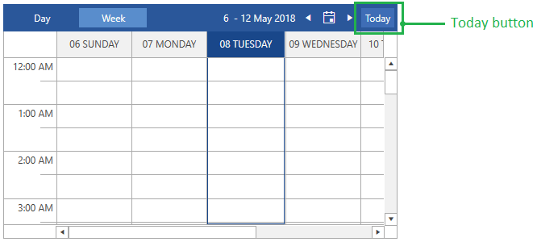

# Set Today

The scheduleview control allows you to easily navigate to the current day. You can do this via the *Today* button shown in __Figure 1__ or by executing the __RadScheduleViewCommands.SetToday__ command.

## Showing the Today button

The *Today* button is hidden by default. To show it in the [navigation header]() you can set the __TodayButtonVisibility__ property.

__Example 1: Showing the Today button__
```XAML
	<telerik:RadScheduleView TodayButtonVisibility="Visible" />
```

#### Figure 1: Today button


## Set Today in Code

You can navigate to the current day in the view using the __RadScheduleViewCommands.SetToday__ command.

__Example 2: Set today in code__
```C#
	RadScheduleViewCommands.SetToday.Execute(null, scheduleView);
```

> Read more about the available commands in the [Commands]() article.

## See Also
* [Getting Started]()
* [ViewDefinitions Overview]()
* [ViewDefinitions Configuration]()


