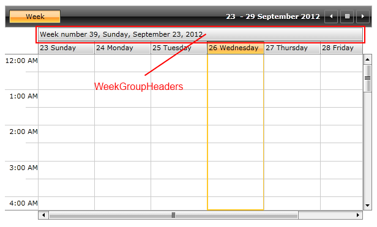
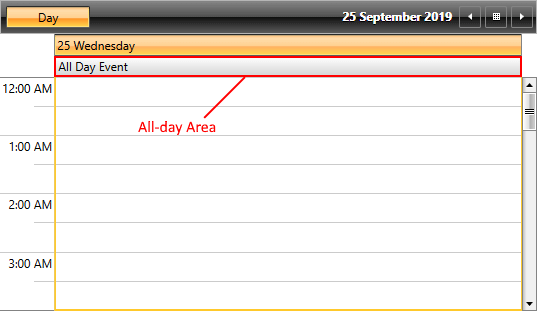
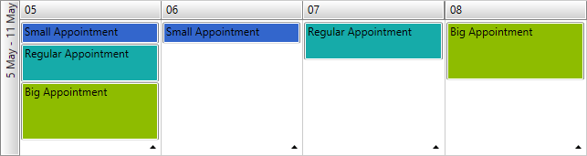
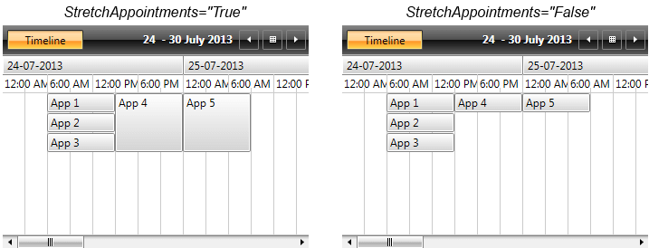
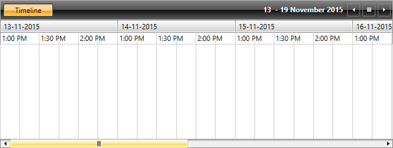

# View Specific Properties

>You can check the [Configuration]() article for more information about the properties that are common for all views.              

## DayView and WeekView Specific Properties

Some ViewDefinitions have specific properties. Here is a list of specific properties for DayView and WeekView:       

* __EnableSmallAppointmentRendering__: Gets or sets whether appointments with duration smaller than MinorTickLength will be rounded to MinorTickLength. 

>When __EnableSmallAppointmentRendering__ is enabled, RadScheduleView will display the appointments with zero duration inside DayViewDefinition and WeekViewDefinition.

* __ShowWeekGroupHeaders__: Gets or sets whether the WeekHeaders should be visible.

* __WeekGroupHeaderStringFormat__: Gets or sets the format that will be applied to the WeekHeaders. After setting the __ShowWeekGroupHeaders__ to __True__ you can customize the string format of the week numbers displayed in the Header.        

	The following code snippet shows how to set the __ShowWeekGroupHeaders__ and __WeekGroupHeaderStringFormat__ property in WeekView:        

	<snippet id='radscheduleview-features-viewdefinitions-specificproperties-block_1-xaml' />

	<snippet id='radscheduleview-features-viewdefinitions-specificproperties-block_2-cs' />

	

* __ShowAllDayArea__: Gets or sets a value indicating whether the all-day area is visible or not. This area displays appointments which have their **IsAllDayEvent** property set to **True**.

	

## MonthView specific properties

The MonthView has a single specific property:

__AllowCustomAppointmentSize__ (available as of Q2 2014 in UI for WPF – sets whether the appointments with custom size can be displayed in the MonthViewDefinition. By default __AllowCustomAppointmentSize__ is set to __False__.

>You can check the [Set Custom Appointment Height]() article for more details on how to implement appointments with custom height in MonthViewDefinition.

## TimelineView specific properties

Here is a list of the properties that are specific for TimelineView:

* [StretchAppointments](#stretchappointments)

* [ApplyStartEndTimeToEachDay](#applystartendtimetoeachday)

* [TimeRulerGroupStringFormat](#timerulergroupstringformat)

### StretchAppointments

It sets whether the appointments will be stretched to fill all available space in the TimeSlot - by default it is set to __False__.

<snippet id='radscheduleview-features-viewdefinitions-specificproperties-block_3-xaml' />

### ApplyStartEndTimeToEachDay

When the __DayStartTime__ and __DayEndTime__ properties are set to the TimelineViewDefinition, the __DayStartTime__ property gets applied only for the first day of the displayed range of days, while the __DayEndTime__ only for the last one. In order to apply them for each day of the VisibleDays range, the __ApplyStartEndTimeToEachDay__ property (introduced in Q1 2016 of UI for WPF needs to be set to __True__. The __ApplyStartEndTimeToEachDay__ is of type bool - its default value is __False__.

The following example illustrates how to set the DayStartTime, DayEndTime and ApplyStartEndTimeToEachDay for the TimelineView:

<snippet id='radscheduleview-features-viewdefinitions-specificproperties-block_4-xaml' />

<snippet id='radscheduleview-features-viewdefinitions-specificproperties-block_5-cs' />
<snippet id='radscheduleview-features-viewdefinitions-specificproperties-block_6-vb' />

>important Please notice that the __DayStartTime__ property should always be set to a time earlier than the __DayEndTime__, otherwise the start and end times won't be applied for each day.

The final result is shown on the snapshot below:

### TimeRulerGroupStringFormat

It sets the format applied on the __TimeRulerGroupItem__.