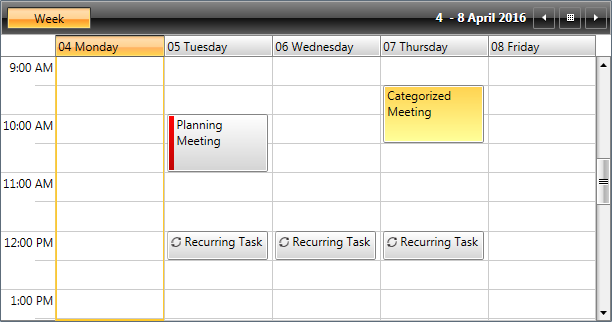

# Understanding Appointments

The __Appointment__ class represents a single piece of data that is visualized in the __RadScheduleView__. Each __Appointment__ has various properties such as __Subject, Start, End, TimeZone__, etc. You can also assign to the appointments [Resources](), [Categories]() and [TimeMarkers](). 

Additionally RadScheduleView provides the functionality to configure [repeating appointments](). The user has the ability to apply recurring scheduling patterns such as daily, weekly, monthly or set a range of recurrence from date to date.

#### __Figure1: RadScheduleView populated with different appointments__

To learn how to manipulate run time the appointments displayed by the __RadScheduleView__ see the following topics:

* [Create Appointment]()

* [Edit Appointment]()

* [Delete Appointment]()

* [Drag&Drop Appointments]()

# See Also

 * [Visual Structure]()
 
 * [Custom Appointment]()
 
 * [Snapping Appointments]()
 
 
