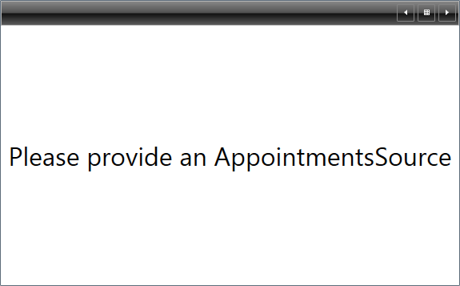
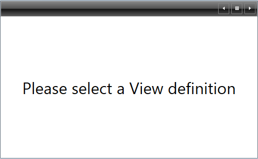
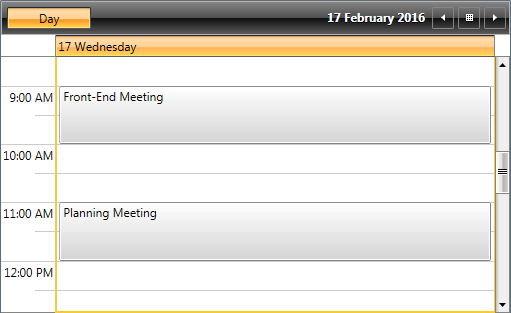
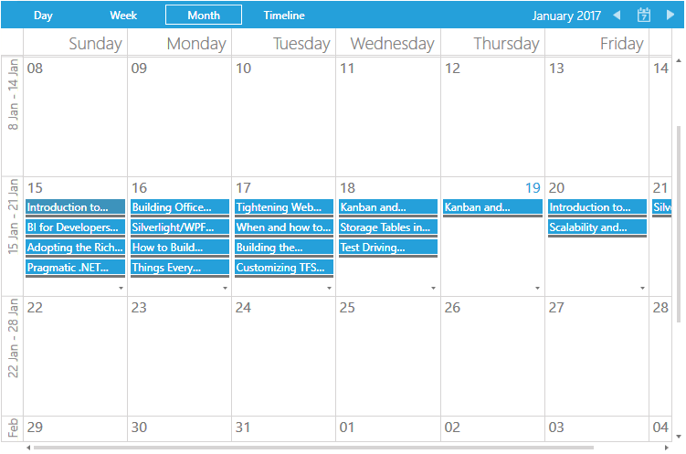

# Getting Started with {{ site.framework_name }} ScheduleView

This tutorial will walk you through the creation of a sample application that contains __RadScheduleView__.      

* [Adding Telerik Assemblies Using NuGet](#adding-telerik-assemblies-using-nuget)
* [Adding Assembly References Manually](#adding-assembly-references-manually)
* [Adding RadScheduleView to the Project](#adding-radscheduleview-to-the-project)
* [Populating with Data](#populating-with-data)
* [Adding ViewDefinitions](#adding-viewdefinitions)
* [Resources, Grouping](#resources-grouping)
* [Setting a Theme](#setting-a-theme)

## Adding Telerik Assemblies Using NuGet

To use __RadScheduleView__ when working with NuGet packages, install the `Telerik.Windows.Controls.ScheduleView.for.Wpf.Xaml` package. The [package name may vary]() slightly based on the Telerik dlls set - [Xaml or NoXaml]()

Read more about NuGet installation in the [Installing UI for WPF from NuGet Package]() article.

>tip With the 2025 Q1 release, the Telerik UI for WPF has a new licensing mechanism. You can learn more about it [here]().

## Adding Assembly References Manually

If you are not using NuGet packages, you can add a reference to the following assemblies:

* __Telerik.Licensing.Runtime__
* __Telerik.Windows.Controls__
* __Telerik.Windows.Controls.Input__
* __Telerik.Windows.Controls.Navigation__
* __Telerik.Windows.Controls.ScheduleView__
* __Telerik.Windows.Data__

## Adding RadScheduleView to the Project

Before proceeding with adding __RadScheduleView__ to your project, make sure the required assembly references are added to the project. 

You can add __RadScheduleView__ manually by writing the XAML code in __Example 1__. You can also add the control by dragging it from the Visual Studio Toolbox and dropping it over the XAML view.

__Example 1: Adding RadScheduleView in XAML__

```XAML
	<telerik:RadScheduleView />     
```


>In order to use __RadScheduleView__ in XAML you have to add the following namespace declaration:
>__Example 2: Declaring Telerik Namespace__
>```XAML
>    xmlns:telerik="http://schemas.telerik.com/2008/xaml/presentation"
>```

If you run the application, you will see an empty ScheduleView with a message saying that AppointmentsSource should be provided as demonstrated in __Figure 1__. 

#### __Figure1: The empty ScheduleView generated by the code in Example 1__



## Populating with Data

In order to populate __RadScheduleView__ with data, you should bind its __AppointmentsSource__ property to a collection of __Appointment__ objects. First, create a ViewModel class containing an ObservableCollection of Appointments as shown in __Example 3__.

__Example 3: View Model containing an ObservableCollection of Appointments__

```C#
	public class MyViewModel
	{
		private ObservableCollection<Appointment> appointments;

		public ObservableCollection<Appointment> Appointments
		{
			get
			{
				if (this.appointments == null)
				{
					this.appointments = this.CreateAppointments();
				}
				return this.appointments;
			}	      
		}

		private ObservableCollection<Appointment> CreateAppointments()
		{
			ObservableCollection<Appointment> apps = new ObservableCollection<Appointment>();

			var app1 = new Appointment()
			{
				Subject = "Front-End Meeting",
				Start = DateTime.Today.AddHours(9),
				End = DateTime.Today.AddHours(10)
			};
			apps.Add(app1);

			var app2 = new Appointment()
			{
				Subject = "Planning Meeting",
				Start = DateTime.Today.AddHours(11),
				End = DateTime.Today.AddHours(12)
			};
			apps.Add(app2);

		return apps;
		}   
	}
```
```VB.NET
	Public Class MyViewModel

		Private m_appointments As ObservableCollection(Of Appointment)

		Public ReadOnly Property Appointments() As ObservableCollection(Of Appointment)
			Get
				If Me.m_appointments Is Nothing Then
					Me.m_appointments = Me.CreateAppointments()
				End If
				Return Me.m_appointments
			End Get
		End Property

		Private Function CreateAppointments() As ObservableCollection(Of Appointment)
			Dim apps As New ObservableCollection(Of Appointment)()

			Dim app1 As New Appointment() With {
				.Subject = "Front-End Meeting",
				.Start = DateTime.Today.AddHours(9),
				.[End] = DateTime.Today.AddHours(10)
			}
			apps.Add(app1)

			Dim app2 = New Appointment() With {
				.Subject = "Planning Meeting",
				.Start = DateTime.Today.AddHours(11),
				.[End] = DateTime.Today.AddHours(12)
			}
			apps.Add(app2)

			Return apps
		End Function
	End Class
```

Now that you have prepared the needed sample data, it is time to bind RadScheduleView to it. For that purpose, you should set the __RadScheduleView's AppointmentsSource__ property to the collection of Appointments.

__Example 4__ demonstrates how you can bind the AppointmentsSource collection in XAML. The _local_ namespace in the example corresponds to the namespace where __MyViewModel__ resides.

__Example 4: Bind RadScheduleView__

```XAML
    <Grid.Resources>
        <local:MyViewModel x:Key="MyViewModel" />
    </Grid.Resources>
    <telerik:RadScheduleView DataContext="{StaticResource MyViewModel}"  AppointmentsSource="{Binding Appointments}" />
```

If you run the application at this stage, you will again see an empty ScheduleView with a message saying that a View Definition should be selected as shown in __Figure 2__. 

#### __Figure2: The empty ScheduleView generated by the code in Example 4__



## Adding ViewDefinitions

__Example 5__ demonstrates how you can add a DayViewDefinition to the __RadScheduleView__ control:

__Example 5: Add DayViewDefinition__

```XAML
	<telerik:RadScheduleView DataContext="{StaticResource MyViewModel}" AppointmentsSource="{Binding Appointments}">
		<telerik:RadScheduleView.ViewDefinitions>
			<telerik:DayViewDefinition />
		</telerik:RadScheduleView.ViewDefinitions>
	</telerik:RadScheduleView>
```

>You can add more than one ViewDefinition. There are five view definitions available:
>* DayViewDefinition
>* WeekViewDefinition
>* TimelineViewDefinition
>* MonthViewDefinition
>* AgendaViewDefinition
> 
>For additional details, see the [ViewDefinitions Overview]() topic.

Running the application containing the code from Examples 1 - 5 will result in a populated __RadScheduleView__, similar to __Figure 3__.

__Figure 3: RadScheduleView bound to a collection of Appointments__


## Resources, Grouping

Using Resources you can associate additional information with the Appointments. Moreover, you can group the Appointments in __RadScheduleView__ according to the Resources assigned to them. For detailed information on this functionality, see the [Resources]() topic.

## Setting a Theme

The controls from our suite support different themes. You can see how to apply a theme different than the default one in the [Setting a Theme]() help article.

>important Changing the theme using implicit styles will affect all controls that have styles defined in the merged resource dictionaries. This is applicable only for the controls in the scope in which the resources are merged. 

To change the theme, you can follow the steps below:
* Choose between the themes and add reference to the corresponding theme assembly (ex: **Telerik.Windows.Themes.Windows8.dll**). You can see the different themes applied in the **Theming** examples from our [WPF Controls Examples](https://demos.telerik.com/wpf/)[Silverlight Controls Examples](https://demos.telerik.com/silverlight/#ScheduleView/Theming) application.

* Merge the ResourceDictionaries with the namespace required for the controls that you are using from the theme assembly. For __RadScheduleView__, you will need to merge the following resources:

	* __Telerik.Windows.Controls__
	* __Telerik.Windows.Controls.Input__
	* __Telerik.Windows.Controls.Navigation__
	* __Telerik.Windows.Controls.ScheduleView__

__Example 8__ demonstrates how to merge the ResourceDictionaries so that they are applied globally for the entire application.

__Example 8: Merge the ResourceDictionaries__  
```XAML
		<Application.Resources>
			<ResourceDictionary>
				<ResourceDictionary.MergedDictionaries>
	                <ResourceDictionary Source="/Telerik.Windows.Themes.Windows8;component/Themes/System.Windows.xaml"/>
	                <ResourceDictionary Source="/Telerik.Windows.Themes.Windows8;component/Themes/Telerik.Windows.Controls.xaml"/>
	                <ResourceDictionary Source="/Telerik.Windows.Themes.Windows8;component/Themes/Telerik.Windows.Controls.Input.xaml"/>
	                <ResourceDictionary Source="/Telerik.Windows.Themes.Windows8;component/Themes/Telerik.Windows.Controls.Navigation.xaml"/>
	                <ResourceDictionary Source="/Telerik.Windows.Themes.Windows8;component/Themes/Telerik.Windows.Controls.ScheduleView.xaml"/>
				</ResourceDictionary.MergedDictionaries>
			</ResourceDictionary>
		</Application.Resources>
```

__Figure 4__ shows __RadScheduleView__ with the **Windows8** theme applied.
	
#### __Figure 4: RadScheduleView with the Windows8 theme__



## Telerik UI for WPF Learning Resources

* [Telerik UI for WPF ScheduleView Component](https://www.telerik.com/products/wpf/scheduleview.aspx)
* [Getting Started with Telerik UI for WPF Components]()
* [Telerik UI for WPF Installation]()
* [Telerik UI for WPF and WinForms Integration]()
* [Telerik UI for WPF Visual Studio Templates]()
* [Setting a Theme with Telerik UI for WPF]()
* [Telerik UI for WPF Virtual Classroom (Training Courses for Registered Users)](https://learn.telerik.com/learn/course/external/view/elearning/16/telerik-ui-for-wpf) 
* [Telerik UI for WPF License Agreement](https://www.telerik.com/purchase/license-agreement/wpf-dlw-s)


## See Also

 * [Understanding Appointments]()
  
 * [Data Binding Support]()
 
 * [ViewDefinitions]()
 
 * [Resources]()
