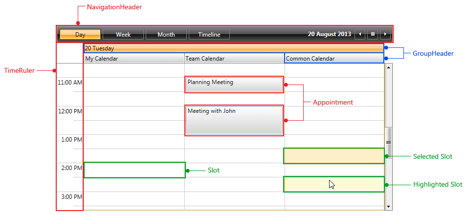
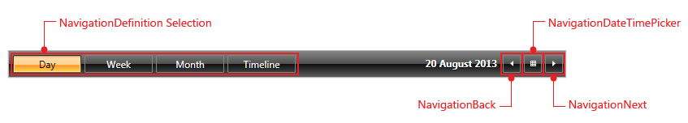

# Visual Structure

This help article will help you understand the main concepts used in the scope of the RadScheduleView control.

__Figure 1__ shows all the basic elements used inside the control with the default Office_Black theme:

* __NavigationHeader__ - used for switching the ViewDefinitions of the ScheduleView as well as changing the current date. It can be easily hidden by setting the __NavigationHeaderVisibility__ property of the ScheduleView to "Collapsed". __Figure 2__ shows it in more details. 

* __TimeRuler__ - it represents the time axis of the ScheduleView. The TimeRuler can be vertical or horizontal according to the active [ViewDefinition orientation](). Additionally, you could customize it by following the instructions in [Configuring the TimeRuler ticks]() topic.

* __Appointment__ - it represents a single piece of data that is visualized in the ScheduleView. For more details on the appointments, check the [Understanding Appointments]() as well as [Populating with Data]() topics.

* __GroupHeader__ - represent the date and the resources (when the ScheduleView is grouped) headers. The group headers can be vertical or horizontal depending on the active [ViewDefinition]() and its orientation. You could check [Styling the GroupHeaders]() and [Templating the GroupHeaders]() topics for detailed information on customizing the look and feel of the GroupHeaders.

* __Slot__ - represent the timeslots of the control defined by the TimeRuler. Furthermore, RadScheduleView provides the option to create [Special and ReadOnly slots]().

* __Selected Slot__, __Highlighted Slot__ - represent the selected/hightlighted state of the Slot. The slot selection behavior can be customizing following the instructions in the [SlotSelectionBehavior]() topic.

__Figure 2__ shows the NavigationHeader in more details:

* __NavigationDefinition Selection__ - used to navigate between the available [ViewDefinitions]() in the ScheduleView.

* __NavigationDateTimePicker__ - opens a Calendar for easier changing of the CurrentDate of the ScheduleView.

* __NavigationBack, NavigationNext__ - decrease or increase the CurrentDate of the ScheduleView according to the ViewDefinition LargeChangeInterval property. For more details check the ViewDefinitions [Configuration]() topic.

## See Also

 * [Getting Started]()

 * [Understanding Appointments]()
