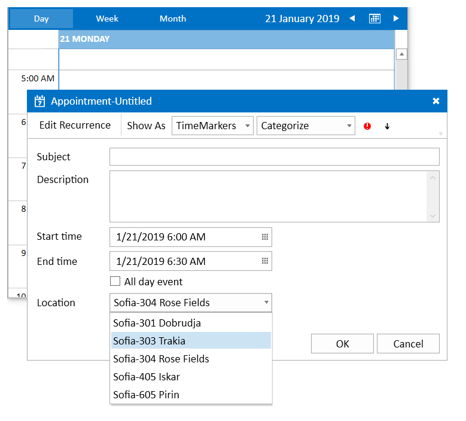

# Add Control to the EditAppointmentDialog

This article shows how to extend the UI of the EditAppointmentDialog by adding a custom control in it. To do this, you will need to edit the __ControlTemplate__ of the __SchedulerDialog__ control.

The tutorial shows how to add an additional RadComboBox that allows you to choose the appointment's location and bind this choice to the Location property of the Appointment model.

## Setting up the View Model

This section shows how to set up the view model used for the example. The model will hold a collection of Appointment objects that are bound to the AppointmentsSource property of RadScheduleView. And also a collection of locations that will be shown in the RadComboBox control.

__Example 1: Creating a basic view model__
```C#
	public class MainViewModel : ViewModelBase
    {
        public ObservableCollection<string> Locations { get; set; }
        public ObservableCollection<Appointment> Appointments { get; set; }

        public MainViewModel()
        {            
            this.Appointments = new ObservableCollection<Appointment>();
            this.Locations = new ObservableCollection<string>() { "Sofia-301 Dobrudja", "Sofia-303 Trakia", "Sofia-304 Rose Fields", "Sofia-405 Iskar", "Sofia-605 Pirin" };
        }
    }
```

## Extracting and Modifying the SchedulerDialog Template

To get the template extract the Style of the __SchedulerDialog__. Read more about extracting templates in the [Editing Control Templates]() article. The Style can be found in the *UI for {{site.framework_name}} installation folder/Themes.Implicit* folder, the __Telerik.Windows.Controls.ScheduleView.xaml__ file.

The following template was extracted from the [Office2013]() theme. Also, the extraction is based on the [Xaml]() version of the Telerik dlls. This means that any resources (converters, DataTemplates, etc.) required by the ControlTemplate of the SchedulerDialog are extracted and added in the project manually. If you use NoXaml dlls you don't need to do this. You can extract only the SchedulerDialog Style and set the Template property.

The newly added RadComboBox is marked with a Xaml comment - &lt;!-- CHANGE --&gt;

__Example 2: Modified SchedulerDialog Style__
```XAML
	<Application.Resources>
		<telerik:InvertedVisibilityConverter x:Key="InvertedVisibilityConverter" />
		<telerik:BoolToInputModeConverter x:Key="BoolToInputModeConverter" />
		<telerik:InvertedBooleanConverter x:Key="InvertedBooleanConverter" />
		<telerik:BooleanToVisibilityConverter x:Key="BooleanToVisibilityConverter"/>
		<telerik:InvertedBooleanToVisibilityConverter x:Key="InvertedBooleanToVisibilityConverter" />
		<telerik:NullToVisibilityConverter x:Key="NullToVisibilityConverter" />
		<telerik:InvertedNullToVisibilityConverter x:Key="InvertedNullToVisibilityConverter" />
		<telerik:ResourcesSeparatorConverter x:Key="ResourcesSeparatorConverter"/>
		<telerik:LocalizationManager x:Key="LocalizationManager" />
		<DataTemplate x:Key="TimeMarkerComboBoxItemContentTemplate">
			<StackPanel Orientation="Horizontal">
				<Rectangle Fill="{Binding TimeMarkerBrush}" Margin="2 0" Width="12" Height="12"/>
				<TextBlock telerik:LocalizationManager.ResourceKey="{Binding TimeMarkerName}" Margin="2 0"/>
			</StackPanel>
		</DataTemplate>
		<DataTemplate x:Key="CategoryComboBoxItemContentTemplate">
			<StackPanel Orientation="Horizontal">
				<Rectangle Fill="{Binding CategoryBrush}" Margin="2 0" Width="12" Height="12"/>
				<TextBlock Text="{Binding DisplayName}" Margin="2 0"/>
			</StackPanel>
		</DataTemplate>
		<ControlTemplate x:Key="HighImportanceMarkTemplate">
			<Grid>
				<Border Width="{TemplateBinding Width}" Height="{TemplateBinding Height}" CornerRadius="5"
						VerticalAlignment="{TemplateBinding VerticalContentAlignment}" HorizontalAlignment="{TemplateBinding HorizontalContentAlignment}"
						Background="{telerik:Office2013Resource ResourceKey=ValidationBrush}">
					<Grid>
						<Rectangle Height="2" Margin="4 0 4 1" VerticalAlignment="Bottom" Fill="{telerik:Office2013Resource ResourceKey=MainBrush}"/>
						<Rectangle Margin="4 1 4 4" Fill="{telerik:Office2013Resource ResourceKey=MainBrush}"/>
					</Grid>
				</Border>
			</Grid>
		</ControlTemplate>
		<Style x:Key="ImportanceMarkContentControlStyle" TargetType="ContentControl">
			<Setter Property="Width" Value="10"/>
			<Setter Property="Height" Value="10"/>
			<Setter Property="VerticalContentAlignment" Value="Center"/>
			<Setter Property="HorizontalContentAlignment" Value="Center"/>
		</Style>
		<ControlTemplate x:Key="LowImportanceMarkTemplate">
			<Grid>
				<Border Width="{TemplateBinding Width}" Height="{TemplateBinding Height}" CornerRadius="5"                    
						VerticalAlignment="{TemplateBinding VerticalContentAlignment}" HorizontalAlignment="{TemplateBinding HorizontalContentAlignment}"                    
						Background="{telerik:Office2013Resource ResourceKey=MainBrush}">
					<Grid>
						<Path Data="F1M329.667,242.3496L324.512,236.8906L324.512,241.3296L331.411,248.6386L338.28,241.3636L338.28,236.9226L333.152,242.3496L333.152,230.0356L329.667,230.0356z"
							  Stretch="Fill" Margin="2 1 2 0" Fill="{telerik:Office2013Resource ResourceKey=InvertedBrush}"/>
					</Grid>
				</Border>
			</Grid>
		</ControlTemplate>
		<telerik:ResourceTypeTemplateSelector x:Key="ResourcesEditorItemTemplateSelector">
			<telerik:ResourceTypeTemplateSelector.SingleSelectionTemplate>
				<DataTemplate>
					<Grid>
						<Grid.ColumnDefinitions>
							<ColumnDefinition MinWidth="100" SharedSizeGroup="LabelsGroup"/>
							<ColumnDefinition Width="*"/>
							<ColumnDefinition Width="*"/>
						</Grid.ColumnDefinitions>
						<TextBlock Text="{Binding ResourceType.DisplayName}" Margin="6"/>
						<telerik:RadComboBox Grid.Column="1" Margin="3" ItemsSource="{Binding ResourceItems}"
											 ClearSelectionButtonVisibility="Visible" ClearSelectionButtonContent="{Binding ClearAllButtonContent}"
											 SelectedItem="{Binding SelectedItem, Mode=TwoWay}" DisplayMemberPath="Resource.DisplayName"/>
					</Grid>
				</DataTemplate>
			</telerik:ResourceTypeTemplateSelector.SingleSelectionTemplate>
			<telerik:ResourceTypeTemplateSelector.MultipleSelectionTemplate>
				<DataTemplate>
					<Grid>
						<Grid.ColumnDefinitions>
							<ColumnDefinition MinWidth="100" SharedSizeGroup="LabelsGroup"/>
							<ColumnDefinition Width="*"/>
							<ColumnDefinition Width="*"/>
						</Grid.ColumnDefinitions>
						<TextBlock Text="{Binding ResourceType.DisplayName}" Margin="6"/>
						<telerik:RadComboBox Grid.Column="1" Margin="3" ItemsSource="{Binding ResourceItems}" ClearSelectionButtonContent="{Binding ClearAllButtonContent}"
											 ClearSelectionButtonVisibility="Visible" SelectedIndex="{Binding SelectedIndex, Mode=TwoWay}">
							<telerik:RadComboBox.ItemContainerStyle>
								<Style TargetType="telerik:RadComboBoxItem">
									<Setter Property="Template">
										<Setter.Value>
											<ControlTemplate>
												<CheckBox IsChecked="{Binding IsChecked, Mode=TwoWay}" Content="{Binding Resource.DisplayName}"/>
											</ControlTemplate>
										</Setter.Value>
									</Setter>
								</Style>
							</telerik:RadComboBox.ItemContainerStyle>
							<telerik:RadComboBox.SelectionBoxTemplate>
								<DataTemplate>
									<TextBlock Text="{Binding Owner.CheckedItems, Converter={StaticResource ResourcesSeparatorConverter}}"/>
								</DataTemplate>
							</telerik:RadComboBox.SelectionBoxTemplate>
						</telerik:RadComboBox>
					</Grid>
				</DataTemplate>
			</telerik:ResourceTypeTemplateSelector.MultipleSelectionTemplate>
		</telerik:ResourceTypeTemplateSelector>

		<!-- Note: If you use NoXaml dlls, please add the following setting to the Style object: -->
		<!-- BasedOn="{StaticResource EditAppointmentDialogStyle}" -->
		<!-- In this case you can also remove all the resources defined above. The StaticResource keyword will be able to find them in the merged ResourceDictionaries -->
		<Style x:Key="CustomEditAppointmentDialogStyle" TargetType="telerik:SchedulerDialog">
			<Setter Property="Foreground" Value="{telerik:Office2013Resource ResourceKey=InvertedBrush}"/>
			<Setter Property="Width" Value="560"/>
			<Setter Property="IsTabStop" Value="False"/>
			<Setter Property="SnapsToDevicePixels" Value="True"/>
			<Setter Property="HeaderTemplate">
				<Setter.Value>
					<DataTemplate>
						<StackPanel Orientation="Horizontal" MaxWidth="400" HorizontalAlignment="Left">
							<TextBlock telerik:LocalizationManager.ResourceKey="Event" Visibility="{Binding Occurrence.Appointment.IsAllDayEvent, Converter={StaticResource BooleanToVisibilityConverter}}"/>
							<TextBlock telerik:LocalizationManager.ResourceKey="Appointment" Visibility="{Binding Occurrence.Appointment.IsAllDayEvent, Converter={StaticResource InvertedBooleanToVisibilityConverter}}"/>
							<TextBlock Text="-"/>
							<TextBlock x:Name="SubjectTextBlock" Text="{Binding Occurrence.Appointment.Subject}" Visibility="{Binding Occurrence.Appointment.Subject, Converter={StaticResource NullToVisibilityConverter}}"/>
							<TextBlock telerik:LocalizationManager.ResourceKey="Untitled" Visibility="{Binding Occurrence.Appointment.Subject, Converter={StaticResource InvertedNullToVisibilityConverter}}"/>
						</StackPanel>
					</DataTemplate>
				</Setter.Value>
			</Setter>
			<Setter Property="IconTemplate">
				<Setter.Value>
					<DataTemplate>
						<Path Data="M188,502L188,481.207C188,480.257,188.771,479.484,189.723,479.484L190.473,479.484L190.473,484.786L197.551,484.786L197.551,479.484L202.568,479.484L202.568,484.786L209.645,484.786L209.645,479.484L210.516,479.484C211.465,479.484,212.237,480.257,212.237,481.207L212.237,502C212.237,502.949,211.465,503.722,210.516,503.722L189.723,503.722C188.771,503.722,188,502.949,188,502 M209.746,487.307L190.503,487.307L190.503,501.544L209.746,501.544z M198.362,499.882L198.186,499.779C197.602,499.439,197.403,498.687,197.744,498.102L201.192,492.208L197.258,492.208C196.581,492.208,196.031,491.658,196.031,490.98L196.031,490.777C196.031,490.102,196.581,489.551,197.258,489.551L203.483,489.551C204.107,489.551,204.623,490.02,204.7,490.623C204.813,490.949,204.788,491.32,204.602,491.643L200.04,499.441C199.699,500.025,198.947,500.223,198.362,499.882 M192.369,482.613L192.369,477.786C192.354,477.697,192.348,477.607,192.348,477.514C192.348,476.605,193.085,475.867,193.994,475.867C194.885,475.867,195.611,476.578,195.639,477.461L195.654,477.461L195.654,482.613z M204.465,482.613L204.463,477.857C204.439,477.747,204.428,477.632,204.428,477.514C204.428,476.605,205.166,475.867,206.075,475.867C206.965,475.867,207.692,476.578,207.721,477.461L207.749,477.461L207.749,482.613z"
							  Fill="{telerik:Office2013Resource ResourceKey=MainBrush}" Stretch="Fill" Width="14" Height="16" Margin="0 0 2 0"/>
					</DataTemplate>
				</Setter.Value>
			</Setter>
			<Setter Property="Template">
				<Setter.Value>
					<ControlTemplate TargetType="telerik:SchedulerDialog">
						<Grid IsSharedSizeScope="True">
							<Grid.RowDefinitions>
								<RowDefinition Height="Auto"/>
								<RowDefinition Height="Auto"/>
								<RowDefinition Height="*"/>
								<RowDefinition Height="Auto"/>
								<RowDefinition Height="Auto"/>
								<RowDefinition Height="Auto"/>
							</Grid.RowDefinitions>
							<telerik:RadToolBar x:Name="AppointmentToolbar" BorderThickness="0 0 0 1" GripVisibility="Collapsed" Grid.Row="0" Margin="0 0 0 3" FocusManager.IsFocusScope="False">
								<telerik:RadButton x:Name="EditRecurrenceButton"  Margin="5 2 0 2" AutomationProperties.AutomationId="EditRecurrenceButton"                        
												   Command="{x:Static telerik:RadScheduleViewCommands.EditRecurrenceRule}"                        
												   Visibility="{Binding CanEditParentAppointment, Converter={StaticResource InvertedBooleanToVisibilityConverter}}">
									<ToolTipService.ToolTip>
										<ToolTip telerik:LocalizationManager.ResourceKey="EditRecurrence"/>
									</ToolTipService.ToolTip>
									<TextBlock Margin="6 0" telerik:LocalizationManager.ResourceKey="EditRecurrence" Foreground="{telerik:Office2013Resource ResourceKey=InvertedBrush}"/>
								</telerik:RadButton>
								<telerik:RadButton x:Name="EditParentAppointmentButton" AutomationProperties.AutomationId="EditParentAppointmentButton"                        
												   IsEnabled="{Binding IsReadOnly, Converter={StaticResource InvertedBooleanConverter}}"                        
												   Command="{x:Static telerik:RadScheduleViewCommands.EditParentAppointment}"                        
												   Visibility="{Binding CanEditParentAppointment, Converter={StaticResource BooleanToVisibilityConverter}}">
									<ToolTipService.ToolTip>
										<TextBlock telerik:LocalizationManager.ResourceKey="EditParentAppointment"/>
									</ToolTipService.ToolTip>
									<TextBlock Margin="4 0" telerik:LocalizationManager.ResourceKey="EditParentAppointment" Foreground="{telerik:Office2013Resource ResourceKey=InvertedBrush}"/>
								</telerik:RadButton>
								<telerik:RadToolBarSeparator Margin="3 2 1 2"/>
								<TextBlock x:Name="ShowAs" VerticalAlignment="Center" Margin="6 0" telerik:LocalizationManager.ResourceKey="ShowAs"                                           
										   Foreground="{telerik:Office2013Resource ResourceKey=InvertedBrush}" FontSize="{telerik:Office2013Resource ResourceKey=FontSizeL}"                        
										   FontFamily="{telerik:Office2013Resource ResourceKey=FontFamily}" />
								<telerik:RadComboBox x:Name="PART_TimeMarkers" AutomationProperties.AutomationId="PART_TimeMarkers"
													 Width="110" Margin="2 4" EmptyText="{Binding TimeMarkersEmptyText}"
													 IsEnabled="{Binding IsReadOnly, Converter={StaticResource InvertedBooleanConverter}}"
													 ItemsSource="{Binding TimeMarkers}" SelectedItem="{Binding Occurrence.Appointment.TimeMarker, Mode=TwoWay}"
													 ClearSelectionButtonVisibility="Visible" ClearSelectionButtonContent="{Binding ClearSelectionButtonContent}"                        
													 ItemTemplate="{StaticResource TimeMarkerComboBoxItemContentTemplate}" SelectionBoxTemplate="{StaticResource TimeMarkerComboBoxItemContentTemplate}" />
								<telerik:RadComboBox x:Name="PART_Categories" AutomationProperties.AutomationId="PART_Categories"                        
													 Width="132" IsEnabled="{Binding IsReadOnly, Converter={StaticResource InvertedBooleanConverter}}"                        
													 EmptyText="{Binding CategoriesEmptyText}" ItemsSource="{Binding Categories}" SelectedItem="{Binding Occurrence.Appointment.Category, Mode=TwoWay}"                        
													 ClearSelectionButtonVisibility="Visible" ClearSelectionButtonContent="{Binding ClearSelectionButtonContent}"                        
													 ItemTemplate="{StaticResource CategoryComboBoxItemContentTemplate}" SelectionBoxTemplate="{StaticResource CategoryComboBoxItemContentTemplate}" Margin="2 4"/>
								<telerik:RadToggleButton x:Name="HighImportaceButton" AutomationProperties.AutomationId="HighImportaceButton"
														 IsEnabled="{Binding IsReadOnly, Converter={StaticResource InvertedBooleanConverter}}"
														 IsChecked="{Binding IsHighImportance, Mode=TwoWay}" Width="25" Height="25">
									<ToolTipService.ToolTip>
										<ToolTip telerik:LocalizationManager.ResourceKey="HighImportance"/>
									</ToolTipService.ToolTip>
									<ContentControl x:Name="HighImportanceMark" Template="{StaticResource HighImportanceMarkTemplate}" 
													Style="{StaticResource ImportanceMarkContentControlStyle}"/>
								</telerik:RadToggleButton>
								<telerik:RadToggleButton x:Name="LowImportaceButton" AutomationProperties.AutomationId="LowImportaceButton"
														 IsEnabled="{Binding IsReadOnly, Converter={StaticResource InvertedBooleanConverter}}"
														 IsChecked="{Binding IsLowImportance, Mode=TwoWay}" Width="25" Height="25">
									<ToolTipService.ToolTip>
										<ToolTip telerik:LocalizationManager.ResourceKey="LowImportance"/>
									</ToolTipService.ToolTip>
									<ContentControl x:Name="LowImportanceMark" Template="{StaticResource LowImportanceMarkTemplate}" Style="{StaticResource ImportanceMarkContentControlStyle}" />
								</telerik:RadToggleButton>
							</telerik:RadToolBar>
							<Border x:Name="AppointmentCategory" Grid.Row="1" Height="20" Margin="6 6" Background="{Binding SelectedItem.CategoryBrush, ElementName=PART_Categories}"
									Visibility="{Binding SelectedItem, ElementName=PART_Categories,Converter={StaticResource NullToVisibilityConverter}}">
								<TextBlock Margin="6 0" VerticalAlignment="Center" Text="{Binding SelectedItem.DisplayName, ElementName=PART_Categories}"
										   Foreground="{telerik:Office2013Resource ResourceKey=MainBrush}" FontSize="{telerik:Office2013Resource ResourceKey=FontSizeL}"
										   FontFamily="{telerik:Office2013Resource ResourceKey=FontFamily}"/>
							</Border>
							<Grid x:Name="Details" Grid.Row="2" Margin="6">                              
								<Grid.RowDefinitions>
									<RowDefinition Height="Auto"/>
									<RowDefinition Height="*"/>
									<RowDefinition Height="Auto"/>
									<RowDefinition Height="Auto"/>
									<RowDefinition Height="Auto"/>
									<!-- CHANGE -->
									<RowDefinition Height="Auto" />
								</Grid.RowDefinitions>
								<Grid.ColumnDefinitions>
									<ColumnDefinition MinWidth="100" SharedSizeGroup="LabelsGroup"/>
									<ColumnDefinition Width="*"/>
									<ColumnDefinition Width="*"/>
								</Grid.ColumnDefinitions>
								<TextBlock Grid.Row="0" Grid.Column="0" Margin="6" telerik:LocalizationManager.ResourceKey="Subject"/>
								<TextBox AutomationProperties.AutomationId="SubjectTextBox" Grid.Row="0" Grid.Column="1" Grid.ColumnSpan="2"
										 Margin="3" IsReadOnly="{Binding IsReadOnly}"
										 Text="{Binding Occurrence.Appointment.Subject, ValidatesOnDataErrors=True, NotifyOnValidationError=True, Mode=TwoWay}"/>
								<TextBlock Grid.Row="1" Grid.Column="0" Margin="6" telerik:LocalizationManager.ResourceKey="Body"/>
								<TextBox AutomationProperties.AutomationId="DescriptionTextBox"
										 Grid.Row="1" Grid.Column="1" Grid.ColumnSpan="2"
										 Margin="3" Height="70" IsReadOnly="{Binding IsReadOnly}"
										 VerticalAlignment="Stretch" VerticalContentAlignment="Stretch"
										 VerticalScrollBarVisibility="Visible" TextWrapping="Wrap"
										 Text="{Binding Occurrence.Appointment.Body, ValidatesOnDataErrors=True, NotifyOnValidationError=True, Mode=TwoWay}"/>
								<TextBlock Grid.Row="2" Grid.Column="0" Margin="6" telerik:LocalizationManager.ResourceKey="StartTime"/>
								<telerik:RadDateTimePicker AutomationProperties.AutomationId="StartTimeDateTimePicker" IsEnabled="{Binding IsNotRecurrent}"
														   Grid.Row="2" Grid.Column="1" Margin="3" IsReadOnly="{Binding IsReadOnly}"
														   Culture="{Binding DefaultCulture, Source={StaticResource LocalizationManager}}"
														   SelectedValue="{Binding ActualStart, ValidatesOnDataErrors=True, NotifyOnValidationError=True, Mode=TwoWay}"                                                          
														   InputMode="{Binding IsAllDayEvent, Converter={StaticResource BoolToInputModeConverter}, ConverterParameter={x:Static telerik:InputMode.DatePicker}}"/>
								<TextBlock Grid.Row="3" Grid.Column="0" Margin="6" VerticalAlignment="Center" telerik:LocalizationManager.ResourceKey="EndTime"/>
								<telerik:RadDateTimePicker AutomationProperties.AutomationId="EndTimeDateTimePicker"
														   Grid.Row="3" SelectedValue="{Binding ActualEnd, ValidatesOnDataErrors=true, NotifyOnValidationError=true, Mode=TwoWay}"
														   Grid.Column="1" Margin="3" IsReadOnly="{Binding IsReadOnly}" IsEnabled="{Binding IsNotRecurrent}"
														   Culture="{Binding DefaultCulture,Source={StaticResource LocalizationManager}}"                                                           
														   InputMode="{Binding IsAllDayEvent, Converter={StaticResource BoolToInputModeConverter}, ConverterParameter={x:Static telerik:InputMode.DatePicker}}"/>
								<CheckBox x:Name="AllDayEventCheckbox" AutomationProperties.AutomationId="AllDayEventCheckbox"
										  Grid.Row="4" Grid.Column="1" Margin="3" VerticalAlignment="Center"
										  IsChecked="{Binding Path=IsAllDayEvent, Mode=TwoWay}" IsEnabled="{Binding IsNotRecurrent}"
										  telerik:LocalizationManager.ResourceKey="AllDayEvent"/>

								<!-- CHANGE -->
								<TextBlock Grid.Row="5" Grid.Column="0" Margin="6" VerticalAlignment="Center" Text="Location"/>
								<telerik:RadComboBox Grid.Row="5" SelectedItem="{Binding Occurrence.Appointment.Location, Mode=TwoWay}" Margin="3" Grid.Column="1"
													 ItemsSource="{Binding RelativeSource={RelativeSource AncestorType=telerik:SchedulerWindow}, Path=ScheduleView.DataContext.Locations}"/>
								
							</Grid>
							<Grid Grid.Row="3" Margin="3" Visibility="{Binding ResourceTypesVisibility}">
								<ItemsControl x:Name="PART_Resources" Margin="3" IsTabStop="False" BorderBrush="{x:Null}"
											  BorderThickness="0" HorizontalContentAlignment="Stretch" VerticalContentAlignment="Stretch"
											  IsEnabled="{Binding IsReadOnly, Converter={StaticResource InvertedBooleanConverter}}"
											  ItemsSource="{Binding ResourceTypes}" Visibility="{Binding ResourceTypesVisibility}"
											  ItemTemplateSelector="{StaticResource ResourcesEditorItemTemplateSelector}" />
								<TextBlock HorizontalAlignment="Center" Margin="3" Text="You can only change the resources by opening the series"                                           
										   Visibility="{Binding ResourceTypesVisibility, Converter={StaticResource InvertedVisibilityConverter}}"/>
							</Grid>
							<StackPanel Grid.Row="4" HorizontalAlignment="Right" Orientation="Horizontal" Margin="13 6 7 7">
								<telerik:RadButton Margin="2" MinWidth="84" Command="{x:Static telerik:WindowCommands.Confirm}"
												   AutomationProperties.AutomationId="OKButton" telerik:LocalizationManager.ResourceKey="Ok"
												   telerik:RadWindow.ResponseButton="Accept">
									<ToolTipService.ToolTip>
										<TextBlock telerik:LocalizationManager.ResourceKey="SaveAndClose"/>
									</ToolTipService.ToolTip>
								</telerik:RadButton>
								<telerik:RadButton AutomationProperties.AutomationId="CancelButton" Margin="2"
												   MinWidth="84" Command="{x:Static telerik:WindowCommands.Cancel}"
												   telerik:LocalizationManager.ResourceKey="Cancel" telerik:RadWindow.ResponseButton="Cancel"/>
							</StackPanel>
						</Grid>
					</ControlTemplate>
				</Setter.Value>
			</Setter>
		</Style>
	</Application.Resources>	
```

>tip We recommend using this Style only with this example. If you decide to use this approach please extract the SchedulerDialog Style according to your version of UI for {{ site.framework_name }} in order to ensure that the Style is up-to-date with the version.

## Setting up the ScheduelView Control

To apply the custom template use the __EditAppointmentDialogStyle__ property of RadScheduleView.

__Example 3: Applying the custom dialog style__
```XAML
	<telerik:RadScheduleView x:Name="scheduleView" 
							 AppointmentsSource="{Binding Appointments}"
							 EditAppointmentDialogStyle="{StaticResource CustomEditAppointmentDialogStyle}">
		<telerik:RadScheduleView.ViewDefinitions>
			<telerik:DayViewDefinition />
			<telerik:WeekViewDefinition />
			<telerik:MonthViewDefinition />
		</telerik:RadScheduleView.ViewDefinitions>
	</telerik:RadScheduleView>
```		

__Example 4: Setting the view model__
```C#
	this.scheduleView.DataContext = new MainViewModel();
```

#### Figure 1: Edit appointment dialog with an additional combobox for the Location of the appointment.


## See Also
* [Getting Started]()
* [Visual Structure]()
* [Data Binding Support]()