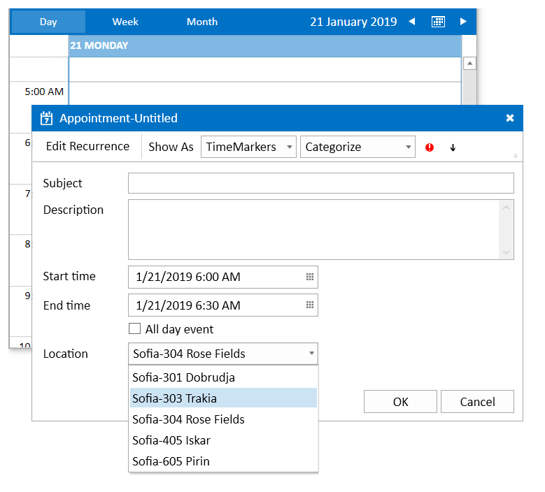

# Add Control to the EditAppointmentDialog

This article shows how to extend the UI of the EditAppointmentDialog by adding a custom control in it. To do this, you will need to edit the __ControlTemplate__ of the __SchedulerDialog__ control.

The tutorial shows how to add an additional RadComboBox that allows you to choose the appointment's location and bind this choice to the Location property of the Appointment model.

## Setting up the View Model

This section shows how to set up the view model used for the example. The model will hold a collection of Appointment objects that are bound to the AppointmentsSource property of RadScheduleView. And also a collection of locations that will be shown in the RadComboBox control.

__Example 1: Creating a basic view model__
<snippet id='radscheduleview-howto-add-radcombobox-to-editappointmentdialog-block_1-cs' />

## Extracting and Modifying the SchedulerDialog Template

To get the template extract the Style of the __SchedulerDialog__. Read more about extracting templates in the [Editing Control Templates]() article. The Style can be found in the *UI for {{site.framework_name}} installation folder/Themes.Implicit* folder, the __Telerik.Windows.Controls.ScheduleView.xaml__ file.

The following template was extracted from the [Office2013]() theme. Also, the extraction is based on the [Xaml]() version of the Telerik dlls. This means that any resources (converters, DataTemplates, etc.) required by the ControlTemplate of the SchedulerDialog are extracted and added in the project manually. If you use NoXaml dlls you don't need to do this. You can extract only the SchedulerDialog Style and set the Template property.

The newly added RadComboBox is marked with a Xaml comment - &lt;!-- CHANGE --&gt;

__Example 2: Modified SchedulerDialog Style__
<snippet id='radscheduleview-howto-add-radcombobox-to-editappointmentdialog-block_2-xaml' />

>tip We recommend using this Style only with this example. If you decide to use this approach please extract the SchedulerDialog Style according to your version of UI for {{ site.framework_name }} in order to ensure that the Style is up-to-date with the version.

## Setting up the ScheduelView Control

To apply the custom template use the __EditAppointmentDialogStyle__ property of RadScheduleView.

__Example 3: Applying the custom dialog style__
<snippet id='radscheduleview-howto-add-radcombobox-to-editappointmentdialog-block_3-xaml' />

__Example 4: Setting the view model__
<snippet id='radscheduleview-howto-add-radcombobox-to-editappointmentdialog-block_4-cs' />

#### Figure 1: Edit appointment dialog with an additional combobox for the Location of the appointment.

## See Also
* [Getting Started]()
* [Visual Structure]()
* [Data Binding Support]()