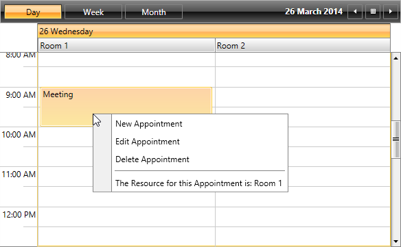

# Get the Resource of the Clicked Slot/Appointment

In many scenarios you may need to implement a __RadContextMenu__ within the __RadScheduleView__ and depending on the clicked item to execute custom logic.
        This article will demonstrate an approach how to get the Resource of the clicked __Appointment__ or __Slot__ in __RadScheduleView__
        and use it as __Header__ of a __RadMenuItem__.
      

## 

Let’s start with following __RadScheduleView__ definition which includes Resources and a __RadContextMenu__ attached:
        

#### __XAML__

{{region radscheduleview-howto-get-clicked-element_0}}
	<telerik:RadScheduleView AppointmentsSource="{Binding Appointments}">
	    <telerik:RadScheduleView.ViewDefinitions>
	        <telerik:DayViewDefinition />
	        <telerik:WeekViewDefinition />
	        <telerik:MonthViewDefinition />
	    </telerik:RadScheduleView.ViewDefinitions>
	    <telerik:RadScheduleView.ResourceTypesSource>
	        <telerik:ResourceTypeCollection>
	            <telerik:ResourceType Name="Location">
	                <telerik:Resource ResourceName="Room 1" />
	                <telerik:Resource ResourceName="Room 2" />
	            </telerik:ResourceType>
	        </telerik:ResourceTypeCollection>
	    </telerik:RadScheduleView.ResourceTypesSource>
	    <telerik:RadScheduleView.GroupDescriptionsSource>
	        <telerik:GroupDescriptionCollection>
	            <telerik:DateGroupDescription />
	            <telerik:ResourceGroupDescription ResourceType="Location" />
	        </telerik:GroupDescriptionCollection>
	    </telerik:RadScheduleView.GroupDescriptionsSource>
	    <telerik:RadContextMenu.ContextMenu>
	        <telerik:RadContextMenu>
	            <telerik:RadMenuItem Header="New Appointment" />
	            <telerik:RadMenuItem Header="Edit Appointment" />
	            <telerik:RadMenuItem Header="Delete Appointment" />
	        </telerik:RadContextMenu>
	    </telerik:RadContextMenu.ContextMenu>
	</telerik:RadScheduleView>
	{{endregion}}

Now you will need to add two additional __RadMenuItems__ - one of them will be shown when an Appointment is clicked and the other when an empty Slot 
          is clicked. In order to get clicked items you can use the default __RadScheduleView__ functionality which sets the clicked __Appointment__ 
          as __SelectedAppointment__ and the clicked __Slot__ as __SelectedSlot__. Also when you have __SelectedAppointment__
          or __SelectedSlot__ - the other property will be null. Knowing this will allow to hide the one of the items when the corresponding value is null.
          In order to get the __SelectedAppointment__ and the __SelectedSlot__ you can use the __Menu__ property of 
          __RadMenuItem__ holds a reference to the UIElement on which the __RadContextMenu__ is attached. This way you will be able to easily get the values of the
          __SelectedAppointment__ and __SelectedSlot__ though a binding and use in the __Header__ of the __RadMenuItem__.
          That is why firstly you will need to implement a ValueConverter which gets the clicked item and returns a simple string with __Resource__ name. You can see a sample implementation
          of the converter below:
        

#### __C#__

{{region radscheduleview-howto-get-clicked-element_0}}
	public class ClickedElementToResourceNameConverter : IValueConverter
	{
	    public object Convert(object value, Type targetType, object parameter, System.Globalization.CultureInfo culture)
	    {
	        if (value is Appointment)
	        {
	            var appointment = value as Appointment;
	
	            return "The Resource for this Appointment is: " + appointment.Resources.First();
	
	        }
	        else if (value is Slot)
	        {
	            var slot = value as Slot;
	
	            return "The Resource for this Slot is: " + slot.Resources.First();
	        }
	
	        return null;
	    }
	
	    public object ConvertBack(object value, Type targetType, object parameter, System.Globalization.CultureInfo culture)
	    {
	        return value;
	    }
	}
	{{endregion}}

As for the Visibility of the MenuItems you can use the built-in NullToVisibilityConverer which will help you to toggle the Visibility accoriding the value of the
          __SelectedAppointment__ and the __SelectedSlot__. When the value is null the coverter will return Visibility.Collapsed.
          Both of the converters can be defined in the resources of the Grid which holds the __RadSchedueView__:
        

#### __XAML__

{{region radscheduleview-howto-get-clicked-element_1}}
	<Grid.Resources>
	    <telerik:NullToVisibilityConverter x:Key="NullToVisibilityConverter"/>
	    <local:ClickedElementToResourceNameConverter x:Key="ClickedElementToResourceNameConverter" />
	</Grid.Resources>
	{{endregion}}

Now you can add the two __RadMenuItems__ with the required bindings for the __Header__ and the __Visibility__:
        

#### __XAML__

{{region radscheduleview-howto-get-clicked-element_2}}
	<telerik:RadMenuItem
	        Header="{Binding Path=Menu.UIElement.SelectedAppointment, RelativeSource={RelativeSource Self}, Converter={StaticResource ClickedElementToResourceNameConverter}}" 
	        Visibility="{Binding Header, RelativeSource={RelativeSource Self}, Converter={StaticResource NullToVisibilityConverter}}" />
	<telerik:RadMenuItem 
	        Header="{Binding Path=Menu.UIElement.SelectedSlot, RelativeSource={RelativeSource Self}, Converter={StaticResource ClickedElementToResourceNameConverter}}" 
	        Visibility="{Binding Header, RelativeSource={RelativeSource Self}, Converter={StaticResource NullToVisibilityConverter}}" />
	{{endregion}}

__Figure 1__ and __Figure 2__ demonstrate the final result. 
        

Figure1: When an Appointment is clicked the RadContextMenu will have information about its Resource. 

Figure2: When an empty Slot is clicked the RadContextMenu will have information about its Resource.

# See Also

 * [Getting Started]()

 * [Understanding Appointments]()

 * [Special and ReadOnly slots]()
