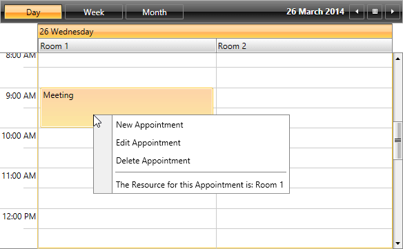
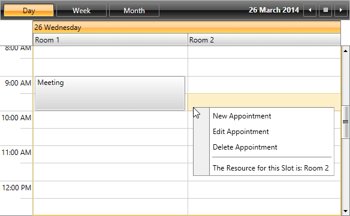

# Get the Resource of the Clicked Slot/Appointment

In many scenarios you may need to implement a __RadContextMenu__ within the __RadScheduleView__ and depending on the clicked item to execute custom logic. This article will demonstrate an approach how to get the Resource of the clicked __Appointment__ or __Slot__ in __RadScheduleView__ and use it as __Header__ of a __RadMenuItem__.

Let’s start with the following __RadScheduleView__ definition which includes Resources and a __RadContextMenu__ attached:

__Example 1: Defining RadScheduleView__

<snippet id='radscheduleview-howto-get-resource-from-clicked-slot-block_1-xaml' />

## Determine Whether an Appointment or a Slot is Clicked

> When an __Appointment__ is selected, the __SelectedSlot__ property of __RadScheduleView__ will be set to __null__. Respectively, when a __Slot__ is clicked, the __SelectedAppointment__ property will have a __null value__.

The process of determining whether an __Appointment__ or a __Slot__ is clicked will be demonstrated through the following steps.

**1.** Define the needed __IValueConverters__.

The built-in __NullToVisibilityConverer__  will set the __Visibility__ of the __MenuItems__ according the value of the __SelectedAppointment__ and the __SelectedSlot__. When the value is null the converter will return __Visibility.Collapsed__. 

__Example 2: Defined the needed IValueConverters__

<snippet id='radscheduleview-howto-get-resource-from-clicked-slot-block_2-xaml' />

**2.** Implement the __ClickedElementToResourceNameConverter__. 

As its name hints, it will get the clicked item and return a simple string with __Resource__ name.

__Example 3: Implement the ClickedElementToResourceNameConverter__

<snippet id='radscheduleview-howto-get-resource-from-clicked-slot-block_3-cs' />

**3.** Add two additional __RadMenuItems__. The first one will be shown when an Appointment is clicked and the second one when a Slot is clicked. 

In order to get the __SelectedAppointment__ and the __SelectedSlot__, the __Menu__ property of __RadMenuItem__ can be used. It holds a reference to the __UIElement__ on which the __RadContextMenu__ is attached. This way, the values of the __SelectedAppointment__ and __SelectedSlot__ properties will be easily fetched through binding and used in the __Header__ of the __RadMenuItem__.

__Define the two RadMenuItems__

<snippet id='radscheduleview-howto-get-resource-from-clicked-slot-block_4-xaml' />

__Figure 1__ and __Figure 2__ demonstrate the final result.

__Figure 1: When an Appointment is clicked the RadContextMenu will have information about its Resource__

__Figure 2: When an empty Slot is clicked the RadContextMenu will have information about its Resource__

## See Also

 * [Getting Started]()

 * [Understanding Appointments]()

 * [Special and ReadOnly slots]()