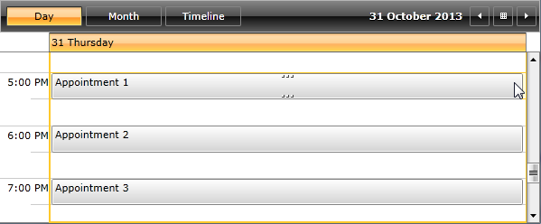

# Remove the Delete Button

This tutorial demonstrates how to remove the Delete button from the Appointments by using Implicit Styles and by using the built in property.

## Remove the Delete Button Using the ShowAppointmentDeleteButton Property

With the Q1 2014 version of UI for WPFSilverlight, __RadScheduleView__ provides built-in property named __ShowAppointmentDeleteButton__ which gives you the ability to easily show or hide the delete button from all of the Appointments. The default value of the __ShowAppointmentDeleteButton__ property is __true__ - the delete button is visible. In order to hide it you need to set the property to __RadScheduleView__ the following way:         

#### __XAML__

```XAML
	<telerik:RadScheduleView ShowAppointmentDeleteButton="False">
	    ...
	</telerik:RadScheduleView>
```

>Setting the __ShowAppointmentDeleteButton__ property to false will only remove the button - you still be able to delete an Appointment by pressing the Delete keyboard button. In order to totally disable the deleting of the Appointments please check the [Disable the Confirm Delete Dialog](#disable-the-confirm-delete-dialog) section from this article.          

## Remove the Delete Button from the ControlTemplate

If you are using an older version of the controls (before Q1 2014), you will need to modify the default ControlTemplates of the AppointemntsItems. The exact approach will be explained in this section. Before you proceed, please check the following topics:        

* [Implicit Styles]()

* [Appointment Style]()

First of all you will have to implement a custom __AppointmentStyleSelector__ with two styles. This will allow you to return a different style (horizontal or vertical) depending on the orientation of the each __ViewDefinition__. The custom __AppointmentStyleSelector__ should look as follows:        

#### __C#__

```C#
	public class CustomAppointmentStyleSelector : OrientedAppointmentItemStyleSelector
	{
	    public Style CustomHorizontalStyle { get; set; }
	
	    public Style CustomVerticalStyle { get; set; }
	
	    public override Style SelectStyle(object item, DependencyObject container, ViewDefinitionBase activeViewDefinition)
	    {
	        if (activeViewDefinition.GetOrientation() == Orientation.Horizontal)
	        {
	            return this.CustomHorizontalStyle;
	        }
	        else if (activeViewDefinition.GetOrientation() == Orientation.Vertical)
	        {
	            return this.CustomVerticalStyle;
	        }
	
	        return base.SelectStyle(item, container, activeViewDefinition);
	    }
	}
```


The styles will be used in order to apply a templates without the delete buttons. So the next step will be to extract both the default __AppointmentItemVerticalControlTemplate__ and __AppointmentItemHorizontalControlTemplate__ ControlTemplates from the used __RadScheduleView__ theme. You can find it in Themes.Implicit folder which is located in the installation folder of the controls. Drill down to find the __Telerik.Windows.Controls.ScheduleView.xaml__ file in that directory. From this resource file you can extract the templates and any needed resources that it uses. Afterwards you could just place them in the App.xaml file as Application resources as shown below:        

#### __XAML__

```XAML
	<Application.Resources>
	    <ResourceDictionary>
	        <ResourceDictionary.MergedDictionaries>
	            <ResourceDictionary Source="/Telerik.Windows.Themes.Office_Black;component/Themes/System.Windows.xaml"/>
	            <ResourceDictionary Source="/Telerik.Windows.Themes.Office_Black;component/Themes/Telerik.Windows.Controls.xaml"/>
	            <ResourceDictionary Source="/Telerik.Windows.Themes.Office_Black;component/Themes/Telerik.Windows.Controls.Input.xaml"/>
	            <ResourceDictionary Source="/Telerik.Windows.Themes.Office_Black;component/Themes/Telerik.Windows.Controls.Navigation.xaml"/>
	            <ResourceDictionary Source="/Telerik.Windows.Themes.Office_Black;component/Themes/Telerik.Windows.Controls.ScheduleView.xaml"/>
	        </ResourceDictionary.MergedDictionaries>
	        <ControlTemplate x:Key="AppointmentItemVerticalControlTemplate" TargetType="telerik:AppointmentItem">
	        ...              
	        </ControlTemplate>
	        <ControlTemplate x:Key="AppointmentItemHorizontalControlTemplate" TargetType="telerik:AppointmentItem">
	         ...          
	        </ControlTemplate>
	    </ResourceDictionary>
	</Application.Resources>
```

After having both ControlTemplates you could apply them in XAML through the custom __AppointmentStyleSelector__ as follows:        

#### __XAML__

```XAML
	<local:CustomAppointmentStyleSelector x:Key="CustomAppointmentStyleSelector">
	    <local:CustomAppointmentStyleSelector.CustomHorizontalStyle>
	        <Style TargetType="telerik:AppointmentItem" BasedOn="{StaticResource AppointmentItemBaseStyle}">
	            <Setter Property="Template" Value="{StaticResource AppointmentItemHorizontalControlTemplate}" />
	        </Style>
	    </local:CustomAppointmentStyleSelector.CustomHorizontalStyle>
	    <local:CustomAppointmentStyleSelector.CustomVerticalStyle>
	        <Style TargetType="telerik:AppointmentItem" BasedOn="{StaticResource AppointmentItemBaseStyle}" >
	            <Setter Property="Template" Value="{StaticResource AppointmentItemVerticalControlTemplate}" />
	        </Style>
	    </local:CustomAppointmentStyleSelector.CustomVerticalStyle>
	</local:CustomAppointmentStyleSelector>
```

>Note that when using __Implicit Styles__ you don't need to replace the whole style, but just part of it when it is based on the default style.					

You also need to set the custom __AppointmentStyleSelector__ to the __RadScheduleView__:        

#### __XAML__

```XAML
	<telerik:RadScheduleView AppointmentsSource="{Binding Appointments}" AppointmentStyleSelector="{StaticResource CustomAppointmentStyleSelector}">
	    <telerik:RadScheduleView.ViewDefinitions>
	        <telerik:DayViewDefinition />
	        <telerik:MonthViewDefinition />
	        <telerik:TimelineViewDefinition />
	    </telerik:RadScheduleView.ViewDefinitions>
	</telerik:RadScheduleView>
```

Until this moment the Appointments should have the default apperance. Now you just need to find the Button named DeleteButton and remove it from both the __AppointmentItemVerticalControlTemplate__ and __AppointmentItemHorizontalControlTemplate__ ControlTemplates.        

#### __XAML__

```XAML
	<telerik:RadButton x:Name="DeleteButton" ... />                       
```

And here is the final result:



## Disable the Confirm Delete Dialog

If you also want to avoid the appearance of the delete confirm dialog, you will need to cancel it in the __ShowDialog__ event handler of __RadScheduleView__. This should be done as shown in the following code snippet:        

#### __C#__

```C#
	private void ScheduleView_ShowDialog(object sender, Telerik.Windows.Controls.ShowDialogEventArgs e)
	{
	    if (e.DialogViewModel is ConfirmDialogViewModel)
	    {
	        e.DefaultDialogResult = false;
	        e.Cancel = true;
	    }
	}
```

>tip Find a runnable project of the previous example in the [WPF Samples GitHub repository](https://github.com/telerik/xaml-sdk/tree/master/ScheduleView/RemoveDeleteButton).         

## See Also

 * [Prevent Dialogs from Opening]()