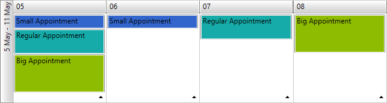

# Set Custom Appointment Height

With the Q2 2014 release version of UI for WPFSilverlight, __RadScheduleView__ provides brand new customization feature for the MonthViewDefinition. Now it is possible to set different heights of the appointments by using a custom [AppointmentStyleSelector](#create-a-custom-appointmentstyleselector).      

## Getting Started

In order to be able to display appointments with different heights in the MonthViewDefinition you will first need to set the new __AllowCustomAppointmentSize__ property of MonthViewDefinition to __True__:        

#### __XAML__

{{region radscheduleview-howto-set-custom-appointment-height_0}}
	<telerik:RadScheduleView AppointmentsSource="{Binding Appointments}">
	    <telerik:RadScheduleView.ViewDefinitions>
	        <telerik:MonthViewDefinition AllowCustomAppointmentSize="True" />
	    </telerik:RadScheduleView.ViewDefinitions>
	</telerik:RadScheduleView>
{{endregion}}

>The default value of the __AllowCustomAppointmentSize__ property is __false__ - the appointments in the MonthViewDefinition are displayed with their default height.

## Implementing Custom AppointmentStyleSelector

Now since you are able to display appointments with different heights you should apply the desired sizes by implementing a custom AppointmentStyleSelector. For example if you need to have three different heights depending on the duration of the appointments you would need to define the corresponding Styles in the StyleSelector. When the Appointment has duration equals or less an hour you should return the Style for the small appointments, if the Appointment has duration between an hour and two you should return the Style for the regular appointments and at last if the Appointment has duration higher than two hours you would need to return the Style for big appointments. The complete implementation of the custom AppointmentStyleSelector should look as shown below:
        
#### __C#__

{{region radscheduleview-howto-set-custom-appointment-height_0}}
	public class AppointmentStyleSelector : OrientedAppointmentItemStyleSelector
	{
	    public Style SmallAppointmentStyle { get; set; }
	    public Style RegularAppointmentStyle { get; set; }
	    public Style BigAppointmentStyle { get; set; }
	
	    public override Style SelectStyle(object item, DependencyObject container, ViewDefinitionBase activeViewDefinition)
	    {
	        var appointment = item as Appointment;
	
	        if (appointment != null)
	        {
	            if (appointment.Duration() <= new TimeSpan(1, 0, 0))
	            {
	                return this.SmallAppointmentStyle;
	            }
	            else if (appointment.Duration() <= new TimeSpan(2, 0, 0))
	            {
	                return this.RegularAppointmentStyle;
	            }
	            else if (appointment.Duration() > new TimeSpan(2, 0, 0))
	            {
	                return this.BigAppointmentStyle;
	            }
	        }
	
	        return base.SelectStyle(item, container, activeViewDefinition);
	    }
	}
{{endregion}}

#### __VB__

{{region radscheduleview-howto-set-custom-appointment-height_0}}
	    Public Class AppointmentStyleSelector
	        Inherits OrientedAppointmentItemStyleSelector
	
	        Public Property SmallAppointmentStyle() As Style
	        Public Property RegularAppointmentStyle() As Style
	        Public Property BigAppointmentStyle() As Style
	
	        Public Overrides Function SelectStyle(ByVal item As Object, ByVal container As DependencyObject, ByVal activeViewDefinition As ViewDefinitionBase) As Style
	            Dim appointment = TryCast(item, Appointment)
	
	            If appointment IsNot Nothing Then
	                If appointment.Duration() <= New TimeSpan(1, 0, 0) Then
	                    Return Me.SmallAppointmentStyle
	                ElseIf appointment.Duration() <= New TimeSpan(2, 0, 0) Then
	                    Return Me.RegularAppointmentStyle
	                ElseIf appointment.Duration() > New TimeSpan(2, 0, 0) Then
	                    Return Me.BigAppointmentStyle
	                End If
	            End If
	
	            Return MyBase.SelectStyle(item, container, activeViewDefinition)
	        End Function
	    End Class
{{endregion}}

Afterwards you will have declare the custom AppointmentStyleSelector as resource in XAML. Here you can set the desired heights and background colors of the different Appointment types:        

#### __XAML__

{{region radscheduleview-howto-set-custom-appointment-height_1}}
	<local:AppointmentStyleSelector x:Key="AppointmentStyleSelector">
	    <local:AppointmentStyleSelector.SmallAppointmentStyle>
	        
	    </local:AppointmentStyleSelector.SmallAppointmentStyle>
	    <local:AppointmentStyleSelector.RegularAppointmentStyle>
	        
	    </local:AppointmentStyleSelector.RegularAppointmentStyle>
	    <local:AppointmentStyleSelector.BigAppointmentStyle>
	        
	    </local:AppointmentStyleSelector.BigAppointmentStyle>
	</local:AppointmentStyleSelector>
{{endregion}}

And the final step would be to assign it to __RadScheduleView__:       

#### __XAML__

{{region radscheduleview-howto-set-custom-appointment-height_2}}
	<telerik:RadScheduleView AppointmentsSource="{Binding Appointments}"
	                         AppointmentStyleSelector="{StaticResource AppointmentStyleSelector}">
	    <telerik:RadScheduleView.ViewDefinitions>
	        <telerik:MonthViewDefinition AllowCustomAppointmentSize="True" />
	    </telerik:RadScheduleView.ViewDefinitions>
	</telerik:RadScheduleView>
{{endregion}}

You can see the final result in __Figure 1__:

Figure 1: Appointments with different heights in MonthViewDefinition

>tipYou can find a runnable project demonstrating the approach from the previous example in our online demos [here](http://demos.telerik.com/silverlight/#ScheduleView/CustomStyles/CustomAppointmentHeight)[here](http://demos.telerik.com/wpf), the example is listed as __ScheduleView / Custom Appointment Height__.          

## See Also

 * [Implicit Styles]()

 * [Appointment Style]()