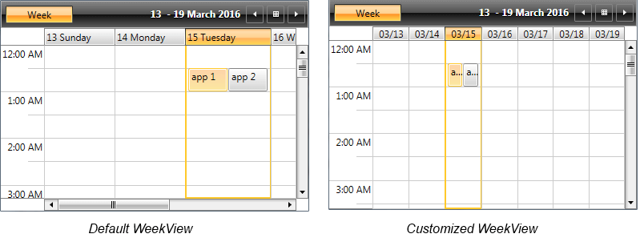

# Set GroupHeaders Width

__GroupHeaders__ represent the date and resource (when RadScheduleView is grouped) headers. They can be horizontal or vertical depending on the active ViewDefinition and its Orientation. 

>For detailed information about the different GroupHeaders, see the [Styling the GroupHeaders]() topic.    

It is a common scenario to apply a specific width to the GroupHeaders. Generally, the width of the headers depend on the following three things:

* The count of the intersecting appointments in each group. When there are more appointments, the width of the group is increased. 

* The desired width of the GroupHeader control itself. It can be changed by either setting a custom [GroupHeaderStyle]() or a [GroupHeaderTemplate]().

>RadScheduleView will disregard the set width if you have a group with many appointments, even if GroupHeaders have a fixed width. The effect of this can be minimized by setting the __MinAppointmentWidth__ property of the ScheduleView to a smaller value.

* Whether the groups are stretched or not. This feature is switched on and off by setting the [StretchGroupHeaders](#stretchgroupheaders) property of the ViewDefinitions. If it is switched on and there is extra space left, it is distributed among the groups.

__Example 1__ will show you how you could decrease the GroupHeaders width by customizing the GroupHeaderTemplateSelector and setting a shorter date format in the WeekViewDefinition of RadScheduleView.

First, we will [generate the default GroupHeaderContentTemplateSelector](#how-to-generate-and-use-groupheadercontenttemplateselector) and will set Width to the ContentPresenters in both the HorizontalTemplate and VerticalTemplate (which template is used depends on the active ViewDefinition Orientation) as shown in __Example 1__.

__Example 1: Modified GroupHeaderContentTemplateSelector__

```XAML
	<telerik:GroupHeaderTemplateSelector x:Key="GroupHeaderContentTemplateSelector">
		<telerik:GroupHeaderTemplateSelector.HorizontalTemplate>
			<DataTemplate>
				<ContentPresenter Content="{Binding FormattedName}" Height="16" Margin="2" Width="30" />
			</DataTemplate>
		</telerik:GroupHeaderTemplateSelector.HorizontalTemplate>
		<telerik:GroupHeaderTemplateSelector.VerticalTemplate>
            <DataTemplate>
                <telerik:LayoutTransformControl VerticalAlignment="Top">
					<telerik:LayoutTransformControl.LayoutTransform>
						<RotateTransform Angle="-90" />
                    </telerik:LayoutTransformControl.LayoutTransform>
					<ContentPresenter Content="{Binding FormattedName}" Margin="2" Width="30" Height="16"  />
				</telerik:LayoutTransformControl>
			</DataTemplate>
		</telerik:GroupHeaderTemplateSelector.VerticalTemplate>
	</telerik:GroupHeaderTemplateSelector>
```

Then, we will apply the created GroupHeaderContentTemplateSelector to the ScheduleView, as shown in __Example 2__.

Additionally, we will change the format of the dates inside the GroupHeaders as explained in the [Formatting]() topic and will set the __MinAppointmentWidth__ property of the ScheduleView to a smaller value.

__Example 2: Apply GroupHeaderContentTemplateSelector__

```XAML
	<telerik:RadScheduleView AppointmentsSource="{Binding Appointments}" 
            GroupHeaderContentTemplateSelector="{StaticResource GroupHeaderContentTemplateSelector}"
			MinAppointmentWidth="10">		
		<telerik:RadScheduleView.ViewDefinitions>
                <telerik:WeekViewDefinition  GroupHeaderDateStringFormat="{}{0:MM/dd}" />           
		</telerik:RadScheduleView.ViewDefinitions>
	</telerik:RadScheduleView>
```

__Figure 1__ shows the RadScheduleView before and after applying the previously explained properties.

#### __Figure 1: Default and customized WeekViewDefinitions__


## See Also

 * [Styling the GroupHeaders]()

 * [Templating the GroupHeaders]()
 
 * [Formatting]()
