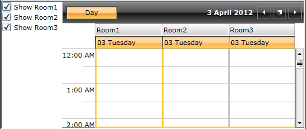
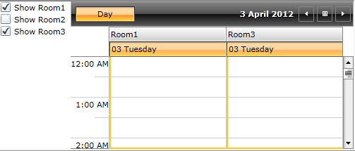
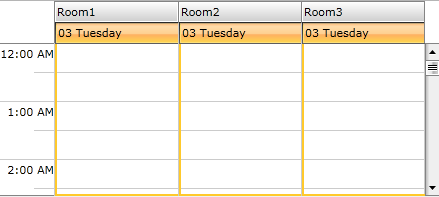
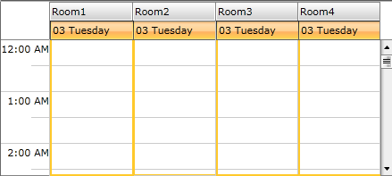

# Update the Resources

This article will show how you can update the visible resources by which the RadScheduleView is grouped.

There are two approaches you can use:

* [Using Filtering feature of the ScheduleView;](#using-filtering-feature-of-the-scheduleview)

* [Adding/removing resources at run time.](#addingremoving-resources-at-run-time)

## Using Filtering feature of the ScheduleView

We will use __GroupFilter__ predicate of the ViewDefinition to specify which resources will be visible per some condition.

Let’s have the following ScheduleView grouped by “Location” resource type:

#### __XAML__

```XAML
	<telerik:RadScheduleView ResourceTypesSource="{Binding ResourceTypes}"  ...>		
		<telerik:RadScheduleView.ViewDefinitions>
			<telerik:DayViewDefinition GroupFilter="{Binding GroupFilter}" />
		</telerik:RadScheduleView.ViewDefinitions>			
		<telerik:RadScheduleView.GroupDescriptionsSource>
			<telerik:GroupDescriptionCollection>
				<telerik:ResourceGroupDescription ResourceType="Location" />
			</telerik:GroupDescriptionCollection>
		</telerik:RadScheduleView.GroupDescriptionsSource>
	</telerik:RadScheduleView>
```

We will add checkboxes for each resource in order to allow the user to change their Visibility:

#### __XAML__

```XAML
	<StackPanel>
		<CheckBox Content="Show Room1" IsChecked="{Binding ShowRoom1, Mode=TwoWay}" />
		<CheckBox Content="Show Room2" IsChecked="{Binding ShowRoom2, Mode=TwoWay}" />
		<CheckBox Content="Show Room3" IsChecked="{Binding ShowRoom3, Mode=TwoWay}" />
	</StackPanel>
```

Next step is to add the ShowRoom1, ShowRoom2, etc . Boolean properties and the GroupFilter predicate to the ViewModel:

#### __C#__

```C#
	public class ViewModel : ViewModelBase
	{
		private bool _showRoom1 = true;
		private bool _showRoom2 = false;
		private bool _showRoom3 = true;
		private Func<object, bool> groupFilter;
	
		public bool ShowRoom1
		{
			get
			{
				return this._showRoom1;
			}
			set
			{
				if (this._showRoom1 != value)
				{
					this._showRoom1 = value;
					this.OnPropertyChanged(() => this.ShowRoom1);
					this.UpdateGroupFilter();
				}
			}
		}
		public bool ShowRoom2
		{
			get
			{
				return this._showRoom2;
			}
			set
			{
				if (this._showRoom2 != value)
				{
					this._showRoom2 = value;
					this.OnPropertyChanged(() => this.ShowRoom2);
					this.UpdateGroupFilter();
				}
			}
		}
		public bool ShowRoom3
		{
			get
			{
				return this._showRoom3;
			}
			set
			{
				if (this._showRoom3 != value)
				{
					this._showRoom3 = value;
					this.OnPropertyChanged(() => this.ShowRoom3);
					this.UpdateGroupFilter();
				}
			}
		}
	
		public Func<object, bool> GroupFilter
		{
			get
			{
				return this.groupFilter;
			}
			private set
			{
				this.groupFilter = value;
				this.OnPropertyChanged(() => this.GroupFilter);
			}
		}
	}
```

Add the UpdateGroupFilter() method:

#### __C#__

```C#
	private bool GroupFilterFunc(object groupName)
	{
		IResource resource = groupName as IResource;
		return resource == null ? true : this.GetEnabledGroups().Contains(resource.ResourceName, StringComparer.OrdinalIgnoreCase);
	}
	
	private IEnumerable<string> GetEnabledGroups()
	{
		List<string> enabledGroups = new List<string>();
	
		if (this.ShowRoom1) enabledGroups.Add("Room1");
		if (this.ShowRoom2) enabledGroups.Add("Room2");
		if (this.ShowRoom3) enabledGroups.Add("Room3");
			
		return enabledGroups;
	}
	
	private void UpdateGroupFilter()
	{
		this.GroupFilter = new Func<object, bool>(this.GroupFilterFunc);
	}
```

So checking/unchecking the checkboxes will update the visible Resources in the ViewDefintion:





>tipYou can check this approach in RadScheduleView Grouping and Filtering demo [here](https://demos.telerik.com/silverlight/#ScheduleView/Grouping/GroupingAndFiltering)[here](https://demos.telerik.com/wpf/).

## Adding/removing resources at run time

When adding/removing resources from the Resources collection of  a certain resource type, the changes will not be reflected in the View immediately - you should also reset the whole ResourceType.  Just remove and add it again to the ResourceTypesSource collection of the ScheduleView.

>We intentionally do not listen for changes in the Resources collection of a ResourceType (actually all of its properties) because of performance considerations. That’s why resetting the ResourceType is needed in these cases.

For example, if we have the RadScheduleView grouped again by “Location” ResourceType:



Calling the following code will add an additional “Room4” resource:

#### __C#__

```C#
	locationResType.Resources.Add(new Resource("Room4"));
	ResourceTypes.Remove(locationResType);
	ResourceTypes.Add(locationResType);
```

where __ResourceTypes__ is the collection to which ResourceTypesSource property of the ScheduleView is bound:

#### __XAML__

```XAML
	<telerik:RadScheduleView ResourceTypesSource="{Binding ResourceTypes}" … />
```

This will lead to the following result:



## See Also

 * [Implementing View-ViewModel ]()

 * [Resources]()
