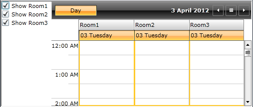
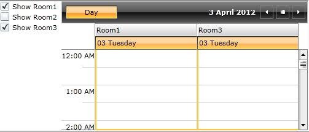
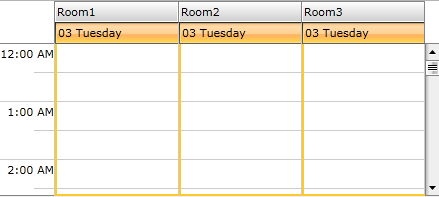
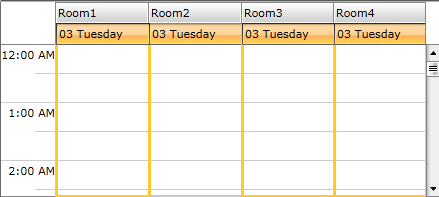

# Update the Resources

This article will show how you can update the visible resources by which the RadScheduleView is grouped.

## Using Filtering feature of the ScheduleView

We will use __GroupFilter__ predicate of the ViewDefinition to specify which resources will be visible per some condition.

Let’s have the following ScheduleView grouped by “Location” resource type:

<snippet id='radscheduleview-howto-update-resources-block_1-xaml' />

We will add checkboxes for each resource in order to allow the user to change their Visibility:

<snippet id='radscheduleview-howto-update-resources-block_2-xaml' />

Next step is to add the ShowRoom1, ShowRoom2, etc . Boolean properties and the GroupFilter predicate to the ViewModel:

<snippet id='radscheduleview-howto-update-resources-block_3-cs' />

Add the UpdateGroupFilter() method:

<snippet id='radscheduleview-howto-update-resources-block_4-cs' />

So checking/unchecking the checkboxes will update the visible Resources in the ViewDefintion:

>tip You can check this approach in RadScheduleView Grouping and Filtering demo [here](https://demos.telerik.com/silverlight/#ScheduleView/Grouping/GroupingAndFiltering)[here](https://demos.telerik.com/wpf/).

## Adding/removing resources at run time

When adding/removing resources from the Resources collection of  a certain resource type, the changes will not be reflected in the View immediately - you should also reset the whole ResourceType.  Just remove and add it again to the ResourceTypesSource collection of the ScheduleView.

>We intentionally do not listen for changes in the Resources collection of a ResourceType (actually all of its properties) because of performance considerations. That’s why resetting the ResourceType is needed in these cases.

For example, if we have the RadScheduleView grouped again by “Location” ResourceType:

Calling the following code will add an additional “Room4” resource:

<snippet id='radscheduleview-howto-update-resources-block_5-cs' />

where __ResourceTypes__ is the collection to which ResourceTypesSource property of the ScheduleView is bound:

<snippet id='radscheduleview-howto-update-resources-block_6-xaml' />

This will lead to the following result:

## See Also

 * [Implementing View-ViewModel ]()

 * [Resources]()